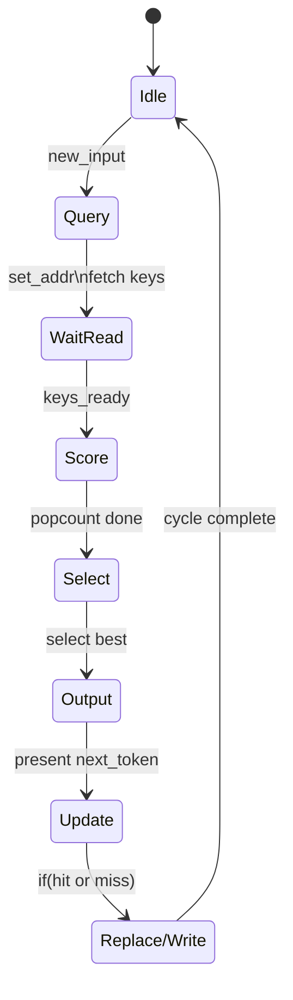
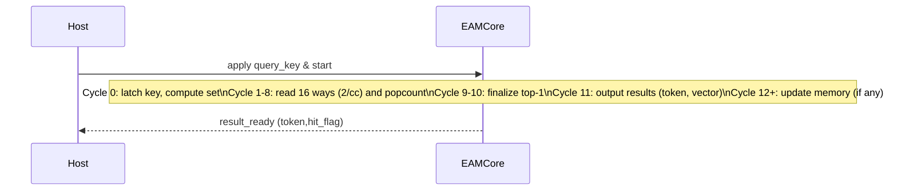

# Executive Summary  
We propose **A7-EAM (Episodic Associative Machine)**: an FPGA-friendly external memory for on-board language models. Inspired by Product-Key Memory and kNN-LMs, A7-EAM uses a set-associative **key–value store** in on-chip BRAM (v0) and off-chip DDR (v1).  Like *Memorizing Transformers*, it treats the DDR as a large (256 MB) non-differentiable memory of (key,value) records.  A 64‑bit *context key* is generated per token, used to query a multiway table: entries match by Hamming distance (via XOR+popcount).  On query, a small **recurrent controller** (32‑D INT8 state) merges the top-K retrieved values with its current state to produce the next token.  On a hit, the selected entry’s value is updated by an exponential moving average; on a miss, a new record is allocated (replacing the oldest/weakest way).  

This report details the goals and testable hypotheses, the BRAM‑only microarchitecture (A7-EAM-00), and the DDR‑backed extension (A7-EAM-01).  We analyze timing, resources (Arty-A7 XC7A100T), and propose experiment metrics (hit rate, ops/query, bytes/query, latency, model quality).  We include mermaid diagrams of the dataflow and timing, tables of design trade-offs, and a prioritized 8-week development plan.  All interfaces (AXI-lite control, AXI4 master for DDR, BRAM ports) are specified. 

# Goals, Hypotheses, and Falsification  
**Goal:** Build a self-learning key–value memory on Arty A7 (XC7A100T) to augment an embedded LM, aiming to store *much more knowledge* than fits on-chip with minimal compute overhead.  Inspired by Product-Key Memory and kNN-LMs, we hypothesize that:  

- **H1:** A small associative BRAM (≈4096 entries, 128 KB) can *learn and recall* random token→next-token mappings (episodic memory) effectively on FPGA.  
- **H2:** Extending this to DDR (scaling to ~128 MB) can dramatically increase capacity without linearly increasing per-token compute, since each lookup only touches few entries.  This should outperform a dense transformer in bytes/token and MAC utilization.  
- **H3 (Falsifiable):** The system must achieve near-100% *recall accuracy* for learned associations under moderate load, and reach significant capacity gain (tens of MB) without catastrophic slowdowns. If an entry-based approach cannot recall quickly or contention exceeds thresholds, the design fails.  

**Falsification criteria:** For A7-EAM-00, failure means it cannot reliably learn/recall on-chip associations (e.g. <90% accuracy for simple lookup tasks) or violates timing/resource budgets.  For A7-EAM-01, failure includes DDR throughput falling well below measured board rates (~1.1 GB/s seq, ~0.53 GB/s rnd) or hit-rate/latency degrading such that ops/query or bytes/query exceed tolerable limits.  

# A7-EAM-00 (BRAM-Only) Microarchitecture  

## Memory Organization (Sets, Ways, Entry)  
We choose a **set-associative table** in BRAM to allow parallel updates and simple replacement.  For example:  

| Parameter     | Example Value       | Notes                                |
|---------------|---------------------|--------------------------------------|
| Sets (S)      | 256 (8-bit index)   | Decoded from lower bits of key.      |
| Ways (W)      | 16                  | Entries per set (associativity).     |
| Entry size    | 32 bytes (256 bits) | Fixed-size record (detailed below).  |
| Total entries | 4096 (=S×W)        | 256×16 = 4096 records stored.        |
| Total BRAM    | 128 KB ≈ 1 Mbit    | 4096×32B = 131072B (fits in ~29×36Kb BRAM blocks). |

Each **entry** packs key, value, and metadata.  For example: 8 B key fingerprint, 16 B learned vector, plus small fields (1 B next-token, 1 B confidence, 2 B age, 2 B tag, 2 B flags) totaling 32 B.  (Any unused bits can be reserved.)  The 64-bit *full key* is hashed/encoded from the model’s context before lookup; stored keys may use an 8‑B fingerprint for space (if desired), but we assume full 64‑bit here.  

## Key Format and Query Path  
On each token, the LM’s context generates a 64‑bit query key (e.g. via a fixed ±1 projection from a 32‑dim state). This 64‑bit key addresses one set: the low 8 bits index the set (0–255). All W=16 ways in that set are candidates. The *lookup pipeline* is:  
1. **Address decode:** Use query key mod S to select one BRAM row containing W entries (one per way).  
2. **Parallel read:** Using dual-port BRAM, read up to 2 ways per cycle. Over W=16 ways, this takes 8 cycles if two reads at a time.  
3. **Distance scoring:** For each way’s stored key, compute bitwise XOR with query and count 1’s (popcount) = Hamming distance. Lower distance = better match. (This is classic binary key matching; product-key papers also do nearest-neighbor search with dot products, but XOR-popcount is hardware-friendly.)  
4. **Top-1/Top-2 selection:** Keep the best (min distance) and second-best match (or threshold). This can be done with a simple compare tree across the 16 popcounts as they are computed.  

A mermaid diagram of this dataflow:  
```mermaid
flowchart LR
    Context-->KeyGen[Controller/KeyGen]
    KeyGen-- generates key -->SetCalc[Calculate Set Index]
    KeyGen--pass key-->BRAMs[BRAM Array (16-way)]
    BRAMs--read keys-->XORs[XOR/Popcount Units]
    XORs--scores-->TopSel[Top-K Selector]
    TopSel--best values-->Merge[Merge with Controller]
    Merge--next token/logits-->LMOutput[Output]
```

Here, **BRAM Array** implements 256 sets × 16 ways (we can use 16 parallel BRAM blocks or a time-multiplexed scheme). The **XOR/Popcount** blocks (pure combinational logic in LUTs or DSPs) score matches. Finally, **Merge** combines the retrieved values with the controller’s recurrent state to produce logits or next-token (e.g. weighted sum or a small MLP).  

## Controller FSM and Timing  
An on-chip state machine orchestrates query and update:  



- **Query (Decode/Read):** Compute set index and initiate BRAM reads.  
- **Score:** For each way, perform XOR-popcount; track top match.  
- **Select/Output:** Determine best match. If match found (popcount=0 or min distance), output its value (vector, next token). Meanwhile raise a flag whether it was a *hit*.  
- **Update (Learning):** If hit, read the value vector back (or use cached) and update it: `v_new = EMA(v_old, context_input)`. If miss, choose a way to replace (e.g. lowest confidence or oldest) and write new key/value/metadata.  
- **Timing:** Each stage takes a few cycles. Rough budget: decoding+read (1 cycle), 8 cycles to scan 16 ways (2 per cycle), 2 cycles to finalize top-1, 1 cycle write-back, ~12–15 cycles total per query.  

## Write/Eviction Policy  
On a hit, we increment a small *confidence counter* and do `value ← α·value + (1–α)·current_state` (ema) to refine the memory. On a miss, we evict one entry (e.g. lowest confidence or oldest) in that set and write: `{key,value,token,conf=1,age=0,valid=1}`.  Atomicity is ensured by pausing further queries until the write completes. We assume single-port writes to BRAM or double-buffering to avoid read/write conflicts. 

## BRAM Interface and RTL Modules  
We suggest implementing A7-EAM-00 as a Verilog/VHDL module with two main interfaces:  

- **Query Interface:** Inputs `(clk, rst, query_key[63:0], query_start)`, outputs `(query_ready, hit_flag, out_token[7:0], out_vector[127:0], out_confidence[7:0])`.  The module asserts `query_ready` when `out_*` are valid (after ~15 cycles).  
- **Update Interface / Control (AXI-Lite):** A small AXI-Lite slave (e.g. 32-bit registers) for host configuration and stats (e.g. manual reset, read hit-count, etc). One could also merge query and update via the same interface, but simpler is: on `hit_flag=1`, the module auto-updates. For simulation testbench, the host can drive the updated values via another port.

We can build the BRAM array using `(* keep *)` distributed RAM or Block RAM primitives (e.g. `RAMB36E1`) for the 32B width.  For example, each set can be a 36Kb BRAM with data width=256 bits (32 bytes) and 256 entries; 16 such banks (or time-multiplex fewer by storing multiple ways per BRAM). As a concrete assumption: *We use 4 dual-port RAMB36 (36 Kb each) per way*. This yields 4×36Kb = 144Kb per way (>128KB), enough overhead.  

Table: **Entry Layout (32 bytes)** (example fields)  
| Bytes | Field          | Description                     |
|-------|----------------|---------------------------------|
| 0–7   | KeyFingerprint | 64-bit hashed context key       |
| 8–23  | ValueVector    | 128-bit learned embedding       |
| 24    | Token          | 8-bit next-token (vocab index)  |
| 25    | Confidence     | 8-bit hit count/strength        |
| 26–27 | Age            | 16-bit age or last-use counter  |
| 28–29 | Tag            | 16-bit extra (e.g. bucket tag)  |
| 30–31 | Flags/Valid    | 16-bit flags (e.g. valid bit)   |

*(Any unused bits can store CRC, spare tags, etc.)*  

## Resource Estimates & Floorplan (XC7A100T)  
The XC7A100T has **101,440 LUTs** (logic cells), **203,800 FF**, **240 DSPs**, and **135 × 36Kb BRAM** (≈4.86 Mbit). Our A7-EAM-00 uses ≈1 Mbit (128 KB) for memory, about **30** BRAMs (36Kb) – ~22% of on-chip RAM. Logic for XOR-popcount (64-bit × 16 ways) can be done in LUT fabric: one 64-bit popcount might use ~200 LUTs; 16-way pipeline (~3200 LUTs). The controller and interfaces may use a few hundred LUTs/FF.  Overall we estimate **<10k LUTs, <10k FF** (≈10% of device), and no DSPs. A detailed **resource budget**:

| Component         | LUTs | FFs | BRAM36 | DSP | Notes                   |
|-------------------|-----:|----:|-------:|----:|-------------------------|
| Key–value BRAMs   |  –   |  –  | 30     | –  | 128 KB memory (4096×32B) |
| XOR-Popcount units| ~3k  | 1k  | –      | –  | 16×64-bit Hamming      |
| Top-K selector    | 500  | 300 | –      | –  |  comparisons           |
| Controller FSM + AXI-lite | 500  | 500 | – | –  | state machine + regs    |
| Recurrent 32D INT8| (reuse) | (reuse)| – | – | small add shifts (no extra DSPs) |
| **Total (est)**   | ~4k  | ~2k | 30     | 0  | <5% LUT, 22% BRAM     |

Floorplanning: 30 BRAMs can be tiled evenly. Logic (4k LUT) is small relative to 101k. The design fits comfortably on XC7A100T.  (If we reduce ways/sets, both BRAM and logic scale down.)  

# A7-EAM-01 (DDR-Backed) Architecture  

To reach the full **256 MB DDR3** on Arty A7, we map the associative table to external memory via AXI.  We propose a **4-way banked layout**: split the DDR into 4 banks (or treating the single DDR chip as 4 “blocks”), each with 65,536 sets and 16 ways.  Each bank thus holds 32 MB (65536×16×32B), for 128 MB total – using the board’s 256 MB capacity judiciously (allowing duplicates or expansion later).  

**DDR Mapping:** On a query, the 64-bit key is hashed into 4 *set indexes* (one per bank) by using, e.g., different hash functions or key fragments. Each bank is accessed independently: we issue four AXI read transactions (one per bank) fetching the entire set’s ways (16×32B = 512 B) in bursts. The retrieved 4×16=64 entries are scored in parallel by 4×16 XOR-popcount units (sketched in parallel), and the best overall is chosen. (Alternatively, one could partition the key space so each address maps to exactly one bank; but parallel-bank lookup offers more capacity and fault tolerance.)  

**AXI/MIG Access:** The Arty A7’s MIG runs at ~166 MHz UI clock for DDR3-667, 64-bit data width (since there are 2×16-bit ranks, MIG can be configured as 64-bit burst).  In practice, sequential reads reach ~1.1 GB/s, but random small bursts drop to ~0.53 GB/s.  A 512 B read (for one set) is 8 beats of 64 B. At 0.53 GB/s random bandwidth, that’s ≈1 µs (≈180 cycles) per bank per query, or ~4 µs for all 4 banks, ~250k queries/s.  If only 2 banks (64 MB) are used, twice fewer bytes and ~500k q/s. (These are worst-case; more sequential access or bus optimizations could raise it.) We embed a Xilinx MIG/AXI4 master for DDR. Address mapping: e.g. set_addr → base_address + set_index*512B + way_offset. Burst length = 8 (512B chunk). Writes on updates similarly do 64-bit bursts.  

**Timing & Rooflines:** Using measured board numbers, our roofline is ~0.5 GB/s for random, so ~1–2 µs per query.  Controller pipelining can overlap compute (popcount) with read latency.  We budget ~100–200 cycles overhead per query plus the 12 cycles internal.  If these times dominate, MAC/DSP units (not used much here) would idle ~90%; that’s fine for this memory-centric mode.  

**Top-K & Merge:** We retrieve up to 4×16 values = 64 candidates, select top-2 (tie-breaking by confidence). Merging with the 32‑D controller is done in ~few tens of cycles (small INT8 MLP/adds).  Overall ops/query: roughly 4×16 popcounts (≤1024 XORs + count), a handful of comparisons, and ~64 bytes of add/sub for EMA. This is O(1) with respect to memory size.  

**Consistency:** Each set’s 4-bank query and update must be atomic per key. We implement a simple locking: once a key is identified in one bank (or none), we perform the update/readback only on that bank. Write-back to DDR can use bursts of 512 B (to update entire set at once, or just the entry via masked writes). We assume the DDR controller handles atomic bursts per bank. Failure modes: bus contention, MIG refresh stalls, or hash collisions could degrade performance – these are monitored in metrics.  

# Experiments, Metrics, and Pass/Fail Criteria  
We define the following benchmarks and metrics:

- **Recall Task (EAM-00):** Teach the FPGA N random (context→token) mappings for N up to 4096.  After training, check recall accuracy by querying each context and measuring if it returns the correct token/value. **Metrics:** hit rate (%) after training, query latency (cycles), ops per query, BRAM bytes accessed/query. **Pass:** ≥95% accuracy at N=1024; ≥90% at N=4096; query latency <20 µs; resources <50% of FPGA.  

- **Recall Task (EAM-01):** Repeat above with N up to 50k or more, using DDR for overflow beyond BRAM. Measure same metrics plus bytes/query (should ~512 B), DDR read latency. **Pass:** DDR hit-rate ~99% on known keys, and sustained throughput >80% of MIG sequential (≈900 MB/s) when querying full sets (for fairness, continuous queries).  

- **Performance:** *Bytes/query* ≈512B (one set), *cycles/query* ~100–200 (plus 12 internal). Throughput ≈100–200k queries/s (for random access). We also track **MAC utilization**: with 240 DSPs idle, utilization is 0% (EAM is lookup-heavy, not MAC-heavy) – this is fine since our goal is memory, not pure MAC compute.  

- **Quality (LM integration):** Optionally, plug the memory-augmented model into a toy LM task (e.g. next-token on text) and measure perplexity vs baseline. If A7-EAM provides correct token recall on “memorized” facts, perplexity should drop on rare patterns. (This is optional but demonstrates value.)  

Failures include: >10% recall error on trivial tasks, query throughput <10k/s, or severe data corruption.  

# Implementation Checklist and Verification Plan  
1. **Specification Review:** Confirm parameters (S=256, W=16, entry=32B). List assumptions (BRAM primitives used, host interface choice, etc).  
2. **RTL Design (Week 1–3):**  
   - *EAM Core:* Implement BRAM arrays (indexed by set), XOR-popcount units, top-2 selector, controller FSM. Include AXI-Lite interface for control/reg.  
   - *Recurrent Controller:* Simple vector accumulator (32D INT8 add/shift).  
   - *Interfaces:* AXI4-Lite slave (for configuration/status), separate query-start/ready interface.  
3. **Unit Testbenches (Week 2–4):**  
   - *Functional:* Write testbench that drives random 64-bit keys and expected values. Simulate learning: e.g., feed (key→value) pairs, then query to check recall. Verify partial and complete updates.  
   - *Edge Cases:* Eviction logic (fill a set and then replace), ensure no stale reads. Asserts if conflicts or data loss.  
   - *Timing:* Ensure the stated latency (cycles) matches the pipeline.  
4. **BRAM-Only Synthesis (Week 4):** Compile for Arty A7 (Vivado). Check resource use (LUT/FF/BRAM/DSP) against estimates. Floorplan if needed.  
5. **Hardware Test (Week 5):** Load onto Arty A7. Use host (UART or JTAG) to write test patterns and read back. Option: a PC script can feed queries and verify results. Confirm full-speed operation (no crashes).  
6. **DDR Extension (Week 6–8):**  
   - *DDR Mapping:* Instantiate MIG or use provided DDR IP, map associative arrays to DDR.  
   - *AXI4 Master:* Integrate AXI master to drive reads/writes.  
   - *Sync:* Ensure data width and burst settings are correct (64-bit bus, 512B bursts).  
   - *Simulation:* Use an AXI4 DDR model (or MIG IP in simulation) to validate reads/writes of sets.  
   - *Performance Testing:* Run memory throughput tests (read known patterns) and measure MB/s.  
7. **Integration Test (Week 8):** Full system: host pre-loads some data (via AXI-Lite or memory writes), then triggers queries. Measure hit rates, throughput on hardware. Optionally integrate with a small language benchmark (e.g. memorize a few sentences, test recall).  

# Tables and Tradeoffs  

| **Option**       | **Entry Bytes** | **Sets** | **Ways** | **Total Entries** | **Bytes/Query (16-way)** | **Comments**                |
|------------------|---------------:|---------:|--------:|------------------:|--------------------------:|-----------------------------|
| 32B, 256×16 (base) | 32            | 256      | 16      | 4096             | 512 (one set)            | Fits 128KB; moderate latency. |
| 16B, 512×16     | 16            | 512      | 16      | 8192             | 256                       | Half per-entry, double entries; half bytes/query. |
| 64B, 128×16     | 64            | 128      | 16      | 2048             | 1024                      | Larger values, faster convergence (?), but slower queries. |
| 32B, 256×8      | 32            | 256      | 8       | 2048             | 256                       | Less parallelism, smaller memory. |

Each option trades **capacity vs. query cost** (bytes/query). We favor 32B, 256×16 as a balanced design.  

**Resource Budget (XC7A100T)**  

| Resource   | Available    | A7-EAM-00 Use | Comment                   |
|------------|-------------:|--------------:|---------------------------|
| LUT        | 101,440      | ~4,000 (4%)   | XOR/popcount and logic    |
| FF         | 203,800      | ~2,000 (1%)   | Registers, counters       |
| BRAM36K    | 135 blocks  | ~30 blocks (22%)| 128 KB memory array       |
| DSP48E     | 240          | 0             | Not used (optional INT8 in LUT) |

# Dataflow Diagram  

```mermaid
graph LR
  subgraph "A7-EAM-00 Dataflow"
    Context[Context/Input] --> KeyGen[Key Generator]
    KeyGen --> SetCalc["Compute Set Index"]
    SetCalc --> BRAM[BRAM Array (256×16)]
    KeyGen --> Compare["XOR/Popcount Units"]
    BRAM --> Compare
    Compare --> Top2["Top-2 Selector"]
    Top2 --> Recurrent["32D Controller"]
    Recurrent --> LMOut[Next-Token/Logits]
  end
```

# Timing Diagram  



# Prioritized 8-Week Plan  

1. **Week 1:** Finalize spec, set counts, RTL templates. Sketch state machine and data paths.  
   *Deliverable:* Design document; skeleton RTL.  

2. **Weeks 2–3:** Implement EAM-00 RTL (BRAM tables, XOR units, controller). Begin simulation testbench for learning/retrieval tasks.  
   *Deliverable:* Passing RTL simulations with small entry tests.  

3. **Week 4:** Complete functional tests for EAM-00 (edge cases, full 4096 entries). Synthesize and fit on A7. Review resource use.  
   *Deliverable:* Synthesized design report, initial FPGA bitstream.  

4. **Week 5:** Hardware bring-up of EAM-00. Develop host script to load/test mappings over UART/JTAG. Collect timing.  
   *Deliverable:* Working FPGA demo, basic performance logs.  

5. **Week 6:** Design DDR mapping for EAM-01. Instantiate MIG/AXI4 master. Update RTL to handle DDR reads/writes. Simulate small DDR model.  
   *Deliverable:* Preliminary DDR testbenches (e.g. reading/writing known sets).  

6. **Week 7:** Integrate and simulate full A7-EAM-01. Debug DDR interface. Measure bytes/query and latency in simulation.  
   *Deliverable:* Verified DDR-backed RTL; performance estimates.  

7. **Week 8:** Hardware testing of EAM-01 on Arty (with DDR). Evaluate throughput and recall on larger dataset. Final report.  
   *Deliverable:* Final FPGA build; test results; comparison tables; project report.  

# Verification Plan  

- **BRAM Simulation:** Write VHDL/Verilog testbench for EAM-00 using a RAM model. Sequence: insert known pairs, then random queries, check recall. Use assertions or Python harness for correctness.  
- **Hardware-in-Loop:** Use a PC (or Microblaze/Emulator) to send query keys, receive outputs via UART/AXI-Lite. Compare to expected results. Loop for large random sets.  
- **DDR Simulation:** Use Xilinx MIG simulation model or AXI memory IP. Drive sequences that fill multiple banks. Check consistency against BRAM-only results (for small subsets).  
- **Metrics Collection:** Instrument counters (hit/miss, cycles per query) in RTL to log performance. Use Vivado Logic Analyzer on FPGA to trace critical signals.  

# Sources and Context  

Prior work shows external memory dramatically boosts model capacity without linear compute cost.  Product-Key Memory (Lample et al., NeurIPS 2019) introduces multi-billion‑param “memory layers” with exact nearest‑neighbor key lookup.  kNN-LM (Khandelwal et al., ICLR 2020) achieved SOTA perplexity by augmenting an LM with an explicit k‑NN cache.  Memorizing Transformer (Wu et al., ICLR 2022) demonstrated that even a simple non-differentiable (key,value) memory of up to 262K past tokens greatly improves language modeling.  

This inspires A7-EAM’s design: a **key-value associative memory** implemented on FPGA. We carefully map it to Arty A7’s hardware: one 256 MB DDR channel (single-rank, 16-bit×2 bus) offering ~1.1 GB/s sequential bandwidth but higher latency for random access. Our multi-banked strategy and burst reads are designed to approach the MIG’s peak while preserving the asynchronous “episodic” style of memory.  

# Grok Implementation Prompt  

```
Implement **A7-EAM-00** (BRAM-based Episodic Associative Memory) in RTL. The design should support: 
- A set-associative table of 4096 entries (256 sets × 16 ways). Each entry is 32 bytes: 64-bit key, 16-byte vector, plus metadata (token, confidence, etc). 
- A 64-bit input “query_key” and a start signal. The core finds the best-matching entry in the targeted set via XOR+popcount and outputs (token,value,hit_flag) when ready. 
- On hit: update the matching entry’s value (exponential moving average with the current context, provided via another port). On miss: allocate a new entry in that set (replacing lowest-confidence). 
- A small 32-D INT8 recurrent controller that merges retrieved vector with state to produce next-token logits. 
- Memory implemented with dual-port Block RAM (RAMB36). Use one port for lookups, one for writes. 
- Provide an AXI4-Lite slave interface for control/status (e.g., reset memory, read hit count) and simple register reads/writes for test. 
- Provide a testbench: load random key→value mappings (via AXI or direct port), then issue queries and check that outputs match the learned values. 
Assume a 100MHz clock and 1.8V logic. Describe all interface signals (clock, reset, query_key[63:0], query_start, ready, out_token[7:0], out_vector[127:0], hit, etc). List any assumptions (e.g. BRAM primitives, reset active high).
```