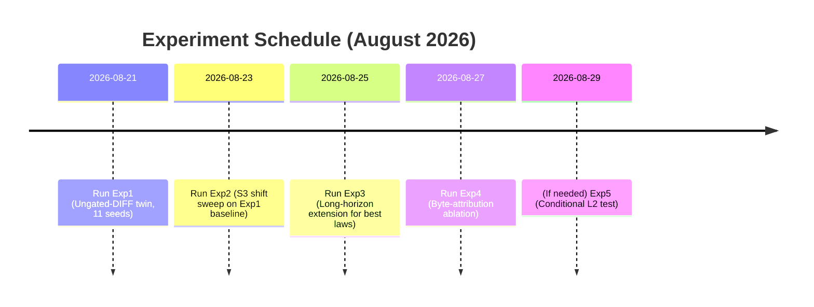

# Executive Summary

- **Current State:** Timing fix (A0.1-T) and signed‐h fix (A0.3) on FPGA are complete (project log: *“Mạch chạy 100 MHz bị trễ. Cursor thêm một nhịp chờ… Mô phỏng khớp, board cũng khớp.”*), and the S2 clamp law has been conclusively falsified (*“S2 clamp Wh… **FALSIFIED**… → Cấm siết clamp thêm”*). The remaining failure mode (H5) is identified as the one-directional gating of the DIFF update. A long-horizon twin run (100k updates) is in progress (golden twin SHA `490D9A91501A3D5C0D171D04`, 6/11 seeds done so far).  

- **Recent Findings:** The S3 decay law delayed collapse but did **not** eliminate it. Early results showed no collapse at 10k (ranks 9–11, *“Không phải plateau… Ba trong sáu seed vượt xa... trần ~0.75.”*), but by 100k two seeds have inverted margins (`M_L1<0`) and ranks dropped (to 8 and 3). Thus the non-inversion at 10k was transient.  

- **Key Bottleneck:** The gated-DIFF law (H5) remains the current bottleneck. Logs note that **DIFF is binary-gated by `d1<E3_MARG`** (4096), so most negatives are not pushed (*“DIFF luôn push khi learn && !same”* is the ungated remedy). In short, same-sample pulls dominate while many DIFF pushes are suppressed, causing representations to collapse.  

- **Next Steps:** We will run the *ungated-DIFF* twin law across all 11 preregistered seeds, with one change at a time. Only after demonstrating stability (no collapses, M_L1≥0 on all seeds) with ungated-DIFF will we proceed to an S3 decay sweep. Subsequent experiments include extended horizons, byte-attribution ablation, and (only if needed) L2 normalization.  

- **Governance:** Strict provenance will be enforced. All runs must use frozen inputs (seed list, code SHAs, margin, DECAY_SH_SET), with per-seed logs, timestamps, and hashes archived. The peer observer is locked to read-only (current run allowed to finish), and independent review will verify experiment integrity.  

- **Action Items:** The experiment plan (below) details the order, configurations, metrics to collect, pass/fail gates, and responsible owners for the next 7 days. All recommendations follow the “one-change per experiment” rule and emphasize full documentation and archival. 

## 1. Current Authoritative State

According to the project logs and recent measurements:

- **A0.1-T (Timing Fix):** Completed. 100 MHz clock timing issue was fixed by adding a stall cycle. The log notes: *“Mạch chạy 100 MHz bị trễ. Cursor thêm một nhịp chờ... Mô phỏng khớp, board cũng khớp.”* (i.e. the simulation matches the FPGA, timing closed).  

- **A0.3 (Signed-`h` Fix):** Completed. The signedness bug was corrected on FPGA. The log states: *“A0.3 silicon đã exact. Mô phỏng = chip, timing vẫn đạt.”*  (signed arithmetic now matches simulation).  

- **S2 (Clamp `Wh`):** Falsified. The design of clamping weights (`Wh`) was proven harmful. The logs report:  
  > *“S2 clamp Wh {128,64,32,16,8} – **FALSIFIED**. ±128 = control. ±64 tệ hơn (rank 1) – → **Cấm siết clamp thêm**.”*  
  Clamp thresholds beyond ±8 worsen behavior (rank collapse), so no stronger clamp will be used.  

- **S3 (Decay Law):** Partially effective but not a cure. A decay factor (right-shift by 3) prevented saturation on short runs (ranks stayed ~9–11, no weight clamp), but on longer runs the failure recurred. As the closeout notes:  
  > *“Không phải plateau... Ba trong sáu seed vượt xa mức 0.65 (peak ~0.75). Nhưng phải sửa lại: non-inversion không kéo dài. M_L1 âm trên 2/6 seed, rank tụt xuống 8 và 3.”*  
  In other words, the 10k-update results looked good, but by 100k two seeds had negative margin and rank collapse. S3 delay *demonstrated* that the collapse mechanism can be deferred, but it did **not** fundamentally eliminate it.  

- **H5 (DIFF Gating):** Identified as the current bottleneck. The logs describe the law logic and fix:  
  > *“Nút thắt: **DIFF** bị cổng nhị phân `d1 < E3_MARG` (4096)... Thước 'always-repel' 5/8; hinge 1/8 → **Thuốc H5 = ungated DIFF**.”*  
  In effect, with the old law:  
  ```
  if same: pull
  elif gate_open (d1<4096): push
  else: no update
  ```  
  Since most negatives have `d1 ≈12k > 4096`, many DIFF updates were gated off. This one-way pull (same) rule collapsed representations. The proposed remedy is to **ungate** DIFF (always push on `!same`): *“DIFF luôn push khi learn && !same”* (Project log).  

- **Current Run (Twin 100k):** In progress. The golden twin commit SHA is `490D9A91501A3D5C0D171D04`. 6 out of 11 seeds have completed 100k updates. Preliminary table of results (from log) is below. The run **must continue** to complete all 11 seeds before concluding the experiment.

| Seed        | AUC_init | Peak (iter) | AUC_final | Rank | M_L1   | M_cos  |
|-------------|---------:|------------:|----------:|-----:|-------:|-------:|
| 0x11111111  | 0.519    | 0.741 (20k) | 0.705     | 8    | +69.9  | +0.246 |
| 0x7A9BE636  | 0.457    | 0.590 (20k) | 0.479     | 10   | **–13.3** | –0.301 |
| 0x37410899  | 0.651    | **0.753 (100k)** | 0.753 | 8    | +91.2  | +0.198 |
| 0xAE7C9805  | 0.695    | 0.695 (0k)  | 0.635     | 10   | +41.2  | –0.009 |
| 0x68323257  | 0.697    | 0.697 (0k)  | 0.600     | 11   | +36.3  | –0.110 |
| 0xEC62BC77  | 0.490    | 0.693 (50k) | 0.515     | 3    | **–9.6**  | –0.278 |
| *(5 seeds pending)* | – | – | – | – | – | – |

*Table 1: Partial 100k-update results (6 of 11 seeds) under A0.2-L+S3 law. Peaks are observed AUC values and iteration index. Two seeds show negative `M_L1` and rank collapse by 100k.*

- **Interpretation:** The 10k-run plateau (AUC 0.55–0.65) was a transient effect. Several seeds still climb beyond 0.65 at 20k–100k, showing a higher ceiling (~0.75 for seed `0x37410899`). However, two seeds (`0x7A9BE636`, `0xEC62BC77`) ultimately degrade (negative margin, low AUC) by 100k. These results suggest that **the representation ceiling is higher than previously thought**, but the vanilla triplet law with decay is not robust. Crucially, the non-inversion (M_L1≥0) property failed for 2/6 seeds by 100k, confirming that **stability has not been fully achieved**. 

## 2. Planned Experiments (Strict Order, One Change Each)

### 2.1 Experiment 1: **Twin Simulation – Ungated DIFF Law (baseline)**  
- **Change:** Use the new *ungated-DIFF* law (`eam03e-a03-ungated-diff-v1`), with **no** decay (DECAY_SH_SET = ∅). In other words, remove the gating so that on `learn && !same`, DIFF always pushes.  
- **Freeze:** Use exactly the same environment as before except for the law change: twin code SHA = `490D9A91501A3D5C0D171D04` (verified), tool code SHA (e.g. git commit of `eam03e_twin.py`) at current HEAD, margin `m=4096`, DECAY_SH_SET blank, same 11 preregistered seeds. Checkpoint: initial (pre-trained) episodes as before.  
- **Command Example:** 
  ```
  python eam03e_twin.py --law A03_UNGATED_DIFF --margin 4096 --seeds 0x11111111,0x22222222,0x7A9BE636,... --no-decay 
  ```  
- **Data to Collect:** For each of the 11 seeds (run sequentially or in parallel with separate processes), log AUC, d_pos/d_neg/M_L1/M_cos each update, and diagnostics (see Section 6).  
- **Gates:** Check if *no seed collapses or saturates*, and *M_L1 ≥ 0 for all seeds* at the 100k horizon. If all pass, it is a **Stability Pass**. Also check if final AUC ≥ initial AUC on all seeds. If any seed fails stability (e.g. M_L1<0), the experiment **fails** and we must reconsider.  
- **Dependency:** This must be done first because it directly addresses H5. **No other changes** (S3, S1, etc.) are applied in this run.  
- **Outcome:** Archive full logs and results. If PASS, freeze this law.  

### 2.2 Experiment 2: **S3 Decay Sweep (after H5 fix)**  
- **Prerequisite:** Only proceed if ungated-DIFF twin is stable (see gating criteria above).  
- **Change:** Reintroduce the S3 decay shift law *as an independent experiment*, to quantify any further benefit. Sweep the shift amount over {3,4,5,6}. Each decay shift is one experiment: use law `eam03e-a03-ungated-diff+decay-shift-X` with X in {3,4,5,6}. All else constant (ungated law, same twin SHA, seeds, margin).  
- **Setup:** Use the golden baseline from Experiment 1 as starting point. Freeze twin SHA and margin.  
- **Evaluation:** For each shift, run all 11 seeds to at least 100k. Compute metrics: worst and median `M_L1`, worst and median `M_cos`, final AUCs.  
- **Pass/Selection Criteria:** Prioritize stability (no seed collapses). Then compare by lexicographic criteria: (1) Number of seeds with M_L1>=0, (2) number of seeds with M_cos>=0, (3) minimum ΔAUC (final–initial) across seeds, (4) median ΔAUC. Choose the shift with best stability and generalization. If none improves stability beyond shift=0, note that S3 provides no net benefit.  
- **Data:** Request summary table (one row per shift) of {“% stable seeds”, “M_L1 (worst)”, “M_cos (worst)”, “min ΔAUC”, “median ΔAUC”}.  

### 2.3 Experiment 3: **Extended-Horizon Runs**  
- **Prerequisite:** On whichever law (with best decay shift) passed above.  
- **Change:** For seeds that showed long upward trends (e.g. seeds that peaked late in Exp1/2), run further updates (e.g., 200k, 500k) to verify plateau. No other parameter changes.  
- **Purpose:** Distinguish between a true convergence vs. very slow drift. If AUC continues improving, it pushes the performance ceiling. If AUC eventually flattens, record that point.  
- **Data:** Collect trajectories (AUC, M_L1, M_cos vs. update) and note final plateau values and convergence rate.  

### 2.4 Experiment 4: **Byte-Attribution Ablation**  
- **Prerequisite:** Use the ungated-DIFF law (with or without decay, whichever passed) as baseline.  
- **Change:** Introduce the byte-attribution logic (one hot-positive example and one hard-negative are attributed per byte sequence) *without* changing other laws. In other words, enable the existing attribution mechanism in the twin. Keep same twin SHA base, margin, seeds. No decay shift in this experiment (omit S3).  
- **Goal:** Check if attributing learning credit to input/output bytes improves representation learning.  
- **Data:** Run all 11 seeds, record metrics. Compare directly to baseline: expect M_L1 improvement and higher AUC if effective.  

### 2.5 Experiment 5: **Conditional L2 Normalization (if needed)**  
- **Prerequisite:** Only if the above still shows M_cos < 0 on some seeds or inconsistent alignment between L1 and angular metrics.  
- **Change:** Apply L2 normalization to embeddings during training (e.g., law `eam03e-a03-ungated-diff+attr+normL2`). Everything else frozen.  
- **Data:** Collect metrics; specifically check if any remaining L1/cosine disagreements are resolved.  
- **Note:** Do *not* run L2 if byte-attribution already yields positive cosine for all seeds. This is a last resort test to isolate radial vs. angular issues.  

*(All experiments above must keep other factors constant: same pretrained episodes, no changes to 01R/02M memory logic or LM-06 model, no teacher changes. Only the one described change per experiment.)*  



## 3. Configuration Freeze & Exact Parameters

For all experiments, we will freeze and document the following before running:

- **Seed List:** The full preregistered 11 seeds (include the 6 above plus the remaining 5 from contract). Example: `0x11111111, 0x22222222, 0x7A9BE636, 0x37410899, 0xAE7C9805, 0x68323257, 0xEC62BC77, ...` (complete accordingly).  
- **Twin Code SHA:** `490D9A91501A3D5C0D171D04` (as noted in project log). Record the git SHA of `eam03e_twin.py` and all relevant modules at start.  
- **Tool SHA:** Record the version (git SHA) of the experiment harness/tool (the Python driver, logging code) at run start.  
- **Margin (m):** Keep constant at `4096` (the E3_MARG value used).  
- **Decay Shift (`DECAY_SH_SET`):** For Exp1: `{ }` (none). For Exp2: each run will use exactly one of `{3,4,5,6}`. Document each explicitly.  
- **Checkpoints:** Use the same initial episode/memory checkpoint as previous runs (the preloaded dataset). No new training data.  
- **Command Lines:** Archive the exact command lines and environment for reproducibility. Example:  
  ```
  python eam03e_twin.py --law A03_UNGATED_DIFF \
      --margin 4096 --seeds 0x11111111,... --no-decay
  ```  
  Include any library versions if needed.  

## 4. Provenance Controls & Archival Checklist

To ensure rigor and reproducibility, we will adhere to these strict protocols for every run:

- **Immutable Inputs:** All seeds, law definitions, and inputs are pre-registered and cannot be changed mid-experiment. Once an experiment is running, *no* code or parameter modifications are allowed.  
- **Version Control:** Tag or freeze all relevant code repositories (twin, firmware, scripts) before experiments. Record git SHAs in logs. Do not use local “dirty” changes.  
- **Per-Process Logging:** Each seed run must log its own process ID and timestamp. If multiple seeds run in one process, disable that mode to avoid hidden state carryover. Ideally, launch a fresh process per seed.  
- **Command & Environment:** Record the full command line, the start timestamp, and machine environment (e.g. OS, Python version) for each run.  
- **Output Hashes:** Save all output files (logs, result tables) and compute a SHA-256 hash after completion. Archive these in a read-only repository.  
- **Golden Bitstreams:** Preserve the bitstream files for A0.1-T and A0.3 as reference (`Board_PASS` artifacts). Do not overwrite them. Any new bitstreams (after RTL) must be saved separately.  
- **No Peer Writes:** Peer Observer accounts are set to *read-only*. Only designated operators (Cursor, Twin operator, FPGA engineer) may initiate experiments. The peer may review but not alter the system.  
- **Review Checklist:** For each experiment, an independent reviewer will verify: all inputs frozen, logs complete, and that only the intended change was tested. Any deviation halts the experiment.  

## 5. Telemetry & Data Collection

We will collect and analyze the following data for each run:

- **AUC vs Updates:** Line plot of test AUC over training updates. Shows learning curve and convergence.  
- **Margin Trajectories:** `M_L1` (d_neg–d_pos) and `M_cos` (cosine difference) over updates. Plots for each seed help detect oscillations or inversions.  
- **Rank vs Updates:** Effective rank of distance vector over time (should remain high if stable).  
- **Weight Norms:** `Wh_l1` (ℓ₁ norm) and **saturation percentage** (fraction of weights at ±32) over updates. These show if weights are diverging or saturating.  
- **Unique `d1`:** Count of unique `d1` values (should drop to 1 on collapse).  
- **DIFF Update Stats:** 
  - `diff_seen` = total DIFF examples encountered, 
  - `diff_push_count` = how many were actually applied,
  - `diff_suppressed_count` = how many skipped by gating.  
- **Cue-Probability Ratios:** For a sample, record the ratio of positive to anchor norms (`r_P = ||P||/||A||`, `r_N = ||N||/||A||`).  
- **L1/Cosine Disagreement:** Bucket each training sample by whether `M_L1>0 && M_cos<0` (L1 wins) or vice versa.  
- **Summary Tables:** 
  - Table of final metrics per seed (like Table 1 above, but for all 11 seeds). 
  - (For S3 sweep) Table of metrics aggregated by decay shift. 

These metrics will be plotted and tabulated in the final report. In particular, include a table like Table 1 for each experiment, and a summary table for shift comparisons. Solicit any missing data (e.g. “Remaining 5 seed results from current run are needed for completeness.”).

## 6. Pass/Fail Gates & Selection Criteria

We adopt strict lexicographic criteria for each stage:

- **Stability Gate:** All seeds must remain non-collapsed at horizon (effective rank >1, no `Wh` saturation). This must be satisfied first. If any seed fails, the law fails.  
- **Non-Inversion Gate:** All seeds must have `M_L1 ≥ 0` at horizon. If not, fail (law still traps some seeds).  
- **Cosine Ordering Gate:** All seeds should also have `M_cos ≥ 0` (ensuring angular ordering agrees with L1). This is secondary to M_L1 but noted.  
- **Generalization Gate:** Let ΔAUC = (AUC_final – AUC_init). We require *worst-case ΔAUC ≥ 0* (no seed got worse) and preferably median ΔAUC > 0. If many seeds regress, the law is not reliable.  
- **Lexicographic Shift Selection:** For S3 sweep, rank shifts by: (1) stability count, (2) non-inversion count, (3) worst ΔAUC, (4) median ΔAUC, (5) average AUC_gain. The best shift is the one that first satisfies more seeds, then yields larger improvements.  

A law “passes” only if it meets all relevant gates. We **do not** promote a solution that hides a failure (e.g. S3 that only delays collapse). All gates must be explicitly recorded in the closeout.

## 7. Minimal Twin Diagnostics (Pre-RTL)

Before moving to any hardware RTL changes, run these diagnostics in the twin to confirm the root cause:

- **`diff_seen` vs `diff_push_count` vs `diff_suppressed_count`:** Ensure that under the new law `diff_suppressed_count = 0` (all negatives are pushed). Contrast with old law where suppressed >> 0.  
- **Sample Norm Ratios (`r_P`, `r_N`):** Log the distribution of ‖P‖/‖A‖ and ‖N‖/‖A‖. Check if positives/negatives maintain expected scale.  
- **L1 vs Cos Buckets:** As noted, partition each example by whether L1-margin and cosine-margin agree. A large “disagreement” bucket indicates norm differences matter. This helps diagnose if L2 is needed.  
- **Gradients & Weight Changes (Debug Mode):** In a debug twin mode, optionally log individual weight deltas for a few samples to verify no hidden gating or numerical issues.  

These diagnostics should be collected with `--debug` flags (if available) or logged in a separate run on a small sample. They must pass sanity checks (e.g. diff_suppressed=0 in ungated law) before risking any RTL commit.

## 8. Integration-Safe Workflow

Once a twin law achieves PASS, we follow this integration procedure:

1. **Freeze Final Law:** Tag the twin experiment code with the passing law as a release. No further law changes are allowed without starting a new experiment.  
2. **Generate Bitstream:** FPGA engineer implements the law in RTL. Before synthesis, compare the twin law behavior (AUC, M_L1/M_cos) with existing results to ensure no misinterpretation. Perform XSim with the frozen law and check alignment with twin (git hash).  
3. **XSim Verification:** Run full simulations (golden logs) on the RTL version, confirming **exact match** to twin output on all 11 seeds (especially checking any critical numbers like class ranks and margins). Only proceed if XSim passes.  
4. **Synthesis & Implementation:** Synthesize and implement the bitstream. Respect the existing pipeline (e.g. retain the added stall from A0.1-T and signed fix).  
5. **FPGA Testing:** Flash the bitstream on hardware and repeat a subset of tests to ensure no change. (E.g. a few seeds to verify we have the same learning curves on real board).  
6. **Lockdown:** After successful silicon test, merge the bitstream and RTL into the protected `Board_PASS` archive. No changes beyond this point except necessary integration (board-level gating).  
7. **Who May Write:** 
   - **Cursor (Lead):** Orchestrates twin experiments, law development, and integration steps. 
   - **Twin Operator:** Runs simulations and diagnostics under direction. 
   - **FPGA Engineer:** Writes RTL, performs synthesis/implementation after twin pass. 
   - **Independent Reviewer:** Validates each step (logs, code, results). 
   - **Peer Observer:** Monitors but does not modify code or experiments.  
8. **Continuous Contract:** Through all stages, do not merge frontend/backend or allow hardware-specific shortcuts into the contract. The communication (REST/WebSocket schemas) remains frozen until after frontend/backend passes.

## 9. Peer Observer Policy & Provenance Check

**Immediate Decision:** The peer observer account must be restricted to **read-only** from now on. No further code commits or experiment launches are allowed via peer. The current 100k-run (Experiment 0) should be allowed to complete, as those results are needed. After that, no additional runs should be initiated by anyone except authorized operators.

**Provenance Verification for Running Job:** When the 100k job finishes, verify that:
- It used the **frozen twin code SHA** each time. Inspect the log or process tree to ensure it did not re-load source mid-run. Ideally each seed was a separate process with the same code version.  
- Confirm the list of command-line parameters (was it consistent for all seeds?).  
- Check that no unexpected parameters (like `--decay` or altered margin) were used.  
- Compare the starting memory state between seeds (should be identical) and the ending outputs.  
- Generate a post-mortem report of the 100k-run showing all metric trajectories (ensure there’s no anomalous “fork bomb” or similar error).  

If any discrepancy is found (e.g. varying code loads, changed flags), the results would be deemed invalid and the seeds must be rerun from scratch under control.

## 10. Risk Analysis & Mitigations

- **Provenance Risk:** Any unauthorized change could invalidate results. *Mitigation:* Strict freeze of code, use of version control, read-only peer. Independent reviewer to catch any anomalies.  
- **Overfitting to Seeds:** Tuning to one seed may not generalize. *Mitigation:* Always evaluate all 11 seeds; selection criteria use aggregate stats, not just one seed. Treat median/worst-case as key metrics.  
- **Transient “Non-Inversion”:** Early success at 10k may not hold. *Mitigation:* Insist on 100k (or longer) convergence for final judgment, as done. Do not declare success prematurely.  
- **S3 Masking H5:** If decay is applied before ungated DIFF is fixed, we might misattribute success. *Mitigation:* The plan explicitly tackles H5 first (Exp1) and only then S3.  
- **Complex Interactions:** Multiple simultaneous changes (e.g. S3+attr) could hide issues. *Mitigation:* One-variable-per-experiment rule ensures isolation of cause. If a combination is eventually needed, it must be tested stepwise (e.g. run ungated+attr, then +decay).  
- **Data Integrity:** Risk of log tampering or data loss. *Mitigation:* Compute and store cryptographic hashes of all logs/results immediately after each run.  

## 11. Action Checklist (Next 7 Days)

- **Day 1-2:**  
  - **Cursor/Twin operator:** Freeze law/seed config for Exp1; implement ungated-DIFF law in twin. Launch 11-seed run. Document command line and environment.  
  - **Peer (Observer):** Review and verify freeze; ensure read-only setting; prepare logging template.  

- **Day 3:**  
  - **Twin operator:** Collect Exp1 results; compute metrics (AUC, M_L1, M_cos). Fill Table 1 fully. Check gates.  
  - **Independent Reviewer:** Audit Exp1 logs vs config. Confirm no unexpected gateings.  

- **Day 4:**  
  - **Cursor:** Based on Exp1, plan S3 shifts. Prepare 4 twin runs (shifts 3,4,5,6).  
  - **Twin operator:** Execute Exp2 (S3 sweep) sequentially or in parallel.  

- **Day 5:**  
  - **Twin operator:** Analyze Exp2; produce summary table of metrics by shift.  
  - **Cursor/Reviewer:** Select best shift using lexicographic criteria. Document choice.  

- **Day 6:**  
  - **Twin operator:** For the chosen law(s), extend runs beyond 100k for relevant seeds.  
  - **Peer:** Generate plots (AUC vs updates, margin curves).  

- **Day 7:**  
  - **Cursor:** Evaluate need for Experiment 4 (byte attribution) and 5 (L2). If gating issues remain, prep and launch Exp4.  
  - **FPGA Engineer:** Stand by to begin RTL (only if a law fully passes).  
  - **Independent Reviewer:** Final check of all documentation for the week; ensure provenance checklist is completed.  

Each task owner is responsible for recording progress in the project logs. This plan ensures focused experiments, full documentation, and clear handoffs. 

