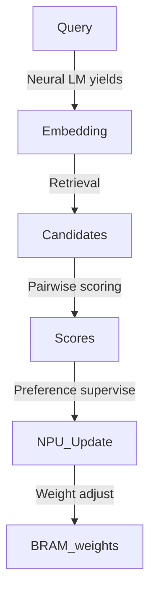

# Executive Summary  
This report analyzes **Native Preference Update (NPU)** for FPGA-based AI: a pairwise hinge-margin learning rule executed on-chip. NPU uses a simple **ranking hinge loss** and saturating weight updates, in contrast to the probabilistic gradients of DPO. Formally, with positive/negative candidate feature vectors \(φ^+,φ^-\), margin \(m\), and scores \(S^\pm = w^\top φ^\pm\), NPU uses 
\[
L=\max(0,\;m - (S^+ - S^-)), 
\quad
w \leftarrow 
\begin{cases} 
w + \eta (φ^+ - φ^-), & S^+ - S^- < m,\\
w, & \text{otherwise},
\end{cases}
\]
with saturating fixed-point arithmetic. Variants include fixed-step hinge (above), **Passive-Aggressive (PA)** (optimally scaling the update step) and **margin-scaled** (dynamic η proportional to violation).  

Mathematically, NPU has perceptron-like convergence guarantees under linear separability (mistake bound by the inverse square margin). Excessively large learning rates or saturation may cause oscillation or stability loss, so η is tuned modestly. PA-type updates solve a min-norm problem to satisfy the margin, yielding \(\tau = \frac{m - (S^+ - S^-)}{\|φ^+ - φ^-\|^2}\) updates, but at hardware cost. Margin-scaled rules (e.g. passive-aggressive I/II) adapt step size to violation but require extra divides or tables, complicating fixed-point logic.  

Unlike DPO (Direct Preference Optimization) which reframes RLHF as a probabilistic binary cross-entropy on a Bradley–Terry model, NPU is purely discriminative. DPO adjusts model log-probabilities via gradient descent to satisfy preferences; NPU uses a **deterministic hinge update** (akin to RankSVM/perceptron). In short, DPO = *logistic classification on preferences*, NPU = *hard-margin perceptron updates*.  DPO’s “simple binary cross-entropy” loss contrasts with NPU’s max-margin hinge. This makes NPU much simpler to implement (no softmax, no floats), though less theoretically “optimal” probabilistically.  

Constrained by **Native AI’s frozen LM-06** and memory hierarchy, NPU can only adapt small weight vectors (e.g. relation/score weights) in on-chip BRAM, without touching DDR-held LM-weights. It must obey the teacher-off rule: *only pairwise preferences and curriculum labels* are host-provided, **no host-provided winner indices or gradients**. All operations must be fixed-point and fit within limited BRAM (e.g. 132 tiles) and DDR bandwidth.  

We propose a hardware datapath for NPU: each query generates candidate feature vectors \(φ_i\). For a supervised pair \((φ^+,φ^-)\), the FPGA computes scores \(S^\pm=φ^\pm\cdot w\) via parallel multiply-add (one MAC per feature). A comparator checks \(S^+ - S^-\ge m\). On violation, it computes \(Δφ=φ^+ - φ^-\) (a small vector difference), scales by η, saturates, and adds it into the weight BRAM. Mermaid flowcharts illustrate this (below).  

| **Variant**           | **Accuracy/Use**                         | **Hardware**                      | **Writeback Cost**        | **Stability/Notes**                     |
|-----------------------|------------------------------------------|-----------------------------------|---------------------------|------------------------------------------|
| **Fixed-step hinge (NPU)** | Good for separable preferences; simple | 1× MAC per feature; 1× vector subtract; saturating adds; no divisions | Writes D words on update (D=feature dim) | Can oscillate if η too large; saturating bounds weights. |
| **PA (Exact)**        | Optimal margin satisfaction; few errors | *Adds:* 1× norm², reciprocal, gain multiply; more DSPs/logic. | Same D-word writes. | Best theoretical bound, but heavy. Risky in fixed-point. |
| **PA-I/II (soft)**    | Like PA with slack/regularization | As PA + complexity for C-constant or slack. | Similar | More robust to noise, but still complex. |
| **Margin-scaled**     | Simplified PA: scale update by violation | Needs multiply by loss/||Δφ|| (or table). | Same | Intermediate, still needs norm or lookup. |

In hardware, fixed-step NPU is cheapest: it only needs multiplies and saturating adders. PA variants require division or square computations (or LUTs), so we **recommend NPU-v1 (fixed η)** for Native V1. 

**Hardware cost example:** For feature dim=32, 8-bit weights, 16-bit accumulator, one MAC per feature (32 DSPs) can compute each score in 1 cycle (fully parallel), or reuse 16 DSPs in 2 cycles, etc. A 32-bit subtract and multiply-by-η (constant) can use LUT logic and maybe 1 DSP. A saturating adder tree updates all 32 weight values (e.g. 2 cycles if 16-wide pipeline). For dim=64 or 128, resources roughly double. Tentatively: *each feature multiply-add* uses 1 DSP; saturating adder uses LUTs; weight storage uses \~D·8 bits of BRAM. Update throughput 0.1–10 per query translates to very few extra DDR writes: each update writes D weights (≤ 128), i.e. 128–512 bytes per update. We estimate for dim=64 at 100 MHz: ~64 DSPs, ~1000 LUTs, <10 BRAM tiles for weights. (Precise synthesis should be done by subagent.)  

**Mermaid diagrams:**  
```mermaid
graph LR
    A[Generate φ⁺,φ⁻] --> B[Fetch weight w from BRAM]
    B --> C[DotProduct: S⁺=φ⁺·w, S⁻=φ⁻·w]
    C --> D{Compare S⁺-S⁻ ≥ m?}
    D -- Yes --> E[No update (NPU stays)]
    D -- No  --> F[Compute Δφ = φ⁺ - φ⁻]
    F --> G[Scale Δw = η·Δφ]
    G --> H[Saturating Add: w += Δw]
```


**Experiments & Measurement Plan:** Implement NPU in simulation and on FPGA:  

- **Benchmarks:** Use synthetic preference tasks (random linear separable data, or real retrieval pairs). Also integration tests where “path A” vs “path B” preferences are labeled.  

- **Metrics:** 
  - *pairwise_accuracy* (fraction of correctly ranked pairs after update), 
  - *violation_rate* (fraction of updates triggered), 
  - *updates/query*, 
  - *DDR_writes/update* (bytes written for each weight update), 
  - *held-out preference accuracy* (like test accuracy on unseen pairs).  

- **Instrumentation:** counters for violations, update count, DDR writes (cycles in writeback), weight saturation events. Capture weights diff snapshots.  

- **Safety Controls:** 
  - **Mutant Swap Test:** If φ⁺ and φ⁻ are swapped, preference should invert; verifying that makes losses flip sign.  
  - **Zero-η Test:** Setting η=0 should yield no learning (baseline).  
  - **Persist/Reload:** After updates, read out weights back-to-back to ensure deterministic storage.  

- **Validation:** Compare NPU outputs to an *oracle* (software) large-margin solver on same data.  

This approach is *science-first*: no learning till retrieval path correctness (global Top-K etc.) is fixed. Once the system retrieves the correct positive/negative, NPU can be plugged in.  

# Key Findings and Recommendations

- NPU is a **valid native learning mechanism**: it respects frozen LM-06, uses only pairwise preferences, and requires no host gradient or winner/address hints.  
- *Algorithmically*, NPU ≠ DPO: NPU is a margin-based perceptron update; DPO is a full model logit optimization via cross-entropy. We emphasize NPU’s simplicity and hardware-safety (no complex ops) over DPO’s probabilistic optimality.  
- **Feasibility:** Given limited BRAM and DDR (241 KB bursts, 1.33 GB/s), NPU must minimize writes. We expect updates/query ≪ 1 (sparse training) to fit DDR throughput, and weight vectors of O(50) dims for BRAM.  
- **Next Steps:** Trial NPU in *simulation* only (do not yet integrate into MAIN retrieval loop). Start with small dim (32) and η tuning to ensure stable learning on test cases. Use subagent to synthesize and verify resource use.  
- **Gate-level Testing:** Create `TB_NPU.sv` (co-sim with golden updates). Check convergence on toy tasks. Instrument `train_state.json` for the required signals. 
- **Risks:** If step-size or saturation are mis-set, NPU can diverge. Also, DDR bandwidth for writes is limited; ensure updates remain rare and small.

# Sources  
- Keras Pairwise Hinge Loss documentation (ranking hinge formula).  
- DPO paper (NIPS 2023) for how its loss is cross-entropy on preferences (contrasting NPU’s hinge).  
- Crammer *et al.* (JMLR 2006) for Passive-Aggressive background.  
- LoRA paper for the frozen-weight + low-rank adapter concept (analogy of freezing LM and small adapter updates).  
- BitNet and quantization literature (e.g. BitNet b1.58) on low-bit regimes for context of weight storage tradeoffs.  

