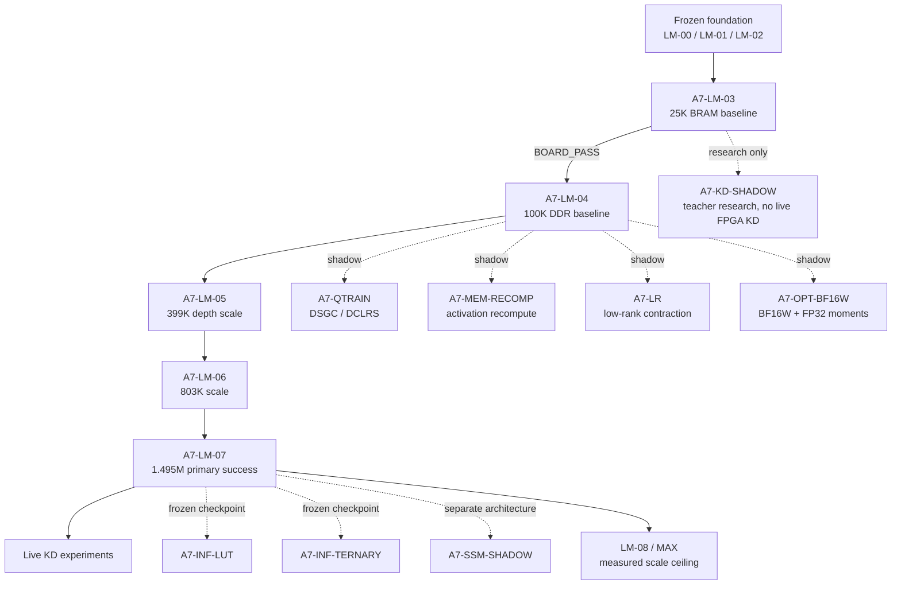
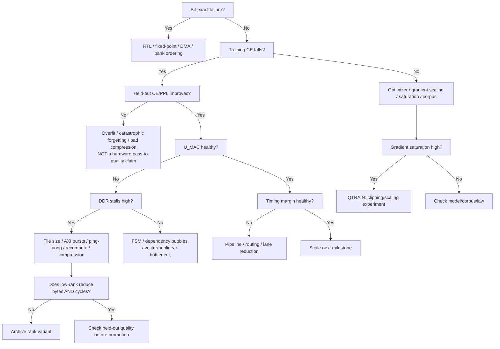
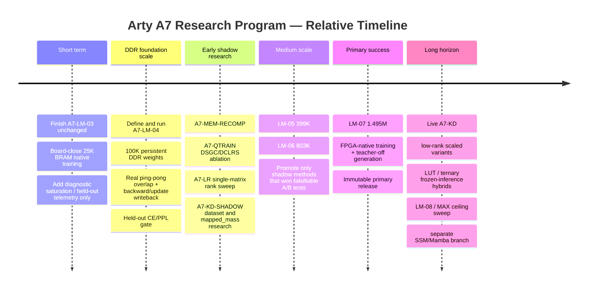

# Revised Arty A7 Program Master: Memory-Centric, Quantized, and Distillation-Aware Milestone Plan

**Program-roadmap authority:** this file is the **sole** active program roadmap.  
**Deprecated for architecture / order / law / DDR interface / gates / next tasks:** `Arty A7-100T Native Online-Training Transformer Program.md` (historical provenance only).  
**Updated:** 2026-08-18 — A7-LM-04 R5 closed BOARD_PASS with a bounded target-switch adaptation claim. LM-00…04 evidence is frozen and is **not** retroactively redesigned.

## Current program state

| Milestone | Status | Persistent weights | Notes |
|---|---|---|---|
| **A7-LM-00** | **BOARD_PASS / FROZEN** | n/a (compat port) | Immutable release + SHA |
| **A7-LM-01** | **BOARD_PASS / FROZEN** | n/a (DDR/MIG) | Official Digilent AXI MIG; `mig.prj` unchanged |
| **A7-LM-02** | **BOARD_PASS / FROZEN** | n/a (tensor engine) | 128-lane AXI DMA + BRAM tiles |
| **A7-LM-03** | **BOARD_PASS / FROZEN** | **BRAM** | P=25,088; V=128 C=16 d=32 L=2 H=2 d_ff=64; `law_id=lm05-signsgd-v1`; claim `ARTY_A7_25K_ONLINE_LM_BOARD_VALIDATED` |
| **A7-LM-04** | **BOARD_PASS / FROZEN (R5)** | **DDR** | P=100,352; exact DDR persist/update, first-try K513 and multi-token parity; bounded target-switch claim. R3/R4 retrieval failures remain. |
| **A7-LM-05** | **OPEN** (user 2026-08-18) | **DDR** | Depth=4 / 399,360. R5 WNS +0.157 does not meet the separate +0.20 timing authorization threshold. |

**Authoritative spine:** LM-04 → LM-05 → LM-06 → LM-07 → LM-08 → LM-MAX.  
**Shadow / research only (cannot close an A7-LM contract):** A7-MEM-RECOMP, A7-QTRAIN, A7-LR, A7-OPT, A7-KD-SHADOW; later A7-INF-LUT, A7-INF-TERNARY, A7-SSM, A7-PEFT.  
**Post-MAX:** freeze Transformer as control; A7-NFA-* alternates with XREF; then A7-XCOMPARE. Do not grow Transformer params after MAX merely because DDR still has room.  
**DDR interface:** official Digilent **AXI MIG** (not native `app_*`).  
**Authority order:** board evidence > `docs/contracts/A7-LM-xx.md` > immutable BOARD_PASS releases > this file > research-branch docs > papers / NotebookLM / ChatGPT / Grok. AI output cannot declare BOARD_PASS.

A7-LM-03 frozen properties (do not rebuild/redesign because this Master was drafted while 03 was OPEN):

```text
P = 25,088
V=128, C=16, d=32, L=2, H=2, d_ff=64
law_id = lm05-signsgd-v1
persistent LM-03 weights = BRAM
claim = ARTY_A7_25K_ONLINE_LM_BOARD_VALIDATED
```

## Executive summary

The central recommendation is **not to replace the existing A7-LM architecture with NeuronFabric, tensor compression, LUT-LLM, ternary arithmetic, or Mamba**. The strongest program is to preserve the current **contract-first A7-LM ladder as the authoritative scientific spine**, while introducing those ideas as explicitly named, falsifiable research branches that can be promoted only after they outperform the baseline on the Arty A7 itself.

That matters because the current program already has something the literature does not provide for this exact board: A7-LM-00…**04** are **BOARD_PASS / FROZEN**. A7-LM-03 is the 25,088-parameter BRAM baseline, while A7-LM-04 R5 is the 100,352-parameter DDR baseline under `lm05-signsgd-v1`, with the bounded claim `ARTY_A7_100K_DDR_ONLINE_LM_BOARD_VALIDATED`. The official Digilent **AXI MIG** path is fixed. Research recommendations cannot retroactively modify those releases.

The most important correction from the literature review is that **NeuronFabric is not yet an FPGA-training result**. Its June 2026 paper explicitly describes a software reference architecture, reports a C# implementation and CPU/GPU experiments, and states that FPGA implementation remains future work with no FPGA timing or measurements yet reported. Its valuable contribution to this program is therefore the **local-update philosophy, BF16-weight/FP32-moment memory accounting, activation recomputation, weight tying, and vocabulary-budget analysis**, not a hardware result to reproduce verbatim. citeturn12view0

By contrast, *Ultra Memory-Efficient On-FPGA Training* does report end-to-end Transformer training on an AMD Alveo U50. It uses low-rank tensor compression plus a bi-directional contraction flow to reduce computation and intra-layer memory, reporting 30–51× lower training-memory demand in its evaluated setups while using less than 6 MB BRAM and 22.5 MB URAM. That makes **low-rank/tensor contraction the most strategically interesting long-term training-scale idea in the three core papers**, but the U50 is so much larger than an XC7A100T that the concept must be re-derived for DDR-backed tiled execution rather than copied literally. citeturn14academia0turn15view5

LUT-LLM and TerEffic should be treated differently. Both are compelling **inference architectures**, not evidence that mutable online-training state can be handled by the same machinery. LUT-LLM shifts vector-quantized linear computation toward 2-D table lookups and reports a 4× arithmetic-operation reduction on its V80 implementation; TerEffic targets ternary inference and aggressively reduces weight footprint. These are excellent candidates for a **teacher-off AFTER/inference branch**, but integrating them into the authoritative training datapath before A7-LM-07 would make the scientific program harder, not stronger. citeturn15view2turn13view4turn9academia3

The practical priority I recommend is therefore:

**A7-LM-03:** **BOARD_PASS / FROZEN.** Change nothing architectural. The 25K BRAM-resident baseline is closed under its existing contract and must not be rebuilt because this Master was drafted while 03 was still OPEN.

**A7-LM-04:** **BOARD_PASS / FROZEN at R5.** It is the first **100,352-parameter DDR-resident trainable model** under the current INT8/fixed-point law. It closes the DDR → ping/pong BRAM → DSP → backward/update → DDR loop and proves bounded target-switch online adaptation, not 8-way retrieval or open-domain language modeling.

**Between LM-04 and LM-07:** prioritize **activation recomputation** and **DSGC/DCLRS-inspired INT8-gradient stabilization** first because they preserve most of the existing datapath; study **low-rank contraction** next because it offers the largest potential scale benefit but changes the model law substantially. BF16W/Adam should remain a separate optimizer branch because, relative to your current INT8/sign-SGD baseline, it actually **increases**, rather than reduces, persistent bytes per parameter.

**A7-LM-07:** retain approximately 1.495M parameters as the primary authoritative success target. Only after that should LUT/ternary frozen-inference variants, live multi-teacher KD, SSM/Mamba experiments, and aggressive 4M–10M ceiling probes become eligible to influence the main architecture.

The proposed program structure is:



This preserves the existing master principle:

> **FITS ≠ RUNS ≠ TRAINS ≠ CONVERGES ≠ USEFUL.**

That rule is already embedded in the contract-first program and should become even more important once compressed or probabilistic methods are introduced. fileciteturn0file0

## Research synthesis mapped to the Arty A7

### Working assumptions and immutable constraints

For this revision I treat the following as program-authority inputs rather than things literature may change:

| Constraint | Program interpretation |
|---|---|
| A7-LM-00/01/02/03/04 | `BOARD_PASS / FROZEN` |
| Current milestone | **A7-LM-05 OPEN** |
| A7-LM-03 model | 25,088 parameters; BRAM-resident; immutable |
| Current numerical law | `lm05-signsgd-v1` |
| DDR interface | **Official Digilent AXI MIG; fixed** |
| External DDR | 256 MB |
| Current compute | 128 MAC lanes |
| Current scratchpad budget | Treat the stated **18 available BRAM tiles** as a project-level budget |
| Exact geometry of those 18 tiles | **No specific constraint** until the relevant implementation report fixes it |
| New optimizer/precision law | Must receive a new `law_id`; cannot silently replace the frozen/current law |
| New literature technique | Shadow branch until its own falsification gates pass |

These current milestone and authority rules come directly from the contract-first Program Master. fileciteturn0file0 The XC7A100T itself has 240 DSP slices and 4,860 Kbit of on-chip memory according to AMD; Digilent specifies 256 MB DDR3L on the Arty A7. citeturn8search2turn3search0

The 256 MB memory system is not merely a datasheet assumption: your frozen A7-LM-01 evidence contains two complete 256 MB sequential traversals and a 100/100 recalibration ladder. The aggregate evidence records approximately 1.166 GB/s sequential read, 1.152 GB/s sequential write, 1.159 GB/s mixed throughput, about 0.533 GB/s random read, and 5.234 whole-memory equivalents transferred. fileciteturn0file13 The two full-memory passes independently report 1.173/1.145 GB/s and 1.166/1.152 GB/s read/write respectively. fileciteturn0file20 fileciteturn0file21

That immediately identifies the real scale problem:

\[
\text{capacity is generous, but bandwidth per training step is finite.}
\]

For example, LM-07 has only about 1.43 MiB of raw INT8 weights, far below 256 MB. The hard problem is repeatedly transporting weights, gradients, activations, and possibly optimizer state while keeping 128 MAC lanes useful. The current Program Master already recognizes this distinction and treats 8.45M/10.55M configurations as **ceiling probes**, not commitments. fileciteturn0file0

### What NeuronFabric really contributes

NeuronFabric's BF16W scheme stores each trainable weight in BF16, while maintaining Adam's two moments \(m\) and \(v\) in FP32. Its accounting is therefore:

\[
2\text{ B weight}+4\text{ B }m+4\text{ B }v
=10\text{ B/parameter},
\]

versus 12 B/parameter for an FP32 weight plus FP32 Adam moments. That is a **16.7% reduction relative to FP32 Adam state**, not a 5× or 10× saving. The paper's 334K configuration uses approximately 3.34 MB for BF16W+moments versus 4.00 MB for FP32+moments, and the software experiment reports held-out loss 1.5426 versus 1.5224 for its FP32 GPU reference. citeturn12view0

For GrOK, this creates a crucial inversion: **BF16W is not a memory-saving replacement for the current INT8/sign-SGD system**. If the current persistent state is essentially one INT8 weight per parameter and no Adam moments, switching to the paper's exact BF16W+Adam state moves from roughly 1 B/parameter to 10 B/parameter before considering transients. That is why BF16W belongs in an optimizer-quality branch, not the main memory-compression branch. This conclusion combines NeuronFabric's 10-B accounting with the Program Master's current INT8/sign-SGD law. citeturn12view0 fileciteturn0file0

Derived storage numbers illustrate the point:

| Model | Params | Current INT8 W | BF16W + FP32 Adam \(m,v\) | 1.6-bit ternary W only |
|---|---:|---:|---:|---:|
| LM-03 | 25,088 | 0.024 MiB | 0.239 MiB | ~0.005 MiB |
| LM-04 | 100,352 | 0.096 MiB | 0.957 MiB | ~0.019 MiB |
| LM-05 | 399,360 | 0.381 MiB | 3.81 MiB | ~0.076 MiB |
| LM-06 | 802,816 | 0.766 MiB | 7.66 MiB | ~0.153 MiB |
| LM-07 | 1,495,040 | 1.426 MiB | 14.26 MiB | ~0.285 MiB |
| LM-08 | 4,276,224 | 4.078 MiB | 40.78 MiB | ~0.816 MiB |
| MAX tied | 8,454,144 | 8.063 MiB | 80.63 MiB | ~1.613 MiB |

The BF16W figures are derived from NeuronFabric's 10 B/parameter state law; the model sizes come from the current Program Master. citeturn12view0 fileciteturn0file0 The ternary column is a theoretical packed-weight comparison only; it **does not include any latent/full-precision training state** that a practical ternary training algorithm might require.

NeuronFabric contributes two other ideas that are more immediately attractive. First, it recommends recomputing layer activations during backward instead of retaining every intermediate tensor, explicitly trading compute for SRAM. Second, it identifies a “vocabulary tax”: at small parameter budgets, embedding capacity can consume most of the model before the Transformer body has meaningful capacity left. Its 100K experiments show that this effect can be severe, and its 334K target uses byte-level vocabulary 256 partly for that reason. citeturn12view0

Those observations support the current LM-04 choice of a compact byte-level vocabulary much more strongly than they support switching to BF16.

### What tensor-compressed training contributes

The tensor-compressed FPGA-training work attacks both storage and arithmetic. The authors tensorize model parameters, train the compressed representation itself, and use a bi-directional contraction strategy intended to cut both contraction depth and intermediate-memory demand. On the Alveo U50 they report end-to-end, single-batch FPGA Transformer training on models whose original FP32 sizes span 36.7–93.5 MB, with less than 6 MB BRAM and 22.5 MB URAM and reported memory reductions of 30–51× relative to the uncompressed setup. citeturn13view0turn15view5

The right Arty lesson is not “expect a 30× model immediately.” The ranks and tensor shapes become new trainable/model-law variables; the U50 resource envelope is dramatically different; and the Arty design has a narrow DDR channel rather than the memory hierarchy used in the paper. The valid hypothesis is narrower:

> **If a linear matrix can be represented with sufficiently small tensor/low-rank factors without unacceptable held-out loss, factor streaming may reduce both DDR bytes and MAC count enough to increase useful training throughput on A7.**

That hypothesis is exceptionally valuable because it attacks the two variables most likely to matter beyond LM-07: **DDR traffic and operations per parameter**. It is therefore the highest-priority algorithmic compression branch after the clean DDR baseline exists. citeturn14academia0

### What LUT, ternary, INT8-gradient, and SSM papers contribute

LUT-LLM uses activation/weight vector co-quantization, centroid search, and 2-D table lookups to shift inference away from conventional arithmetic. Its V80/Qwen3-1.7B implementation reports a 4× reduction in arithmetic operations and higher generation performance/energy efficiency than the GPU baselines studied. The paper explicitly frames the hardware as an **LLM inference accelerator**, even though a model-conversion/training recipe is used to prepare LUT-compatible weights. citeturn15view2turn13view4

For an online-learning FPGA the challenge is obvious: when \(W\) changes, the code assignment, centroid relationships, or precomputed lookup values associated with \(W\) may become stale. I therefore recommend **never placing LUT-LLM in the mutable training loop until a separate experiment proves that lookup/codebook maintenance is cheaper than the computation it replaces**. In the near term it belongs after `FREEZE`, where the checkpoint is immutable.

TerEffic likewise targets inference. Its core principle—ternary weights \(\{-1,0,+1\}\) allowing multiplication to become selection/sign inversion rather than a general multiply—is extremely FPGA-friendly, and the design is explicitly motivated by removing off-chip bandwidth pressure. citeturn17academia0 The commonly cited TerEffic packing encodes five ternary values in one byte, yielding 1.6 bits/weight; this is consistent with the simple information argument \(3^5=243<256\). The original paper establishes the ternary inference architecture, while an Artix-7 implementation inspired by it also documents the 1.6-bit compression approach. citeturn17academia0turn18search0 For GrOK, however, the unresolved scientific problem is **how the ternary weights are trained online**. A hidden FP16/INT8 master weight plus ternary projection could destroy most of the persistent-state saving during TRAIN, so the first authoritative ternary experiment should be frozen-checkpoint inference.

The DSGC/DCLRS INT8-training paper addresses a problem much closer to the current GrOK numerical law. It reports that gradient quantization can destabilize or even crash training, proposes Direction Sensitive Gradient Clipping to reduce gradient-direction deviation and Deviation Counteractive Learning Rate Scaling to counter bad update directions, and validates those ideas on CNN workloads. It does **not** prove Transformer or FPGA applicability, but this is exactly why it is a useful low-risk falsifiable branch rather than a new architectural assumption. citeturn13view9turn11search0

Finally, SpecMamba and LowRank-SSM should **not** alter the Transformer ladder. SpecMamba is an FPGA Mamba *inference* accelerator focused on speculative decoding, hidden-state rollback, FIFO-based verification and compute overlap. LowRank-SSM likewise targets Mamba inference; importantly, its SVD is a **software-side post-training truncated SVD/rank-allocation process**, while hardware executes the resulting mixed-rank factors. It is not “dynamic SVD computed on FPGA” as an earlier summary could imply. citeturn9academia1turn9academia0

The ideas worth borrowing are narrower: explicit state checkpoints, rollback-safe buffers, multiple independent AXI streams where justified by arbitration measurements, and rank as a hardware design variable. Those belong in `A7-SSM-SHADOW`, not A7-LM.

## Technique assessment and falsifiable experiments

The following comparison is deliberately conservative. “Expected” means an **engineering hypothesis for Arty**, not a reproduction claim from a paper.

| Technique | Expected memory effect on GrOK | Expected compute effect | Hardware/resource effect | Numerical / convergence risk | LM-03 suitability | LM-04+ suitability | Priority |
|---|---|---|---|---|---|---|---|
| **BF16W + FP32 Adam** | **Worse than current INT8/sign-SGD**; 10 B/param persistent state. Only 16.7% smaller than FP32 Adam | More costly than current INT8 core | BRAM pressure ↑; DDR traffic ↑↑; FP-like DSP/LUT/FF control ↑; no benefit from 128-lane INT8 datapath without new arithmetic | Medium–high on new hardware; software paper shows small loss gap but FPGA unvalidated | **No** | Shadow optimizer experiment | Low–medium |
| **Low-rank / tensor contraction** | Potentially very large; rank dependent. Paper reports 30–51× training-memory reduction in its setup | Potentially large MAC reduction | Factor buffers use BRAM; contraction FSM/LUT ↑; DSP cycles and DDR bytes can fall with rank | High: new parameterization and gradient path | No | **Excellent research candidate** after clean DDR baseline | **High** |
| **LUT-LLM lookup** | Codebook/index storage can reduce weight representation, but table storage consumes BRAM/LUTRAM | Paper reports 4× lower arithmetic count in its V80 setup | DSP demand ↓; BRAM/LUTRAM and lookup routing ↑↑; mutable-table maintenance problematic | High for online training; moderate for frozen inference | No | AFTER/frozen inference only initially | Medium long-term |
| **Ternary 1.6-bit packing** | ~5× smaller raw W traffic than INT8 if truly stored at 1.6 b/W | General multipliers can become select/negate/add | DSP demand can fall; LUT/adder tree ↑; BRAM/DDR weight traffic ↓ sharply | **Very high for online training** unless training law is independently proven | No | Frozen inference first; training much later | Medium long-term |
| **INT8 DSGC/DCLRS** | Essentially no persistent-weight saving beyond current INT8 | No guaranteed MAC reduction; intended to stabilize low-bit backward | Small/moderate extra clipping/statistics/scale logic; LUT/FF ↑ slightly; DDR ~same | Medium because evidence is CNN, but architectural disruption is low | Diagnostic-only, do not change law | **Strong early shadow branch** | **High** |

The external evidence behind these classifications is important: BF16W is 10 B/parameter and software-only in NeuronFabric; tensor-compressed optimization is the one cited work here that actually demonstrates end-to-end FPGA Transformer training; LUT-LLM and TerEffic are inference architectures; DSGC/DCLRS is a low-bit training method but was validated on CNNs. citeturn12view0turn14academia0turn9academia2turn17academia0turn11academia13

### BF16W experiment

`A7-OPT-BF16W-00` should be a **new law**, never a silent change to A7-LM.

Benefits are possible if the goal changes from “smallest possible state” to “Adam-like optimizer fidelity.” The paper's software results show that storing only the weights in BF16 while preserving moments in FP32 can stay close to FP32 Adam on its Shakespeare configuration. citeturn12view0

The implementation cost on A7 is high: weight conversion, FP32-equivalent \(m\) and \(v\) accumulation, bias correction, square-root/division or documented approximations, and approximately ten bytes of persistent optimizer state per parameter. A7's DSP48E1 is fundamentally a configurable fixed-point multiply/accumulate resource rather than a native BF16 training processor, so a faithful BF16W/Adam implementation is a new arithmetic engine, not a storage-format flip. AMD documents DSP48E1 as a multiplier/accumulate/ALU primitive with fixed-width integer datapaths. citeturn2search14

The falsification experiment should use LM-04-sized tensors in DDR but a very small controlled training corpus. A custom bit-level reference must define BF16 rounding and every FP32 optimizer operation. PASS should require deterministic weight/moment updates against that reference, no non-finite state, correct checkpoint recovery, and held-out CE within a **pre-registered tolerance** of an FP32-Adam software oracle. A reasonable initial research threshold is an absolute CE gap ≤0.03 after matched update count; this is a **program-proposed falsification bound**, not a value claimed for Arty by NeuronFabric. The paper's measured software gap of +0.020 makes 0.03 a defensible first test rather than an arbitrary claim. citeturn12view0

Promotion rule: BF16W should enter the authoritative ladder only if its quality improvement over current INT8/sign-SGD is large enough to justify the measured added bytes/step and cycles/step.

### Activation-recomputation experiment

`A7-MEM-RECOMP-00` is lower risk and should happen earlier.

For a selected layer, execute two bit-identical paths:

\[
\text{STORE}: FWD \rightarrow DDR\ activation\ spill \rightarrow DDR\ reload \rightarrow BWD
\]

versus

\[
\text{RECOMPUTE}: FWD \rightarrow sparse\ checkpoint \rightarrow re-FWD \rightarrow BWD.
\]

NeuronFabric explicitly proposes layer-wise recomputation in its future FPGA target to trade compute for SRAM. citeturn12view0 On your board, this is particularly plausible because DDR sequential bandwidth is only about 1.16 GB/s while the tensor datapath may have unused compute cycles depending on phase. fileciteturn0file13

PASS should require identical backward tensors and updates, then a measured win in one of two pre-registered objectives: either **≥10% lower train-step cycles** or **≥25% lower activation DDR bytes** with no more than 5% cycle regression. The first condition promotes recomputation as a performance technique; the second permits promotion as a capacity technique.

### Low-rank contraction experiment

`A7-LR-00` should start with **one matrix family**, not the whole Transformer.

For one FFN or projection matrix \(W\), construct:

\[
W \approx UV
\]

or the tensor-train representation chosen from the paper, then measure ranks from high to low. The paper's key lesson is to train the compressed factors themselves rather than merely compress a finished model, and to structure forward/backward contractions to avoid unnecessarily materializing large intermediates. citeturn14academia0turn15view5

Required measurements per rank:

| Metric | Why it matters |
|---|---|
| Stored bytes / original bytes | actual capacity gain |
| DDR read + write bytes / train token | actual bandwidth gain |
| MACs / train token | compute gain |
| `U_MAC` | whether reduced work actually improves utilization |
| cycles / train step | end-to-end value |
| forward reference error | decomposition error |
| backward reference error | training-law correctness |
| held-out CE/PPL | whether compression remains useful |
| saturation by factor | low-rank factors may have different dynamic range |

The first promotion threshold should be **≥2× reduction in persistent+streamed matrix bytes and ≥1.5× reduction in matrix MACs, while final held-out CE degrades by no more than 2% relative to a same-seed full-rank baseline**. Those are proposed GrOK contract thresholds, not extrapolations of the U50's 30–51× result.

Only after that one-family experiment passes should `A7-LR-01` tensorize Q/K/V/O or both FFN matrices.

### LUT and ternary experiments

The first LUT experiment should be `A7-INF-LUT-00`, taking a **frozen LM-07 checkpoint**. Train/derive the codebooks externally, generate immutable 2-D lookup tables, and compare the resulting FPGA AFTER mode with the normal INT8 checkpoint. LUT-LLM's demonstrated strengths are table-based vector-quantized inference and lower arithmetic work; its published result does not establish mutable on-chip table maintenance during online learning. citeturn15view2turn9academia2

PASS should require teacher-off bitstream execution, held-out CE/PPL degradation ≤2% relative to frozen INT8 inference, no host next-token decision, and either **≥1.5× tokens/s** or **≥25% lower DSP-active cycles/token**. If BRAM/routing becomes worse without a throughput gain, the branch should be archived rather than forced into the ladder.

The first ternary experiment should likewise be `A7-INF-TERN-00`. Before language-model evaluation, test all \(3^5=243\) possible five-trit groups through the pack/unpack codec, followed by bit-exact GEMV/GEMM against a ternary software reference. TerEffic's primary evidence is ternary inference, so it should not be cited as proof that ternary online updates converge. citeturn17academia0

Only after inference succeeds should a separate `A7-QTRAIN-TERN-00` define whether training uses a latent master weight, STE, stochastic update, or genuinely discrete ternary state. The persistent bytes of that **training** state—not merely the 1.6-bit inference representation—must be reported.

### DSGC/DCLRS experiment

`A7-QTRAIN-00` should use the existing LM-03 or LM-04 architecture and compare:

```text
BASE = current lm05-signsgd-v1
A    = BASE + DSGC-inspired clipping
B    = BASE + DCLRS-inspired scaling
C    = BASE + both
```

No existing law ID is overwritten.

The crucial telemetry is gradient-direction fidelity. For a small deterministic sample of updates, compute a higher-precision reference gradient on the host **only as an evaluator**, then log an angle/cosine proxy between that reference and the FPGA's quantized gradient/update direction. Also log zero/deadzone fraction, positive/negative saturation fraction, update magnitude histograms, train CE, held-out CE/PPL and final tensor hashes.

The source paper motivates exactly this kind of investigation by showing that low-bit backward quantization can distort gradient direction and destabilize training, while DSGC and DCLRS are designed to counter those effects. Its evidence is CNN-specific, so an Arty Transformer result must be independently demonstrated. citeturn11academia13turn11search0

Promotion should require **held-out improvement across at least three seeds**, not merely a prettier training curve.

## Revised authoritative milestone ladder

The authoritative ladder should remain conservative. New ideas are introduced first as **shadow experiments**, and only a contract revision approved before a validation run can promote one into a later authoritative milestone.

### Core ladder

| Milestone | Target | Persistent model placement | Authoritative numerical strategy | Required new gates | Research allowed in parallel |
|---|---:|---|---|---|---|
| **A7-LM-03 BOARD_PASS / FROZEN** | 25,088 | **BRAM** | Existing `lm05-signsgd-v1` | Closed; do not move goalposts or rebuild | telemetry-only studies |
| **A7-LM-04** | 100,352 | **DDR** | INT8/current law baseline | DDR training loop, real ping-pong overlap, explicit requant/saturation, held-out improvement | RECOMP, QTRAIN, LR-00 |
| **A7-LM-05** | 399,360 | DDR; BRAM tiles | Same baseline unless a shadow technique has been formally promoted | depth=4, all-layer gradients, sustained overlap, DDR roofline | LR-01, optional promoted RECOMP/QTRAIN |
| **A7-LM-06** | 802,816 | DDR | Baseline or explicitly versioned promoted law | scale stability, mixed forward/backward DDR traffic, quality | low-rank variant, BF16W shadow |
| **A7-LM-07** | 1,495,040 | DDR | Stable proven law | primary native-training proof, teacher-off AFTER, sustained throughput | KD live eligibility after closure |
| **A7-LM-08** | 4,276,224 | DDR; hybrid KV if measured necessary | Variant chosen by evidence | DDR-dominated stretch, KV traffic, convergence | low-rank candidate may become central |
| **A7-LM-MAX** | sweep to 8.45M/10.55M probes | DDR | experimental | every attempted config logged; last full PASS = ceiling | LUT/ternary/SSM remain independent claims |

The parameter targets and current scientific intent come from the Program Master; this revision changes **how experimental techniques are allowed to enter**, not those target sizes. fileciteturn0file0

### A7-LM-03: freeze the experiment, not the research

**Status note (2026-08-17):** A7-LM-03 is **BOARD_PASS / FROZEN**. The following block is the immutable closed geometry. Do not reopen, rebuild, or redesign LM-03 because this subsection was written while the contract was still OPEN.

Grok should continue exactly with:

```text
V        = 128
C        = 16
d_model  = 32
L        = 2
H        = 2
d_ff     = 64
P        = 25,088

weights  = BRAM-resident
law_id   = lm05-signsgd-v1
MAC      = existing 128-lane architecture
MIG      = unchanged official AXI path
```

The existing contract already requires the scaled model to show the specified CE reduction, exactness, trainable-bank changes, zero AFTER writes, FPGA next-token selection, non-negative timing and unchanged hashes for the frozen foundation. fileciteturn0file0

I recommend adding **non-blocking diagnostic telemetry only** during the current build if doing so does not alter timing/datapath behavior: saturation counts by tensor family, train-vs-held-out CE if a held-out set already exists, update/deadzone count, and cycles split into forward/backward/update.

Do **not** add BF16W, Adam, low-rank factors, DDR weights, ternary weights, LUT inference, teachers or a new optimizer to LM-03.

The literature strengthens this decision rather than weakening it: NeuronFabric's BF16W is not hardware-validated, tensor compression changes the model parameterization, and LUT/TerEffic are inference-oriented. citeturn12view0turn14academia0turn9academia2turn17academia0

### A7-LM-04: the critical architecture breakpoint

A7-LM-04 should be contractually defined as:

> **First DDR-resident persistent-weight, fully FPGA-updated autoregressive Transformer.**

That is a much more scientifically useful milestone than simultaneously trying to prove BF16W or low-rank training.

The minimum tensor path must be:

```text
AXI MIG DDR
    │
    ▼
DMA prefetch tile n+1 ─────────────┐
    │                              │ overlap
    ▼                              ▼
BRAM PING/PONG ───────────────► 128 MAC lanes
                                  │
                                  ▼
                           activation / psum
                                  │
                                  ▼
                         backward / update
                                  │
                                  ▼
                              AXI write
                                  │
                                  ▼
                           persistent DDR W
```

Because earlier milestone review exposed ambiguity around single-bank/single-tile execution, I would make the multi-tile test unambiguous:

```text
K = 257
K = 511
K = 513
```

for deterministic GEMV/GEMM/backward cases.

Mandatory counters:

```text
bank_swap_count     > 0
dma_overlap_cycles  > 0
dma_underflow       = 0
bank_hazard         = 0
axi_rresp_error     = 0
axi_bresp_error     = 0
```

No aggregate `hazards=0` counter should substitute for these distinct failure modes.

Requantization should be exercised by an opcode/path that intentionally generates both positive and negative saturation, plus a non-saturating control. A PASS requires the saturation count itself to match the reference, not merely the final checksum.

For quality I propose, before contract freeze:

\[
\frac{CE_{\text{heldout,before}}-CE_{\text{heldout,after}}}
{CE_{\text{heldout,before}}}
\ge 5\%
\]

as the initial LM-04 held-out gate, with **three independent seeded runs**, median relative improvement ≥5%, PPL lower in all three, and no individual run degrading held-out CE by more than 2%. These are proposed program thresholds, not literature results. They should be pre-registered before the board-validation corpus is run.

### A7-LM-05 through A7-LM-07

LM-05's purpose remains **depth**, not compression. If activation recomputation has passed its branch by then, it may be promoted because it preserves the mathematical model. Low-rank should still remain an A/B variant unless its full-rank-vs-compressed experiment has closed.

At LM-06 the program finally has enough scale for low-rank compression to become genuinely interesting. An `A7-LM-06-LR` variant may run alongside the 802,816-parameter baseline, but it should not replace that baseline. This gives the research report an unusually strong comparison: same board, similar semantic task, uncompressed native training versus compressed native training.

LM-07 remains the **primary program success** at 1.495M parameters, as the existing master intends. fileciteturn0file0 Its closure should require all earlier hardware invariants plus a clean teacher-free AFTER phase and held-out improvement. The claim remains a **small FPGA-native autoregressive Transformer**, not a modern large language model.

### Timing policy

I recommend two separate timing thresholds:

| Threshold | Meaning |
|---|---|
| **WNS ≥ 0, TNS = 0** | minimum physical release correctness |
| **WNS ≥ +0.20 ns, TNS = 0** | authorization to increase model/lanes in next milestone |

This prevents a barely passing design from automatically becoming the foundation for a larger one.

For example, a model with WNS +0.03 ns may be a valid BOARD_PASS but should trigger architecture cleanup before model scaling. Conversely, increasing from 128 to 160/192 lanes is only justified when `U_MAC`, cycles/step and DDR stalls demonstrate that compute, rather than bandwidth/control, is the limiting factor.

The device has 240 DSP slices, but simply filling them is not an objective. citeturn8search2

## Acceptance tests, telemetry, and bottleneck diagnostics

Every authoritative milestone after LM-03 should produce the **same core telemetry schema** so results remain comparable as architecture changes.

### Mandatory evidence record

I recommend the following `VALIDATION.json` families:

| Family | Required telemetry |
|---|---|
| Identity | `milestone`, `law_id`, git/source tree hash, bitstream SHA-256, contract SHA-256, Vivado/tool version |
| Model | V, C, d, L, H, FF, parameter count, tied/untied state |
| Numeric | tensor format per family, scale/shift, saturation ±, zero/deadzone counts, accumulator high-water marks |
| Correctness | exact cases passed/total, fold/checksum, sentinel tensor hashes, before/after hashes |
| DMA | read/write bytes, bursts, stall cycles, overlap cycles, bank swaps, underflow, hazard, AXI R/B response errors |
| Compute | useful MAC count, MAC-active cycles, `U_MAC`, GEMV and GEMM cycles, backward cycles, update cycles |
| Quality | train CE, held-out CE, held-out PPL, seed, update count, corpus hash |
| Freeze | weight writes after FREEZE, optimizer writes after FREEZE, FPGA argmax count, host target count |
| Physical | LUT/FF/BRAM/DSP, Fmax/target, WNS/TNS/WHS, runtime |
| Release | immutable manifest and hashes of prior frozen releases |

The current DDR evidence already provides a useful model for this discipline: it records bytes, cycles, bandwidth, calibration, whole-memory equivalents and explicit gates rather than simply saying “DDR PASS.” fileciteturn0file13

### Exactness should be stratified

“Bit-exact” should mean different things for different experiments, but never become vague.

For the baseline INT8/fixed-point machine:

> **FPGA tensor output and update must exactly equal a bit-level software reference.**

For BF16W:

> **Stored BF16 bits, FP32 moment bits and every specified rounding operation must match a custom reference implementing the same numerical law.**

For low-rank:

> First require the FPGA to be bit-exact with the **compressed algorithm reference**. Separately measure how that compressed algorithm differs from the full-rank baseline.

For LUT:

> FPGA lookup output must be exact with the LUT-transformed reference; quality degradation versus the original checkpoint is a different gate.

This separation prevents “approximation error” from becoming an excuse for RTL error.

### The bottleneck tree

The current master already has the right idea; I recommend extending it to incorporate compression and quality branches:



A crucial addition is:

> **Train loss falls but held-out worsens = model/optimization failure, not hardware failure.**

Likewise:

> **Compression reduces bytes but slows tokens/s = capacity technique only, not performance optimization.**

Both can still be scientifically valuable, but the claim must say which one was demonstrated.

### Failure classification for new techniques

| Observation | Likely diagnosis | Correct action |
|---|---|---|
| BF16W exact but much slower | optimizer arithmetic/DDR state traffic | keep experimental; do not promote |
| BF16W improves CE materially | sign-SGD quality bottleneck | evaluate bytes/quality trade |
| Low-rank exact but CE worsens | rank too low/model-law problem | increase rank; not RTL debugging |
| Low-rank CE stable but no speed gain | contraction/control overhead dominates | profile FSM/DMA |
| Ternary GEMV exact but PPL poor | quantization/QAT issue | model-side branch |
| LUT exact but BRAM routing explodes | architecture mismatch with A7 | archive or shrink codebooks |
| QTRAIN lowers saturation but CE unchanged | clipping irrelevant to current bottleneck | do not promote |
| Random DDR pattern slow, sequential good | expected access-pattern sensitivity | improve layout/burst, not MIG replacement |
| WNS negative after extra lanes | routing/physical bottleneck | reduce lanes before adding model scale |

The last DDR diagnosis is especially grounded in your measured system: sequential read is about 1.166 GB/s while random read is about 0.533 GB/s, so layout and burst locality can matter by roughly a factor of two in the present implementation. fileciteturn0file13

## KD shadow lane and long-horizon architecture branches

The multi-teacher work should remain **orthogonal to the LM ladder**. The existing KD design correctly states that teacher outputs are data, the FPGA remains the source of student forward/backward/update, and teacher access cannot provide a direct weight-write path. fileciteturn0file8

Classical distillation transfers information from a larger model or ensemble to a smaller student using the teacher's softened predictive distribution rather than only a one-hot label. Hinton, Vinyals and Dean formalized this form of distillation; MiniLLM later showed that generative-language-model distillation can behave differently from classification KD and proposed reverse KL to address low-probability overestimation. citeturn10academia1turn10academia0

### A7-KD-SHADOW before LM-07

After LM-03 closes, `A7-KD-SHADOW` may run entirely beside the base program:

```text
Teacher APIs / local teachers
          │
          ▼
provenance + tokenizer mapping
          │
          ▼
canonical GrOK target records
          │
          ├── SEQ_HARD
          └── TOPK_SOFT
          │
          ▼
offline replay / reference simulator
```

It may query teachers, cache outputs, study cross-tokenizer mappings, build a Random Forest arbitration model, measure disagreements, and develop the UART/credit protocol.

It must not:

```text
change LM-03…07 RTL
write FPGA model state
close an LM gate
use live teacher data to claim LM training success
```

This matches the current Program Master's separation of KD from the base ladder. fileciteturn0file0

### `mapped_mass` becomes a first-class scientific metric

For each soft teacher record define:

\[
M_{\text{mapped}}
=
\sum_{j\in\text{teacher probabilities successfully mapped}}
p_j.
\]

The log must retain at least:

```text
mapped_mass.mean
mapped_mass.p10
mapped_mass.p50
mapped_mass.p90

teacher_topk_mass.mean
renormalization_factor
fallback_SEQ_HARD_rate
tokenizer_id
teacher_id
mapping_version
```

This is already anticipated in the KD architecture: cross-tokenizer probability mapping is the central weakness of top-K soft KD, and low mapped probability mass may make a supposed soft target functionally little better than a hard pseudo-label. fileciteturn0file8

I recommend a **research threshold**, not yet a fixed universal truth:

```text
mapped_mass.mean >= 0.80
mapped_mass.p10  >= 0.60
```

to qualify a teacher/mapping pair for the primary soft-KD experiment. Below that, the record may still be stored, but should fall back to `SEQ_HARD` or enter a separate low-coverage cohort.

The values must be adjustable by contract before the experiment begins because teacher APIs/top-K availability and tokenization behavior differ.

### Soft versus hard must be a controlled experiment

The key KD experiment should be:

```text
same student initialization
same corpus
same number of FPGA updates
same teacher examples
same hard target token

Group H:
hard / sequence target

Group S:
mapped sparse soft target

>= 3 independent seeds per group
```

The required claim variable is:

\[
\Delta CE_{\text{soft-hard}}
=
CE_{\text{heldout,soft}}
-
CE_{\text{heldout,hard}}.
\]

`A7-KD-SCI` should PASS only when the soft condition produces a reproducible held-out advantage. My recommended threshold is:

\[
\operatorname{median}
(CE_{\text{soft}}-CE_{\text{hard}})
\le -0.02
\]

absolute CE **and** soft beats hard in at least 2 of 3 pre-registered independent repeats, with PPL moving in the same direction.

Again, −0.02 is a proposed program threshold intended to prevent a numerically trivial win from becoming a “dark knowledge” claim; it is not a value supplied by Hinton et al.

If FPGA sparse-target arithmetic is exact but soft KD does not outperform hard KD, the correct result is:

> `SPARSE_SOFT_TARGET_HARDWARE_VALIDATED`

not:

> `DARK_KNOWLEDGE_VALIDATED`.

This distinction is one of the most important scientific protections in the entire roadmap.

### Random Forest's correct role

Random Forest should initially decide **which teacher record to trust/use**, not learn GrOK weights.

Useful RF features include teacher ID, mapped mass, entropy, teacher agreement, domain label, historical teacher correctness, replay age and anomaly indicators. Its outputs can be:

```text
ACCEPT
REJECT
ABSTAIN
teacher_weight[...]
```

This keeps RF in the sandbox control plane rather than confusing an ensemble arbitration system with native FPGA learning.

### SSM/Mamba stays separate

`A7-SSM-SHADOW` should begin only when the Transformer platform has reached enough maturity that there is a clean baseline to compare against.

SpecMamba suggests useful state-management ideas for speculative decoding and rollback; LowRank-SSM shows that projection rank can be treated as a hardware/software co-design variable and uses multiple AXI paths to sustain its particular DDR workload. Both are **inference results on much larger AMD platforms**, so neither justifies replacing the Transformer training ladder on Arty. citeturn9academia1turn9academia0

A first SSM experiment should therefore answer only:

> At equal approximately trainable parameter count and quantization, does a tiny SSM reduce per-token memory traffic or improve throughput enough on this particular DDR/DSP balance to justify building a backward path?

Until that answer is yes, no Mamba training RTL should enter A7-LM.

## Contract changes and prioritized execution timeline

The main Program Master should be amended in a way that lets research expand without weakening gate discipline.

### Recommended contract clauses

**Technique identity.** Every non-baseline numerical technique receives an immutable identifier:

```text
law_id
storage_format_id
compression_id
optimizer_id
target_format_id
```

A checkpoint is invalid if those identifiers are missing.

**BF16W clause.** A release may use the label `BF16W` only when weights are actually stored in BF16 and optimizer moments \(m,v\) are FP32 as defined by the referenced scheme. If the implementation keeps INT16 moments or uses sign-SGD, it must receive a different name. This prevents “inspired by BF16W” from becoming a misleading equivalence claim. NeuronFabric's definition specifically keeps both Adam moments FP32. citeturn12view0

**Compression clause.** Every low-rank/tensorized release must state uncompressed parameter count, physical stored factor count, effective rank(s), exact DDR bytes/token, and compression ratio. “Equivalent 4M model” may not substitute for actual trainable/stored state.

**Inference-only technique clause.** LUT or ternary acceleration may not close a TRAIN milestone merely because AFTER inference passes. LUT-LLM and TerEffic's cited FPGA results are inference results. citeturn9academia2turn17academia0

**Quantized-gradient clause.** Any DSGC/DCLRS-inspired release must record gradient saturation/deadzone and a direction-fidelity metric versus a higher-precision evaluator on a pre-registered sample. Since the source work is on CNNs, promotion into the Transformer baseline requires Arty-specific held-out evidence. citeturn11academia13

**Held-out clause.** From LM-04 onward, train-only CE reduction cannot close the quality gate. Every authoritative learning milestone receives a frozen held-out corpus/hash before training.

**Ping-pong clause.** Any DDR tensor milestone must expose distinct:

```text
bank_swaps
overlap_cycles
dma_underflow
bank_hazard
axi_rresp_error
axi_bresp_error
```

and run a multi-tile shape whose contraction dimension crosses at least two tile boundaries.

**Requantization clause.** Positive saturation, negative saturation, zero/deadzone and non-saturating paths must each be intentionally exercised.

**KD clause.** Any soft-KD release records mapped-mass distribution, fallback rate, teacher top-K captured mass, renormalization and hard-vs-soft held-out ablation. No soft-KD quality claim is permitted from training loss alone. This follows the existing sandbox architecture's requirement to handle cross-tokenizer mapping explicitly. fileciteturn0file8

**Timing clause.** WNS ≥0/TNS=0 closes the current physical gate; WNS ≥+0.20 ns is required to authorize further lane/model scaling unless program authority records a formal exception.

**Release clause.** Every BOARD_PASS freezes:

```text
contract
bitstream
RTL/source revision
golden/reference revision
law definitions
model manifest
DDR layout
corpus train hash
corpus held-out hash
tokenizer hash
validation JSON
timing/utilization reports
before/after tensor hashes
```

and verifies that hashes from frozen LM-00/01/02 remain unchanged.

### Prioritized experiment sequence

The recommended sequence is intentionally asymmetric: low-cost falsification happens early; expensive architectural substitutions happen only after the baseline is strong.



### Priority ranking for Grok

| Priority | Work | Reason |
|---:|---|---|
| **P0** | Close LM-03 exactly as currently contracted | Establish clean scaled-model baseline before adding variables |
| **P1** | LM-04 DDR-backed 100K baseline | Most important missing architectural transition |
| **P1** | Ping-pong/multi-tile + explicit DMA error telemetry | Makes DDR tensor scaling scientifically defensible |
| **P2** | Activation recomputation | Low architectural risk; directly attacks activation traffic |
| **P2** | DSGC/DCLRS shadow | Low hardware disruption; directly investigates quantized backward stability |
| **P3** | Low-rank single-layer contraction | Highest long-term scale upside; higher scientific complexity |
| **P4** | Low-rank whole-model variant around LM-06/07 | Only after single-layer evidence |
| **P4** | A7-KD-SHADOW | Valuable parallel research without contaminating LM critical path |
| **P5** | BF16W+Adam | Interesting optimizer study, but memory/compute regression versus current INT8 law |
| **P5** | LUT/ternary frozen inference | Potentially excellent AFTER optimization, not base training |
| **P6** | SSM/Mamba | Separate architecture; wait until Transformer baseline is mature |

The main subjective conclusion from the research is therefore somewhat counterintuitive:

> **The most famous “memory-saving” idea in NeuronFabric—BF16W—is not the best memory optimization for this particular GrOK baseline.**

It saves memory relative to **FP32 Adam**, while GrOK already begins with **INT8 weights and a much lighter optimizer law**. What GrOK should take immediately from NeuronFabric is **local ownership of updates, weight tying/vocabulary discipline, activation recomputation and strict held-out validation**. citeturn12view0

> **The most promising literature-driven route to train materially larger models on the same Arty A7 is low-rank/tensor-compressed computation, but only after LM-04 proves a clean DDR-backed full-rank baseline.**

That conclusion follows from the tensor-compression work being the only primary source in this set that both changes the memory/computation scaling law and actually demonstrates end-to-end Transformer training on an FPGA. Its published resource envelope cannot be transplanted to XC7A100T, so Arty must independently measure rank-versus-quality-versus-DDR traffic. citeturn14academia0turn15view5

> **LUT and ternary methods should initially accelerate the frozen student, not define how the student learns.**

That keeps their genuine strength—dramatically more memory-centric inference—without confusing inference evidence with online-training evidence. citeturn9academia2turn17academia0

And finally:

> **A7-KD-SHADOW can begin as soon as LM-03 is frozen, but live knowledge-transfer claims should stay behind the LM-07 native-training proof.**

The experiment that matters is not “we connected ChatGPT/Claude/DeepSeek to the board.” It is whether mapped soft probability information survives cross-tokenizer projection and produces a **repeatable held-out advantage over the same hard teacher targets**, while every GrOK weight update remains FPGA-owned. Classical KD motivates transferring softened predictive structure; the existing GrOK sandbox correctly adds the hardware trust boundary and mapped-mass requirement needed to make that idea scientifically meaningful on this system. citeturn10academia1 fileciteturn0file8

Under this revision, the immediate instruction is straightforward: **A7-LM-00…04 are BOARD_PASS / FROZEN — do not reopen them; use A7-LM-04 R5 as the clean 100K DDR-backed trainable baseline; continue A7-LM-05 only under its own frozen contract; run recomputation, quantized-gradient stabilization and low-rank compression as measured challengers; preserve BF16W, LUT, ternary, KD and SSM as explicitly versioned branches until evidence earns promotion.**
