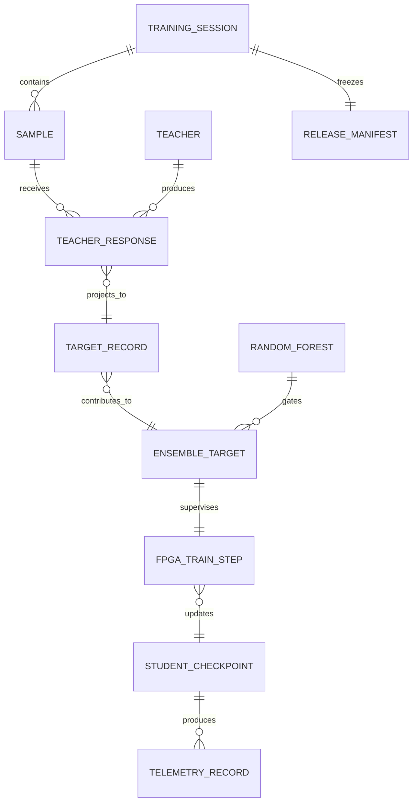
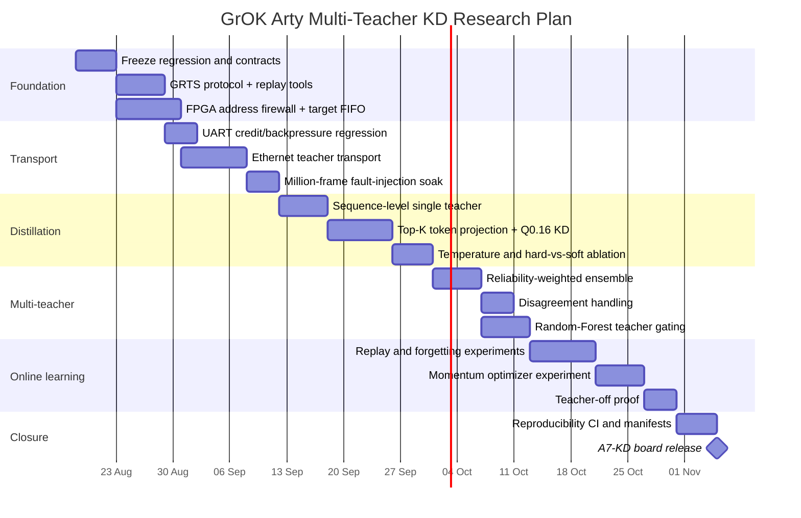

# Sandboxed Multi-Teacher Knowledge Distillation and Hybrid Online Training for GrOK on Arty A7-100T

## Executive summary

The strongest design for GrOK is **not** to let ChatGPT, Claude, DeepSeek, Random Forest, or the host PC “train the FPGA model” directly. Instead, every external model should be treated as an **untrusted teacher that can supply training targets but can never write GrOK's weights, gradients, optimizer state, or inference decisions**.

The architectural boundary should therefore be:

> **Teachers provide knowledge; Arty performs learning.**

That distinction preserves the defining research property of the existing project: forward inference, loss/gradient generation, optimizer action, and weight modification remain FPGA-resident. The host is permitted to query teachers, normalize their outputs into a canonical student-target representation, arbitrate among teachers, tokenize examples, schedule batches, and log telemetry; it must have **no hardware path capable of directly modifying model parameters**.

This is also a natural extension of classical knowledge distillation. Hinton, Vinyals and Dean formalized distillation as training a smaller student from a teacher or ensemble's softened output distribution rather than only hard labels, with temperature exposing more of the relative probability structure between alternatives. Earlier model-compression work had already shown that ensemble behavior could be compressed into a smaller model, and subsequent work expanded KD to intermediate features, mutual learning and multiple-teacher ensembles. citeturn19academia49turn21search1turn19academia48turn21academia48turn21academia49 IBM's overview similarly distinguishes response-, feature- and relation-based distillation and explicitly discusses ensemble and online variants. citeturn20search0

For GrOK, I recommend a staged system:

```text
External teachers
 OpenAI API ─────┐
 Claude API ─────┤
 DeepSeek API ───┤
 Local LLM ──────┤
 Random Forest ──┤
 Manual teacher ─┘
         │
         ▼
┌───────────────────────────────┐
│ HOST TEACHER SANDBOX          │
│                               │
│ provider adapters             │
│ rate / cost control           │
│ token-space projection        │
│ provenance + checksums        │
│ teacher arbitration           │
│ soft-target quantization      │
│ replay/cache                  │
└──────────────┬────────────────┘
               │
               │ TARGETS ONLY
               ▼
┌───────────────────────────────┐
│ ARTY A7-100T                  │
│                               │
│ RX validation / firewall      │
│ teacher-target FIFO           │
│ DDR target/replay store       │
│ student forward pass          │
│ KD + hard-label loss          │
│ FPGA backward pass            │
│ FPGA optimizer                │
│ FPGA-only WEIGHT_WRITE        │
│                               │
│ DDR3: weights/state/KV        │
│ BRAM: ping-pong tiles         │
│ DSP: 128→160→192 MAC lanes    │
└──────────────┬────────────────┘
               │
               ▼
       GrOK next-token output
```

This should become a new research branch such as **A7-KD**, built on top of the A7-LM foundation rather than mixed prematurely into the tensor-engine milestones.

The minimum successful result I would seek is:

> **A multi-teacher-distilled Arty-resident autoregressive model whose targets originate from heterogeneous external teachers, while every GrOK parameter update is calculated and committed on the FPGA; after teachers are physically/logically disconnected, the trained model continues autoregressive generation with zero external weight writes.**

The proposed system is technically compatible with the current hardware foundation. Arty A7-100T provides 240 DSP slices, 4,860 Kbit of on-chip block memory, 256 MB DDR3L on a 16-bit 667 MT/s interface, 10/100 Ethernet and a USB-UART bridge. citeturn23search1 Your A7-LM-01 silicon evidence already measures approximately **1.166 GB/s sequential read, 1.152 GB/s sequential write and 1.159 GB/s mixed throughput**, including two complete 256 MiB memory traversals and 100/100 recalibration cycles. fileciteturn0file4 fileciteturn0file11 fileciteturn0file12

The most consequential design decision is this:

> **Do not transmit teacher text alone when a teacher can expose probabilities. Preserve probabilistic “dark knowledge” wherever possible, but first project it into GrOK's own vocabulary.**

That last clause matters enormously. OpenAI, Claude, DeepSeek and GrOK generally do **not** share tokenizers, so raw provider token logits cannot simply be compared with GrOK logits. Cross-tokenizer alignment must be an explicit subsystem.

## Distillation model and teacher landscape

### What knowledge GrOK should accept

Hinton-style distillation begins with teacher logits \(z_t\) and student logits \(z_s\), with temperature \(T\):

\[
q_t(i;T)
=
\frac{\exp(z_{t,i}/T)}
{\sum_j \exp(z_{t,j}/T)}
\]

and similarly \(q_s(i;T)\). The usual conceptual objective combines supervised hard-label loss and soft teacher matching:

\[
L =
\lambda_h\,CE(y,p_s)
+
\lambda_{KD}\,T^2
KL(q_t^T\Vert q_s^T)
\]

The \(T^2\) scaling compensates for the gradient scaling introduced by temperature in the original formulation. citeturn19academia49

For GrOK, extend the teacher term to an ensemble:

\[
q_E(i)
=
\sum_{k=1}^{K}
w_k q_k(i),
\qquad
\sum_k w_k=1
\]

followed by:

\[
L =
\lambda_h L_{\text{hard}}
+
\lambda_d L_{\text{ensemble-KD}}
+
\lambda_r L_{\text{replay}}
+
\lambda_a L_{\text{anchor}}
\]

The ensemble literature supports learning or adapting teacher weights instead of treating every teacher identically; teacher correctness can guide weighting on labeled data, while teacher disagreement can be used as information about hard or ambiguous examples. citeturn21academia49

For FPGA implementation, an especially convenient formulation is to construct one effective target distribution

\[
t =
\lambda_h y_{\text{one-hot}}
+
(1-\lambda_h)q_E
\]

so that, for a conventional softmax-cross-entropy formulation, the logit-gradient structure reduces approximately to:

\[
\frac{\partial L}{\partial z_s}
\propto p_s - t
\]

That is attractive for GrOK because the host sends **targets**, while the FPGA still derives the student's error and every downstream gradient itself.

### The cross-tokenizer problem

This is the biggest conceptual trap in the proposed project.

A teacher token such as:

```text
"ing"
```

might correspond to one token for Teacher A, several tokens for GrOK, or a different byte segmentation for Teacher B. Therefore:

> **Provider token ID 17492 must never be sent directly to GrOK as though it were GrOK token 17492.**

I recommend four target modes, ranked from most universal to richest:

| Mode | Source | Mapping to GrOK | Fidelity |
|---|---|---|---|
| `SEQ_HARD` | Any LLM | Decode teacher text → tokenize with GrOK tokenizer | Universal; loses soft knowledge |
| `TOPK_SOFT` | API exposing token logprobs | Decode token/bytes → project probability mass onto GrOK continuations | Rich but sparse/approximate |
| `FULL_SOFT` | Local teacher using compatible/custom interface | Project or directly use full vocabulary distribution | Best response-based KD |
| `FEATURE_HINT` | Local model/embedding model | Learn projection from feature vector into GrOK representation | Experimental |

FitNets demonstrated that intermediate representations can act as hints, but proprietary chat APIs generally do not expose their internal hidden activations, so **feature distillation should initially be reserved for local models**, not simulated using unrelated embedding endpoints. citeturn19academia48

For API teachers returning only top-\(K\) probabilities, every canonical target must carry:

\[
C_{\text{map}}
=
\sum_{\text{successfully mapped }j} p_j
\]

as `mapped_probability_mass`. If coverage is too small, for example below a contractually chosen threshold, GrOK should fall back to sequence-level distillation rather than pretending the sparse projection represents the complete teacher distribution.

### Current teacher capabilities

The provider landscape below is current as of **August 17, 2026**; prices and quotas are intentionally treated as configuration rather than hard-coded project constants because they are mutable.

| Teacher | Automation interface | Soft-label availability | Token/feature considerations | Current cost indication | Recommended GrOK role |
|---|---|---|---|---|---|
| **OpenAI GPT-5.6 Sol / Terra / Luna** | Official API; current GPT-5.6 family is exposed through OpenAI's API. citeturn17search1turn17search2turn17search0 | Chat/API response structures support token logprob/top-logprob fields, but capability must be probed per chosen endpoint/model. citeturn8view0turn8view1 | Provider tokenizer differs from GrOK; retain token bytes/text plus probabilities and project into student space | Sol $5/$30, Terra $2.50/$15, Luna $1/$6 per input/output MTok on current official listings. citeturn17search10 | Sparse soft KD + high-quality sequence teacher |
| **Claude Sonnet 5 / Opus 5 / Haiku 4.5** | Official Claude Messages API | The current Messages reference inspected here does **not document a token-logprob field**, so design Claude as a sequence/pseudo-label/ranking teacher unless Anthropic adds one. citeturn15view0 | Anthropic documents a newer tokenizer for Claude 4.7+ that can produce a different token count for the same text, reinforcing the need for GrOK-side retokenization. citeturn16search0 | Sonnet 5 has introductory $2/$10 input/output MTok pricing through Aug. 31, 2026, then $3/$15; Opus 5 $5/$25 and Haiku 4.5 $1/$5. citeturn16search0 | Sequence KD, judging/ranking, disagreement signal |
| **DeepSeek V4 Flash / Pro** | Official API supports current V4 models and OpenAI-compatible interfaces. citeturn22search1turn22search4 | **Yes:** official Chat Completion API exposes `logprobs` and `top_logprobs` up to 20. citeturn22search10 | Same cross-tokenizer projection requirement | Official current page lists Flash ¥1 uncached input/¥2 output MTok and Pro ¥3/¥6, with lower cached-input rates. citeturn22search4 | Excellent low-cost sparse soft-label teacher |
| **Local llama.cpp model** | `llama-server` exposes an OpenAI-compatible HTTP server; the project also supports embedding serving. citeturn14search1 | Prefer direct local integration that exposes the model's full logits rather than depending on server compatibility | Full control enables tokenizer-aware mapping; can deliberately choose a teacher sharing GrOK's tokenizer | No per-token API fee; hardware/energy cost is local | Best experimental **full-logit teacher**, privacy-sensitive data |
| **Random Forest** | Local scikit-learn or equivalent | `predict_proba` supplies class probabilities; RF probabilities are averages over tree predictions. citeturn14search5turn14search2 | Not naturally a language-token teacher; classes require explicit semantic mapping | Local compute | Domain gate, trust estimator, anomaly filter, bounded-class soft teacher |
| **ChatGPT / Claude desktop GUI** | Manual UI rather than the project's contractual machine API | Do not assume logits | Capture only explicitly exported response text and provenance | Subscription-dependent | Manual curated teacher only; **exclude UI automation from reproducible releases** |

End-to-end latency should **not** be encoded as a fixed number in the design. Cloud-teacher latency depends on model, request size, service tier, network and provider load. The gateway should measure `TTFT`, completion time, p50/p95/p99 latency and token throughput for every adapter. Anthropic, for example, applies request/token limits and returns `429` plus `retry-after` when limits are exceeded. citeturn15view3turn15view5 DeepSeek similarly documents concurrency limits and `429` behavior. citeturn22search0turn22search6 OpenAI quotas also vary by usage tier rather than representing one universal constant. citeturn17search1

The teacher capability negotiation should therefore occur at gateway startup:

```json
{
  "teacher_id": 3,
  "provider": "deepseek",
  "model": "deepseek-v4-flash",
  "capabilities": {
    "sequence": true,
    "token_logprobs": true,
    "max_topk": 20,
    "embedding": false,
    "streaming": true
  },
  "tokenizer_fingerprint": "provider-specific",
  "adapter_version": "grteacher-0.1",
  "enabled": true
}
```

No capability should be inferred from provider brand alone.

## System specification and teacher-stream protocol

### Trust boundary and on-host versus on-device roles

The division of responsibility should be contractual:

| Operation | Host gateway | Arty FPGA |
|---|---:|---:|
| Call external teacher APIs | ✅ | ❌ |
| Store API keys | ✅ | ❌ |
| Parse provider JSON | ✅ | ❌ |
| Teacher token → GrOK token projection | ✅ | ❌ initially |
| Compute teacher ensemble target | ✅ first phase | optional later |
| RF inference / teacher gating | ✅ | optional later |
| Quantize target probabilities | ✅ | validate |
| Send labels / targets | ✅ | receive |
| Student forward | ❌ | **✅** |
| Student logits | observe/log only | **✅ source of truth** |
| KD loss | ❌ | **✅** |
| Student gradients | ❌ | **✅** |
| Weight delta | ❌ | **✅** |
| Weight/optimizer-state write | **physically forbidden** | **✅ only** |
| Autoregressive next-token decision | ❌ | **✅** |
| Teacher-off inference | disconnected | **✅** |

The key phrase is **physically forbidden**, not merely “the Python program promises not to do it.”

The FPGA memory map should expose different trust domains:

```text
HOST-WRITABLE
┌────────────────────────────┐
│ TEACHER_RX_INBOX           │
│ DATASET_TOKEN_INBOX        │
│ CONTROL_MAILBOX            │
└────────────────────────────┘

FPGA-OWNED, HOST READ-ONLY
┌────────────────────────────┐
│ TELEMETRY                  │
│ LOGITS/PREDICTIONS         │
│ CHECKPOINT HASH            │
└────────────────────────────┘

OPTIMIZER-ONLY WRITE DOMAIN
┌────────────────────────────┐
│ ACTIVE WEIGHTS             │
│ MOMENTUM / OPT STATE       │
│ TRAINABLE EMBEDDINGS       │
└────────────────────────────┘
```

An RTL invariant should reduce the training law to something auditable:

```systemverilog
weight_write ->
    train_enable
    && optimizer_commit
    && !teacher_freeze
    && !host_dma_master;
```

and separately:

```systemverilog
host_rx_write ->
    address_inside_teacher_inbox;
```

That creates a stronger claim than “no host weight-write command was used”: **no such datapath exists**.

### Canonical teacher record

I recommend a binary protocol named `GRTS-1` — **GrOK Teacher Stream v1**.

A frame header can be fixed-width:

```c
struct grts_header_v1 {
    uint32_t magic;              // "GRT1"
    uint8_t  version;            // 1
    uint8_t  msg_type;
    uint16_t flags;

    uint64_t session_id;
    uint64_t sample_id;
    uint32_t prefix_crc32c;

    uint16_t teacher_id;
    uint16_t tokenizer_id;

    uint32_t checkpoint_epoch;
    uint16_t sequence_pos;
    uint8_t  target_kind;
    uint8_t  top_k;

    uint16_t temperature_q8_8;
    uint16_t confidence_q0_16;
    uint16_t mapped_mass_q0_16;
    uint16_t payload_len;

    uint32_t seq_no;
    uint32_t crc32c;
};
```

`target_kind`:

```text
0x01 HARD_TOKEN
0x02 SOFT_TOPK
0x03 SEQUENCE
0x04 RF_PROBA
0x05 TEACHER_SCORE
0x06 EMBEDDING_HINT
0x07 BARRIER
```

A sparse soft-label payload should contain **GrOK token IDs**, never provider token IDs:

```c
struct soft_entry {
    uint16_t student_token_id;
    uint16_t probability_q0_16;
};
```

If GrOK's vocabulary eventually exceeds 65,535 entries, only that field needs widening.

At `K=20`, a 64-byte-class header plus 20 × 4-byte entries is only roughly **144 bytes per target token**. Even a 100 Mb/s Ethernet link has orders of magnitude more transport capacity than such a teacher stream, while your DDR tensor traffic is already around 1.16 GB/s. The external-teacher data stream therefore should not be the primary hardware bandwidth bottleneck; model weight/activation traffic remains the concern. Arty's board-level Ethernet is 10/100 Mb/s, while USB connectivity includes a USB-UART bridge rather than a native general-purpose high-throughput USB endpoint. citeturn23search1

### Reliability, retry and backpressure

Use a **credit protocol**, not “sleep N milliseconds”.

```text
FPGA → host
CREDIT 24
     │
     ▼
host may send ≤24 records
     │
     ├─ record 100
     ├─ record 101
     └─ ...
     │
FPGA validates + queues
     │
     ▼
ACK highest_contiguous_seq
CREDIT +N
```

Required transport behavior:

| Condition | Action |
|---|---|
| Good CRC + expected sequence | enqueue + ACK |
| Duplicate `sample_id/seq_no` | ACK, do not retrain twice |
| CRC failure | NACK exact sequence |
| FIFO almost full | advertise zero credits |
| Missing frame | NACK first missing sequence |
| Provider timeout | mark teacher missing, do not stall FPGA indefinitely |
| HTTP `429` | obey provider retry semantics/backoff |
| HTTP `5xx/503` | bounded exponential retry + circuit breaker |
| Irrecoverable teacher | form partial ensemble only if quorum policy permits |
| Prefix/checkpoint mismatch | reject as stale target |

This is directly motivated by your earlier A7-LM-00 experience: a continuous UART dump produced a repeatable 950/1000 result while isolated cases were exact, making pacing/draining an explicit lesson from the Basys→Arty port. fileciteturn0file15 The teacher protocol should therefore never infer reliability from delays such as 1 ms/10 ms/20 ms.

### FPGA ingestion API

Use three transport profiles:

**Ethernet should be production-primary.** Arty A7 has a 10/100 Ethernet interface. citeturn23search1 Implement a small UDP-based protocol first if minimizing logic is paramount, with GRTS sequence/CRC/retransmission providing reliability; TCP is reasonable later if the Ethernet stack cost is already acceptable.

**USB-UART should remain control/regression/fallback.** The board provides a USB-UART bridge. citeturn23search1 At 115,200 baud with 8-N-1 framing, theoretical payload is only about 11.5 kB/s before protocol overhead, so it is inappropriate as the long-term multi-teacher training pipe.

**JTAG/USB should not become a hidden training channel.** It can program the bitstream and inspect debug state, but release-mode logic should not expose arbitrary memory modification through JTAG once the training-law experiment begins.

Suggested commands:

```text
0x80 HELLO / CAPS
0x81 SESSION_BEGIN
0x82 TEACHER_DESCRIPTOR
0x83 TARGET_PUSH
0x84 TARGET_BATCH_COMMIT
0x85 CREDIT
0x86 ACK
0x87 NACK
0x88 TRAIN_STEP
0x89 BARRIER
0x8A FREEZE
0x8B TELEMETRY
0x8C CHECKPOINT_HASH
0x8D SESSION_END
```

Conspicuously absent:

```text
WRITE_WEIGHT
WRITE_GRADIENT
WRITE_OPTIMIZER_STATE
SET_STUDENT_LOGITS
FORCE_NEXT_TOKEN
```

Those opcodes should **never exist**.

### Entity relationships



## Multi-teacher arbitration and hybrid training

### Recommended arbitration hierarchy

Do not start with a learned arbitrator. Start with something deterministic enough to debug.

#### Fixed weighted ensemble

For teacher \(k\), calculate:

\[
s_k
=
r_k\,
c_k\,
f_k\,
d_k
\]

where:

- \(r_k\): validation reliability;
- \(c_k\): mapped probability coverage;
- \(f_k\): freshness/staleness factor;
- \(d_k\): domain relevance.

Then:

\[
w_k
=
\frac{s_k}{\sum_j s_j}
\]

and:

\[
q_E=\sum_k w_kq_k
\]

Raw textual claims such as “I am 95% confident” should **not** be treated as calibrated confidence. When token probabilities are available, use entropy, top-1/top-2 margin and mapped mass. When they are unavailable, mark confidence as a proxy derived from repeated-consistency, validation history or an explicit evaluator.

#### Disagreement-aware ensemble

Compute Jensen-Shannon divergence or a cheaper fixed-point proxy between teacher distributions.

```text
low disagreement
→ normal KD strength

moderate disagreement
→ reduce KD λ
→ retain as "hard example"

extreme disagreement
→ abstain
→ queue for anchor/human/re-evaluation
```

This is better than forcing a small student to average contradictory teachers. Multi-teacher KD research specifically supports exploiting both per-teacher correctness and ensemble disagreement rather than assuming uniformly reliable teachers. citeturn21academia49

#### Random Forest fusion

Random Forest should **not** initially predict GrOK's arbitrary next token among thousands of vocabulary entries. That wastes its strengths.

Use it as a meta-teacher:

```text
features
 ├ teacher entropy
 ├ teacher top1 margin
 ├ disagreement
 ├ domain ID
 ├ prompt length
 ├ mapped mass
 ├ provider latency
 ├ previous teacher accuracy
 ├ student entropy
 └ OOD/anomaly features
       │
       ▼
Random Forest
       │
       ├ teacher reliability weights
       ├ accept/reject
       └ task/domain class
```

Random forests naturally expose class probabilities through `predict_proba`, and soft voting/stacking are established ensemble mechanisms in scikit-learn. citeturn14search5turn14search2

For bounded tasks where RF classes map directly to GrOK output tokens, RF probabilities can enter the distribution:

\[
q_{\text{final}}
=
(1-\lambda_{RF})q_{\text{LLM}}
+
\lambda_{RF}P_{\text{map}}q_{RF}
\]

Otherwise RF should gate teachers rather than inject fake language-token probabilities.

#### On-FPGA meta-learner later

A particularly interesting research extension would be to migrate the teacher arbiter onto Arty:

```text
teacher metrics
      ↓
tiny INT8 gating network
      ↓
w_OpenAI
w_Claude
w_DeepSeek
w_local
w_RF
```

That would allow GrOK to learn **which teacher to trust** as part of the online architecture.

Deep Mutual Learning shows that collaborative teaching need not be restricted to one immutable powerful teacher, although GrOK's hardware use case is structurally different. citeturn21academia48 Born-Again Networks further demonstrate that distillation can act as more than pure compression. citeturn21academia51

I would make this an **A7-KD-05 or later** experiment. Keeping arbitration deterministic initially is much easier to validate scientifically.

### Temperature and probability normalization

For teachers providing top logprobs, the gateway should preferably request a neutral sampling configuration when possible:

```text
generation_temperature = 1
top_p = 1
penalties = 0
logprobs = true
top_logprobs = maximum practical K
```

Then apply the **KD temperature** separately:

\[
q_i^{(T)}
\propto
\exp\left(\frac{\log p_i}{T}\right)
\]

This separates “temperature used to generate teacher text” from “temperature used to soften distillation targets.”

For sparse top-\(K\) distributions:

```text
teacher top-K mass
        ↓
token-space mapping
        ↓
mapped mass
        ↓
temperature
        ↓
renormalize mapped support
        ↓
Q0.16 quantization
```

and log both:

```text
original_topk_mass
mapped_topk_mass
renormalization_factor
```

Without these fields a 20-token sparse distribution can misleadingly appear fully normalized.

### Precision contract

A sensible first hardware law is:

| Quantity | Precision |
|---|---|
| Model weights | INT8 |
| Main activations | INT16 |
| MAC accumulation | INT32/48-bit DSP accumulator |
| Teacher target probabilities | unsigned Q0.16 |
| Ensemble weights | Q0.16 |
| Temperature | Q8.8 |
| Student probability/error | INT16/Q-format |
| Gradient tile | INT16 initially |
| Momentum | INT16 |
| Loss telemetry | INT32 fixed-point |

Do **not** transmit float32 probabilities to the FPGA merely because cloud APIs return floats. The gateway should retain the original float/logprob in the audit archive and deterministically quantize an FPGA representation.

### Optimizer progression

The optimizer sequence I recommend is:

```text
sign-SGD
   ↓
fixed-point SGD
   ↓
SGD + error feedback
   ↓
INT16 momentum SGD
   ↓
Adam-like experiment
```

Sign-SGD is still useful as the regression law because your Basys-era line of evidence already depends on simple deterministic fixed-point updates. Momentum should be the first significant optimizer upgrade because it adds only one principal state tensor. Adam-like methods should come last: two moment tensors plus normalization/division or reciprocal-square-root approximations increase both memory traffic and numerical complexity.

The key invariant never changes:

\[
\text{external teacher}
\rightarrow
\text{target}
\rightarrow
\boxed{\text{FPGA loss}}
\rightarrow
\boxed{\text{FPGA gradient}}
\rightarrow
\boxed{\text{FPGA optimizer}}
\rightarrow
\boxed{\text{FPGA weight write}}
\]

not:

```text
teacher → host PyTorch → gradient → FPGA
```

and never:

```text
teacher → host fine-tuned checkpoint → overwrite Arty weights
```

## Mapping onto the Arty A7 architecture

### Hardware baseline

Digilent specifies the Arty A7-100T with XC7A100T, **240 DSP slices, 4,860 Kbit on-chip block memory, and 256 MB DDR3L on a 16-bit 667 MT/s interface**, plus 10/100 Ethernet and USB-UART. citeturn23search1

More importantly, the project already has board evidence rather than merely datasheet bandwidth. A7-LM-01's full ladder records approximately 1.166 GB/s sequential read, 1.152 GB/s sequential write and 1.159 GB/s mixed bandwidth. Random access is materially lower, around 0.533 GB/s in the recorded random 16 MiB case. fileciteturn0file4 fileciteturn0file8

That makes the memory strategy straightforward:

> **Teacher traffic may be sparse; model traffic must be sequential, tiled and reusable.**

### Recommended DDR layout

Do not lock absolute offsets until the final model geometry is known. Lock **regions and access permissions**:

```text
DDR3 256 MiB
┌─────────────────────────────────────────┐
│ ACTIVE_MODEL_WEIGHTS      optimizer RW  │
├─────────────────────────────────────────┤
│ CHECKPOINT_A              FPGA RW       │
├─────────────────────────────────────────┤
│ CHECKPOINT_B              FPGA RW       │
├─────────────────────────────────────────┤
│ OPTIMIZER_STATE           optimizer RW  │
├─────────────────────────────────────────┤
│ ACTIVATION / KV WORKSPACE FPGA RW       │
├─────────────────────────────────────────┤
│ REPLAY BUFFER             trainer RW    │
├─────────────────────────────────────────┤
│ TEACHER TARGET INBOX      host-RX RW    │
├─────────────────────────────────────────┤
│ TELEMETRY / TRACE         FPGA RW       │
├─────────────────────────────────────────┤
│ RESERVED / GUARD REGION                 │
└─────────────────────────────────────────┘
```

The RX DMA address generator must have no legal address representation that reaches the active-weight or optimizer regions.

### Ping-pong and DMA schedule

The correct steady state is:

```text
time ──────────────────────────────────────────────→

BRAM A:
DMA W0   COMPUTE W0   DMA W2   COMPUTE W2 ...

BRAM B:
         DMA W1       COMPUTE W1   DMA W3 ...

DSP:
         W0 compute   W1 compute   W2 compute ...

DDR:
read W0  read W1      read W2      read W3 ...
```

For training, extend it:

```text
FORWARD TILE
DDR W[n]
   ↓
BRAM A/B
   ↓
DSP
   ↓
activation

BACKWARD TILE
activation/error
   ↓
DSP
   ↓
gradient tile
   ↓
optimizer
   ↓
updated INT8 W[n]
   ↓
DDR
```

Prefer **tile-local gradient consumption** over a full persistent gradient tensor whenever the training law permits:

```text
calculate gradient tile
        ↓
update weight tile
        ↓
discard gradient tile
```

rather than:

```text
calculate all gradients
        ↓
write whole gradient model to DDR
        ↓
read it all again
        ↓
optimizer
```

That distinction can save multiple bytes of DDR traffic per parameter per update.

### DSP lane scenarios

Assuming the current tensor-engine family continues around an **83.33 MHz compute clock**, arithmetic peak scales approximately as:

\[
\text{GMAC/s}_{peak}
=
N_{lanes}\times83.33\text{ MHz}
\]

giving:

| Tensor configuration | Raw DSP MAC peak | DSPs consumed by lanes | Remaining device DSP before auxiliary arithmetic | Character |
|---|---:|---:|---:|---|
| **128 lanes** | ~10.67 GMAC/s | 128 | 112 | Safest, best routing margin |
| **160 lanes** | ~13.33 GMAC/s | 160 | 80 | **Recommended balanced target** |
| **192 lanes** | ~16.00 GMAC/s | 192 | 48 | Stretch; tight for optimizer/LN/special math |

These are arithmetic peaks, not predicted application throughput. Because your measured sequential DDR path is ~1.16 GB/s, a GEMV that fetches one unique INT8 weight for each MAC can become memory-bound near ~1.16 GMAC/s regardless of whether 128 or 192 multipliers exist. fileciteturn0file4 The extra lanes become valuable when one fetched weight/activation is **reused**, such as batched GEMM, multi-token training or sufficiently tiled matrix operations.

This argues strongly for:

> **128 → perfect double buffering → measured utilization → 160 lanes**

rather than:

> **128 → immediately instantiate 192 lanes.**

### Parameter ceilings

More memory always increases the **storage ceiling**, but lane count primarily changes compute capacity, not storage capacity.

The full-memory A7-LM-01 test addresses `268,435,456` bytes. fileciteturn0file11 Therefore pure INT8 weight storage has a raw theoretical ceiling of about **268 million parameters**. That is not remotely the same thing as a useful online-training ceiling.

For a more realistic allocation, suppose only **160 MiB** of DDR is allowed for persistent model/optimizer state, leaving the remainder for activation/KV, replay, teacher queues, checkpoints and guards:

| Persistent representation | Approx. state/param | Storage ceiling in 160 MiB |
|---|---:|---:|
| INT8 W + 1-byte residual/error state | 2 B | ~84 M params |
| INT8 W + INT16 momentum + residual | 4 B | ~42 M |
| INT8 W + two INT16 Adam-like moments + residual | 6 B | ~28 M |

Those are **capacity ceilings only**.

For engineering planning, I would use these *provisional*, explicitly non-claimed online-training ranges:

| DSP lanes | Storage hard limit | Practical research target for full online training | Stretch experiment | Primary expected limiter |
|---|---|---|---|---|
| **128** | unchanged; tens of millions with training state | **1–5 M** | 8 M | DDR traffic / training time |
| **160** | unchanged | **3–8 M** | 10 M | DDR + routing |
| **192** | unchanged | **5–10 M** | 10–12 M | routing/headroom + DDR |

These ranges are **not FPGA laws**. A “maximum parameter count” is undefined unless you also specify acceptable update latency, tokens/s, convergence, optimizer state and context length. A 30 M parameter model might technically train extremely slowly while failing the research project's usefulness criterion. Therefore the eventual `A7-LM-MAX` experiment should empirically sweep model size and record throughput/convergence rather than declare a number from memory capacity alone.

### Proposed complete dataflow

```mermaid
flowchart LR
    OA[OpenAI API] --> GW
    CL[Claude API] --> GW
    DS[DeepSeek API] --> GW
    LL[Local llama.cpp] --> GW
    RF[Random Forest] --> ARB

    subgraph HOST["Host Teacher Sandbox"]
        GW[Provider adapters]
        GW --> TOK[Token-space projection]
        TOK --> ARB[Arbitration / calibration]
        ARB --> Q[Q0.16 target quantizer]
        Q --> FR[GRTS frame + provenance]
    end

    FR -->|Ethernet primary| RX

    subgraph FPGA["Arty A7-100T"]
        RX[CRC / sequence / address firewall]
        RX --> TF[Target FIFO]
        TF --> TI[DDR target inbox]
        TI --> LOSS[Distillation loss]

        DDR[(DDR3 weights/state)] --> DMA[Tile DMA]
        DMA --> A[BRAM tile A]
        DMA --> B[BRAM tile B]
        A --> MAC[128→160 DSP MAC]
        B --> MAC
        MAC --> FWD[Student forward]
        FWD --> LOSS
        LOSS --> BWD[FPGA backward]
        BWD --> OPT[FPGA optimizer]
        OPT -->|only legal weight-write path| DDR
        FWD --> GEN[FPGA argmax/sampler]
    end

    GEN --> OUT[GrOK token]
```



## Experimental program, metrics, and acceptance gates

The experiments should be structured so that each one proves exactly one additional claim.

### Baseline and transport experiments

**A7-KD-00 — frozen no-teacher regression.**

Nothing about KD should be accepted until the unchanged student reproduces the existing baseline:

```text
1000 / 1000 forward logits
fixed gradient pack exact
CE baseline exact
autoregressive generation exact
AFTER writes = 0
```

The project's earlier A7-LM-00 contract demonstrates why the 1000/1000 gate matters: 950/1000 during burst telemetry was not accepted even though isolated computation was correct. fileciteturn0file15

Acceptance:

```text
student arithmetic changed = false
1000/1000 logits
golden gradients exact
teacher packets accepted = 0
weight writes in freeze = 0
```

**A7-KD-01 — sandboxed teacher transport.**

Send synthetic teacher records rather than live AI.

Acceptance proposal:

```text
≥ 1,000,000 protocol records
CRC failures injected and detected 100%
duplicates applied twice = 0
sequence gaps unnoticed = 0
FIFO overflows = 0
host accesses to weight region accepted = 0
backpressure violations = 0
```

This milestone should prove the security boundary before any provider key is introduced.

### Distillation experiments

**A7-KD-02 — one hard sequence teacher.**

Use Claude or another text-only teacher:

```text
prompt
 → teacher answer
 → GrOK retokenization
 → HARD_TOKEN targets
 → FPGA training
```

Run:

```text
baseline supervised stream
vs
teacher-generated sequence stream
```

Acceptance should require statistically repeated improvement on held-out data, not merely one declining training loss. A practical initial contract could require:

```text
training CE decreases from start
held-out CE improves over untrained checkpoint
no regression in bit-exact inference implementation
teacher-off generation PASS
```

**A7-KD-03 — true soft KD.**

Use an API exposing log probabilities, initially DeepSeek and/or a compatible OpenAI endpoint. DeepSeek's current API explicitly provides token logprobs and top-\(K\) logprobs up to 20. citeturn22search10

Compare:

```text
A: hard top-1 teacher token
B: top-K soft labels, T=1
C: top-K soft labels, T=2
D: top-K soft labels, T=4
```

Primary result:

\[
\Delta CE_{heldout},\quad
\Delta PPL,\quad
\Delta calibration,\quad
\text{adaptation steps}
\]

The scientifically valuable result is not “KD worked”; it is **whether FPGA fixed-point sparse KD carries useful dark knowledge compared with hard teacher imitation**.

**A7-KD-04 — multi-teacher ensemble.**

Configurations:

```text
OpenAI only
DeepSeek only
Claude sequence only
OpenAI + DeepSeek
OpenAI + DeepSeek + Claude
full ensemble + local LLM
```

Measure:

```text
best single teacher
uniform ensemble
reliability-weighted ensemble
disagreement-aware ensemble
```

Acceptance:

> The multi-teacher system should either outperform the best single-teacher baseline on the frozen evaluation corpus or demonstrate a statistically defensible benefit in robustness/adaptation; simply averaging providers is not sufficient evidence.

**A7-KD-05 — RF hybrid/meta-teacher.**

Train RF on teacher-quality features and compare:

```text
fixed teacher weights
vs
RF gating
vs
learned FPGA gate later
```

Log both student quality and teacher query cost. A useful RF may improve **cost/quality** even when absolute CE changes little by learning when the expensive teacher is unnecessary.

### Continual-learning experiment

This is essential because GrOK's distinguishing feature is **online learning**, not merely distillation.

Protocol:

```text
Checkpoint C0
     ↓
Train domain A
     ↓
evaluate A → score A0
     ↓
online adapt domain B
     ↓
evaluate B
evaluate A → score A1
```

Define a forgetting metric such as:

\[
F_A = CE_A^{afterB} - CE_A^{beforeB}
\]

and compare:

```text
plain SGD
KD only
replay only
KD + replay
KD + anchor teacher
```

This experiment can become more important scientifically than raw parameter scale.

### Teacher-off proof

The final acceptance test should physically or logically disconnect all teacher sources:

```text
Ethernet teacher port disabled
teacher credits = 0
teacher RX frames = 0
host training targets = 0
learn_enable = 0
freeze = 1
```

Then:

```text
load FPGA-owned learned checkpoint
run fixed evaluation prompts
generate autoregressively
```

Required evidence:

```text
external teacher calls       0
teacher target frames        0
student weight writes        0
student optimizer writes     0
host next-token decisions    0
generation                   PASS
checkpoint SHA before/after  identical
```

That is the cleanest demonstration that **knowledge was distilled into GrOK**, rather than GrOK remaining dependent on the teachers.

### Telemetry schema

Every training step should produce enough data to reconstruct what happened:

| Domain | Required telemetry |
|---|---|
| Teacher | provider/model ID, request ID, adapter version, latency p50/p95/p99, input/output tokens, cost, retries, HTTP status |
| Target | type, `K`, temperature, entropy, top-1 margin, original mass, mapped mass, teacher weight, disagreement |
| Transport | bytes, frames, seq gaps, duplicate frames, CRC errors, credits, FIFO high-water mark |
| Student | hard CE, KD loss, total loss, PPL, top-1 accuracy, entropy, student-teacher KL |
| Learning | gradient norm proxy, saturated gradients, zero gradients, weight writes, bytes updated, optimizer state traffic |
| Hardware | DDR read/write GB/s, DMA wait cycles, bank swaps, underflow, hazard count, MAC active cycles, MAC utilization |
| Runtime | cycles/token, inference tokens/s, training tokens/s, milliseconds/update |
| Continual learning | domain-A CE before/after B, forgetting score, replay hit rate |
| Integrity | checkpoint hash, target-batch hash, FPGA bitstream SHA, config hash |

For hardware quality, separate:

\[
U_{MAC}
=
\frac{\text{useful MAC operations}}
{\text{MAC lanes}\times\text{available compute cycles}}
\]

from DDR utilization. Otherwise a design can report “192 lanes” while most multipliers are idle.

## Security, reproducibility, and implementation roadmap

### Security and sandbox rules

The sandbox should assume a teacher can be wrong, unavailable, compromised, rate-limited, prompt-injected, or simply change behavior between model revisions.

The minimum policy is:

**Teacher responses are data, never executable instructions.** The gateway must disable teacher tool execution for training calls unless a specific experiment explicitly needs it. Returned code, URLs, shell commands, file paths and tool requests remain inert strings.

**API credentials remain host-only.** Never serialize them into GRTS frames, FPGA DDR, board telemetry or release logs.

**Outbound connections use an allowlist.** For example:

```text
OpenAI adapter   → official configured OpenAI origin only
Anthropic        → official configured Claude origin only
DeepSeek         → official configured DeepSeek origin only
Local teacher    → loopback/LAN allowlisted endpoint only
```

**Rate and budget limits exist per teacher.** Anthropic provides explicit rate-limit headers including `retry-after`, while DeepSeek documents concurrency/429 handling; adapters should use provider-native feedback rather than uncontrolled retry loops. citeturn15view3turn22search0turn22search6

**Every record has provenance.**

```text
teacher provider
model ID
model snapshot/fingerprint if exposed
request hash
response hash
adapter version
tokenizer mapping version
temperature
timestamp
sample ID
student checkpoint epoch
```

**Wire integrity and research integrity are separate.**

```text
CRC32C
→ catches transfer corruption

SHA-256 batch manifest
→ detects artifact modification

immutable release manifest
→ establishes reproducibility
```

A checksum does **not** prove a teacher is semantically trustworthy.

**Sensitive data receives a routing label.**

```text
PUBLIC_OK
PROVIDER_OK
LOCAL_ONLY
NO_TEACHER
```

`LOCAL_ONLY` samples may go only to local LLM/RF adapters.

**Opt-out must be immediate.**

A teacher descriptor has:

```json
{
  "teacher_id": 2,
  "enabled": false,
  "reason": "user_opt_out"
}
```

The FPGA should also have a hardware-visible `TEACHER_OFF` state in which teacher targets cannot trigger learning.

**Quorum protects against one teacher.**

Example:

```text
normal sample:
1 teacher allowed

high-value online update:
≥2 independent teacher families

high-disagreement sample:
no update until anchor/review
```

The most important limitation is unavoidable: the FPGA firewall can prevent unauthorized **weight writes**, but if a compromised host is allowed to supply arbitrary training targets, it can still attempt **data poisoning**. The mitigations are provenance, teacher diversity, quotas, anchor tests, disagreement rejection, replay and update-rate caps—not checksums alone.

### Reproducible release gates

I would require this AND-gated release structure:

```text
releases/
  A7-KD-XX-BOARD-PASS-YYYYMMDD/
    CONTRACT.md
    CLOSEOUT.md
    MANIFEST.json

    bitstream/
      grok_a7_kdxx.bit

    rtl_hashes/
    timing/
    utilization/

    board/
      regression.json
      kd_train.json
      teacher_off.json
      transport_soak.json

    teacher/
      capability_manifest.json
      adapter_manifest.json
      sanitized_requests.jsonl
      targets.grts
      target_batch_sha256.txt

    golden/
      fixedpoint_reference.json
      tokenizer_map_hash.txt

    metrics/
      heldout.json
      forgetting.json
      throughput.json

    SHA256SUMS.txt
```

CI should contain two distinct tiers:

**Deterministic CI** never calls live cloud models. It replays frozen teacher records and verifies:

```text
schema parser
CRC vectors
token projection
Q0.16 quantization
ensemble arithmetic
fixed-point KD loss
golden gradients
RTL simulation
no-host-weight-write assertion
release SHA verification
git dirty == false
```

**Live-provider compatibility CI** is a separate smoke test because provider behavior, availability, quotas and pricing are not deterministic. It should validate only:

```text
authentication works
selected model exists
declared capability still exists
schema still parses
top_logprobs available if required
rate-limit metadata parseable
```

A live provider response must never determine whether an old frozen research release remains reproducible.

### Proposed A7-KD milestone sequence

```text
A7-KD-00
Frozen student regression
1000/1000
        │
        ▼
A7-KD-01
Teacher sandbox + GRTS protocol
host-weight firewall
        │
        ▼
A7-KD-02
Single-teacher sequence KD
        │
        ▼
A7-KD-03
Sparse soft-label KD
temperature experiment
        │
        ▼
A7-KD-04
Multi-LLM ensemble
        │
        ▼
A7-KD-05
RF fusion / teacher gate
        │
        ▼
A7-KD-06
Continual learning
forgetting + replay
        │
        ▼
A7-KD-07
Teacher-off closed proof
        │
        ▼
A7-KD-SCALE
25K → 100K → 400K → 1M+
```

### Planning timeline

The following is an **engineering sequence**, with dates used to expose dependencies rather than to imply fixed completion times:



### Concrete next implementation checklist

The immediate implementation should **not begin by wiring three commercial APIs into the FPGA**. First build the immutable boundary that makes those teachers safe to add.

The next closure target should be `A7-KD-01`, with this exact order:

1. Freeze GrOK's **student tokenizer and tokenizer hash**, because every future teacher target depends on a stable student token space.
2. Write `docs/contracts/GRTS-1.md` specifying `session_id`, `sample_id`, `prefix_hash`, `teacher_id`, target types, Q-formats, sequence numbers, CRC, retries, credits and stale-target rejection.
3. Add a physically separated **teacher RX DDR region** and RTL address firewall. Prove in simulation/formal assertions that host traffic cannot assert a weight-memory write.
4. Implement a **record/replay teacher** on the host before any cloud provider. It should generate deterministic synthetic `HARD_TOKEN` and `SOFT_TOPK` records and replay them byte-for-byte.
5. Close a **million-frame fault-injection test** with duplicate, dropped, reordered and corrupted packets.
6. Move teacher transport to **100 Mb/s Ethernet**, retaining USB-UART only for commands and diagnostics; the board supports both interfaces. citeturn23search1
7. Implement student-vocabulary soft targets as `token_id + Q0.16 probability`, with explicit `mapped_mass`.
8. Add the FPGA soft-target loss while retaining the existing hard-label path. First prove Python/fixed-point/RTL equality using synthetic distributions; do **not** involve an external AI yet.
9. Add **DeepSeek V4** as the first live soft teacher because the current official API explicitly exposes up to 20 top token log probabilities. citeturn22search10 Add Claude next as a sequence/ranking teacher and OpenAI through a capability-probed adapter rather than depending on desktop automation. OpenAI's current family is API-accessible, while Claude's current first-party reference inspected here does not document token logprobs. citeturn17search10turn15view0
10. Only after single-teacher KD passes, introduce the reliability-weighted ensemble, then RF gating, and finally a learned FPGA arbiter.

The research architecture that results is substantially more interesting than conventional “LLM API fine-tunes a small model”:

\[
\boxed{
\text{heterogeneous external knowledge}
\rightarrow
\text{sandboxed targets}
\rightarrow
\text{Arty-resident error}
\rightarrow
\text{Arty-resident learning}
}
\]

The teachers can disappear after training. GrOK's state remains in its own DDR, its update law remains FPGA-resident, and the same platform can experimentally answer a much deeper question:

> **Can a very small, continuously learning hardware language model acquire useful behavior from a changing society of much larger teachers without surrendering control of its own learning rule or weights to the host?**

That is a coherent research direction combining Hinton-style distillation, multi-teacher ensemble learning, classical probabilistic learners, continual adaptation and FPGA-native online training, while remaining compatible with the resource and DDR foundation already demonstrated on the Arty A7-100T. citeturn19academia49turn21academia49turn20search0 fileciteturn0file4