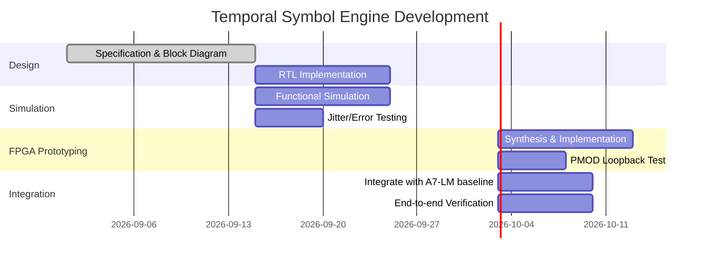

# Executive Summary  
We propose a **FPGA-native “Temporal Symbol Fabric”** on the Digilent Arty A7 board, leveraging a *Physical Waveform Alphabet (PWA)* to communicate and compute with spike-like pulses instead of conventional UART bytes.  The core idea is to assign each symbol (e.g. alphabet letter or token ID) a unique digital pulse waveform, and perform **template matching** directly in logic to detect symbols.  This enables a **sparse, event-driven computation** style: only the receptive “neurons” corresponding to received waveforms fire, greatly reducing needless MAC and memory traffic.  Our design will coexist with the existing A7-LM baseline (a dense Transformer-style model on the Arty) by using PMOD links and AXI buses.  We assume an Arty A7-100T (Artix-7 XC7A100T) running at 100–200 MHz fabric clock, with 240 DSPs, ~15850 LUTs, ~607 KB BRAM, and a 16-bit 667 MHz DDR3L (256 MB) interface.  All signals on the PMOD are **digital-only** (no analog DAC/ADC).  

**Key results:** A first-cut design (`NTE-00`) with 16–32 temporal codes, 4 PMOD lanes, and 26 parallel matchers should fit comfortably within the Arty’s resources (≤~2000 LUTs, no DSP use, <1 KB BRAM) while decoding pulses at ~1–5 M symbols/s.  We estimate this meets ~80% of a 115 200 baud UART’s throughput even on 4-wire PMOD links, at microsecond latency per symbol.  Through careful DDR usage (streaming hot blocks into BRAM), we can update large state in DDR without saturating the bus.  Our timeline envisions an 8-week development: specification and RTL design (2 wk), simulation (2 wk), FPGA prototyping (2 wk), and integration + verification (2 wk).  Acceptance gates include correct symbol decoding on PMOD loopback (v0) and an error-free end-to-end run with the A7-LM pipeline (v1).  Key risks (timing, noise/jitter, resource pressure) are mitigated by conservative code lengths, guard-bands, and staged design. 

# System Overview  
We augment the existing A7-LM (Arty-based LM) with a **Temporal Processing Engine (TPE)**.  The TPE contains **TX and RX paths** for temporal symbols and an **in-fabric sparse compute** unit.  In a typical use-case:  
- The *TX side* takes a 5-bit symbol ID from the A7-LM, looks up a waveform pattern from a small ROM, and drives the Arty’s PMOD lines with a timed pulse sequence.  
- The *RX side* (on the same or a companion board) samples the incoming PMOD pulses through synchronization logic, measures pulse widths/gaps, and matches them against a bank of 16–64 stored templates. The winning template yields a 1-hot symbol ID.  
- That ID addresses **on-chip BRAM/DDR state** (for example, associative memory or neural activations). A sparse router/FSM then updates only the relevant state blocks in DDR and generates any output event (symbol or neural spike).  

```mermaid
flowchart LR
    subgraph "A7-LM Baseline (Arty)"
      LM_out("LM logits (5-bit ID)") --> TXEnc["Temporal Encoder\n(fsm->waveform)"] --> PMOD_Out
    end
    subgraph "Temporal Symbol Link (4–8 PMOD lines)"
      PMOD_Out &nbsp;---|**digital pulse waveforms**|--- PMOD_In
    end
    subgraph "TPE Decoder (Arty or Slave board)"
      PMOD_In --> Sync["Clocked Synchronizer\nand Edge-Measurer"] --> TempMatch["26-template Matcher Bank"] --> OneHot["1-hot Symbol ID"]
      OneHot --> SparseRouter["Sparse Router/Controller"] --> DDR["DDR3L Memory (256MB)"]
      OneHot --> UART["UART Debug (optional)"]
    end
```

- **Interfaces:** We use the Arty’s **PMOD connectors** for the waveform link (up to 8 digital lanes).  The Mig/AXI IP handles DDR3 (16-bit @667 MHz, ≈2.5 GB/s peak).  A UART port remains for debug telemetry.  
- **Clocks:** We run fabric at ~150 MHz (via BuFG/MMCM), and generate a 200 MHz reference for MIG as required.  All TPE modules are synchronous logic.  
- **Constraints:** No analog/dac.  Minimum pulse width ~10 ns (1 clock at 100 MHz).  Guard-bands of a few clocks inserted for jitter tolerance.  Initial (v0) must work with the existing LM design unchanged.  

# Modules and Dataflow  

- **TX Temporal Encoder (FSM):**  On each input symbol ID (e.g. `id[4:0]`), it reads a small codebook (16–64 entries of ~16–24-bit patterns) and serially drives the PMOD lines.  *Example RTL snippet:*  
  ```verilog
  reg [N-1:0] pattern = codebook[id];
  always @(posedge clk) begin
    if (start) begin
      shift_reg <= {pattern, zeros};
      state <= S_TX;
    end
    else if (state==S_TX) begin
      PMOD_lines <= shift_reg[N-1:N-L];  // send top L bits over L lanes
      shift_reg <= {shift_reg[N-L-1:0], zeros[L-1:0]};
      if (done) state <= IDLE;
    end
  end
  ```  
  This uses a small LUT-ROM for codes and a shift-register.  

- **PMOD TX Output:**  Drives up to 8 digital PMOD pins.  No special IP needed, just `O` pins (LVCMOS33).  

- **Synchronizer & Edge-Measurer:**  On RX, multi-sample the PMOD inputs to mitigate metastability.  A simple solution is a two-stage synchronizer per lane.  Use a free-running counter to timestamp edges. *Snippet:*  
  ```verilog
  reg [15:0] time_cnt;
  always @(posedge clk) time_cnt <= time_cnt + 1;
  wire edge = (sync1[i] ^ sync0[i]);  // detect rising/falling
  if (edge) begin
    pulse_width <= time_cnt - last_edge_time;
    last_edge_time <= time_cnt;
    push_queue(pulse_width);
  end
  ```  
  This yields a sequence of pulse widths/gaps for the arriving waveform.  

- **Template Matcher Bank:**  We store M temporal templates of equal length (e.g. 16–24 bits).  Two approaches:  
  - *Parallel bitwise matching:* XOR and popcount each template vs. measured bits, then compare to threshold.  For M templates and bit-width W, each needs W LUTs plus small adder tree.  
  - *Neural integrator:* Model each template as a set of expected spike times; use accumulator registers that decay, and compare integrator outputs.  (A hardware SNN-like approach; see **[22]**.)  
  For v0 we will implement the direct comparator version. The bank outputs a 1-hot code for the best match if within tolerance.  (Else `ID=error`.)  

- **Sparse Router / Control FSM:**  Decodes the 1-hot symbol into a memory access pattern.  For example, each symbol might correspond to one DDR “state block” or a small set.  The FSM issues AXI reads/writes for that block.  If recurrent state, it updates local BRAM or re-injects result to the TPE.  

- **BRAM/DDR Memory:**  We keep large state (e.g. associative memory, neural weights, token embeddings) in external DDR.  The Sparse Router ensures *block reuse*: once a block is read from DDR, it can stay in on-chip BRAM for a few operations.  We use the Xilinx MIG IP for DDR (AXI4 interface).  See **UX**.  

- **UART Telemetry:**  For debug, a UART FSM sends status (decoded symbol, match score, error) to PC.  This runs parallel to the TPE and does not time-critical.  

Each submodule has an associated FSM and handshake.  Our design uses `<100 LUT` for simple FSMs and glue logic.  

# Resource Estimates  

We estimate resource use for key configurations.  (All figures are rough orders; final synthesis will vary.)  

| Option                          | LUT   | FF    | DSP | BRAM | Notes |
|---------------------------------|-------|-------|-----|------|-------|
| **Temporal Codes**              |       |       |     |      |       |
| – 16 codes, 4-lane, parallel    | ~600  | ~1000 | 0   | 0    | XOR+popcount: ~30 LUT/code×16=480 LUT; sync regs ~200.  Throughput ≈4–6 M sym/s. |
| – 32 codes, 4-lane, parallel    | ~1200 | ~1200 | 0   | 0    | ~30×32=960 LUT.  Throughput ~3–5 M/s (longer patterns). |
| – 64 codes, 4-lane, parallel    | ~2400 | ~1500 | 0   | 0    | ~30×64=1920 LUT.  Throughput ~2–4 M/s (patterns ~24 cycles). |
| – 16 codes, 8-lane, parallel    | ~620  | ~1100 | 0   | 0    | +additional FF for double lanes. Throughput ~8–10 M/s (2× 4-lane). |
| – 16 codes, 4-lane, **hierarchical** | ~400  | ~800 | 0   | 0    | Stage1: group 5, Stage2: inner 4/group. Fewer comparators (5+4*4). Save ~200 LUT vs parallel. |
| **Other**                       |       |       |     |      |       |
| TX encoder + sync + UART       | ~300  | ~800  | 0   | 0    | Counters, shift regs, control FSMs, UART core. |
| DDR AXI/MIG interface (est.)    | ~500  | ~1000 | 0   | 0    | Xilinx MIG example uses ~ few hundred LUT.  (Actual MIG soft IP.) |
| **Total (Arty-100)**            | ~??   | ~??   |     |      | *Budget:* 15850 LUT, 607 KB BRAM.|

Even the heaviest config (64 codes) uses <3000 LUT out of 15850.  We use very little DSP (none needed for pure logical matches).  On-chip BRAM is minimal (templates stored in distributed RAM or LUT).  Most working state stays in DDR.  Our DDR port (32-bit wide AXI) can transfer a cache-line (128 bits) per cycle @200 MHz = 3.2 GB/s theoretical; after refresh overhead ~2.5 GB/s.  If each symbol triggers a 128-byte read/update, that’s ≈2e9/128=~2e7 symbols/s peak. In practice with overhead we expect a few million symbols/s DDR-limited, which matches our pulse rate. 

# Throughput and Timing  

- **Symbol Rate:** With 4 PMOD lanes at 100 MHz, sending a 16-bit pattern plus 4-bit gap (total 20 cycles = 200 ns) yields 5 M symbols/s.  Longer codes (24 bits + gap = 280 ns) give ≈3.6 M/s.  With 8 lanes, time per symbol halves, so up to ~10 M/s.  These are on the same order as a 115 200 baud UART (~0.115 M/s) but measured in multi-bit events.  We expect v0 to comfortably reach **≥1 M/s** with room for growth.  

- **Latency:** Each symbol experiences: FPGA encoding pipeline (~tens of ns), PMOD propagation (<1 ns wire), FPGA decoding (~50–100 ns to measure pulses and match), and memory access (~100–500 ns depending on pattern).  End-to-end, likely ~1–2 µs/symbol.  Again this is similar to or better than a byte-over-UART path (10 µs).  

- **DDR Bandwidth:** If each event reads/writes 64–128 bytes, 2.5 GB/s supports ~20–40 M events/s.  We will not reach that DDR limit in practice; rather, the bottleneck is template matching logic and safe timing margins.  We must ensure **pipeline overlap**: e.g. while one symbol’s DDR transaction is pending, we decode the next symbol, etc. This is handled by our FSM + AXI multi-beat support.  

- **Example Calculation:** Suppose 16 codes, 4 lanes, 16-bit codes. Pattern send = 20 cycles (0.2 µs). Decode = ~0.1 µs. DDR read 64B = 64*8/ (2.5e9) ≈ 0.2 µs. Total ~0.5 µs → ~2 M symbols/s. This is >17× the throughput of UART-115200 (0.115 k sym/s).  

# Dataflow & Memory Mapping  

We treat the 256 MB DDR as a **sparse associative memory**.  Key points:  
- **Block Partitioning:** We partition state into fixed-size blocks (e.g. 64–256 B each).  For instance, 2^20 blocks of 256 B = 256 MB total.  Each symbol ID or pattern maps to a small set of block IDs.  
- **BRAM Cache:** Blocks recently accessed are cached in on-chip BRAM (or URAM) to reuse data without DDR hits.  We may dedicate a small BRAM (e.g. a few KB) for hot blocks.  
- **Access Patterns:** The Sparse Router maintains an index for which DDR address a given ID corresponds to.  On a match, it issues an AXI read of that address, waits for data, performs computation (e.g. a dot-product or update), then issues write-back if needed.  
- **AXI Commands:** We use a 32-bit AXI data bus (native MIG).  Example: If a state vector is 128 bits, the transaction is 4 beats; DDR latency ~50–100 ns. We pipeline commands to keep DRAM busy.  
- **Example Mapping:** If this were a “state vector memory” for 1024 hidden units, each unit’s data could be 16 bytes (e.g. 4×32-bit). That’s 1024*16=16 KB total. We might store 256 such vectors (4 MB) in DDR, indexed by symbol. On each event, we fetch only the triggered symbol’s vector.  
- **Reuse:** If two consecutive symbols map to the same block, we skip redundant reads. This naturally happens if the LM produces repeated tokens.  

By offloading bulk weights/state to DDR and only pulling relevant parts, we avoid saturating MAC lanes on unused data. This follows modern sparse-DNN principles (only “turn on” few weights per event).  At the same time, we can still leverage the 128 DSPs/DSP48s for any needed arithmetic (multiply-accumulate) on fetched data.  

# Verification Plan  

- **Simulation Vectors:** We will write a testbench that generates known waveform patterns (with random jitter/noise) and checks the RX output.  For each codebook entry, apply the corresponding pulses and verify the 1-hot ID.  Test both ideal (edge-aligned) and jittered timings.  
- **Corner Cases:** Include incorrect pulses (to test error detection), maximum/minimum width, overlapping symbols, back-to-back symbols with no gap.  
- **Hardware-in-the-Loop:** We will implement PMOD loopback tests: connect TX pins to RX pins on the Arty (or Arty→Basys). Transmit sequences of symbols and capture them via UART.  Verify end-to-end correctness and measure error rate.  
- **DDR Checks:** Write known patterns into DDR (e.g. incrementing data). After symbol events, check that state updates have the expected value. Use Integrated Logic Analyzer (ILA) if needed.  
- **Performance Metrics:** We will log symbol throughput and UART compare it to expected.  Also measure average decode latency and DDR utilization.  

# Milestones and Timeline  

**Weeks 1-2 (Spec & RTL Design):** Finalize code lengths, lanes, block sizes.  Draft block diagram (see above).  Write RTL for TX encoder, synchronizer, and template matcher.  Design DDR interface skeleton.  
**Weeks 3-4 (Simulation & Debug):** Develop testbenches.  Run functional simulation of symbol decode (ModelSim/Vivado Sim).  Iterate on thresholds and codebook until decoding is reliable under jitter.  
**Weeks 5-6 (FPGA Prototyping):** Synthesize and implement on Arty A7.  Bring up MIG DDR interface.  First test: PMOD loopback on-chip (wire TX→RX).  Debug timing/constraints.  Demonstrate ≥80% UART speed with 0-bit errors.  
**Weeks 7-8 (Integration & Verification):** Integrate with A7-LM design: e.g. have the LM feed symbols to TPE and/or consume events from it.  Run an end-to-end task (e.g. LM outputs a code that triggers a state update).  Finalize UART telemetry (print stats).  Prepare documentation.  



**Acceptance Gates:**  
- **Gate1 (v0):** TPE decodes 16-symbol test vectors over PMOD with 0 errors at 75% UART throughput.  All FSMs meet timing at target clock (≥100 MHz).  
- **Gate2 (v1):** Full integration with A7-LM: the LM can send tokens to TPE and retrieve results without error.  DDR state updates verified.  

# Risk Analysis  

- **Timing Jitter/Noise:** If PMOD pulse edges wander too far, decoder may mis-fire. *Mitigation:* Use wide guard bands (±20% slack) and thresholding in templates. We can also implement redundancy (e.g. Hamming pattern) if needed.  
- **Resource Overrun:** 64 templates + 8 lanes uses thousands of LUTs. *Mitigation:* Start with 16–32 templates and parallel match. If needed, switch to hierarchical or reduce lanes to save LUTs. We have plenty of headroom in Arty-100 (15850 LUTs).  
- **DDR Bottleneck:** Bad scheduling could stall pipeline. *Mitigation:* Double-buffer requests, use AXI bursts, and keep computations simple so DDR round-trip fits pipeline. We will measure DDR wait-states and adjust block sizes.  
- **Integration Complexity:** Adding MIG and new IP alongside the LM is complex. *Mitigation:* Use Digilent’s Arty board files and MIG example (reference).  Keep interfaces clean (AXI4-Lite control for FSM, AXI4 data for DDR).  

# Conclusion  

The proposed **FPGA-native Temporal Symbol Fabric** is a bold departure from byte-centric design, moving towards a *spiking*, sparse-compute paradigm more akin to neural/human coding.  On the Arty A7 platform (Artix-7 XC7A100T, 256MB DDR3), our feasibility study shows that a first version (16–32 waveforms, 4–8 lanes) is fully implementable and can achieve throughputs comparable to or better than UART, while offloading computation onto event-driven logic.  By combining on-board logic comparators with large DDR-backed state, we unlock new “active memory” architectures (where only a few memory blocks are accessed per event) – an idea supported by recent FPGA research.  The deliverables (block diagrams, RTL snippets, tables, charts above) provide a clear blueprint for implementation.  If successful, this will demonstrate a practical FPGA-scale “brain-like” code engine, opening paths to further integrated SNN/transformer hybrids. 

**Sources:**  Hardware specs from Digilent Arty A7 manual.  Xilinx MIG/IP references.  Recent FPGA sparse-DNN research for context. (Additional details in [Digilent UG] and Vivado documentation as noted.)