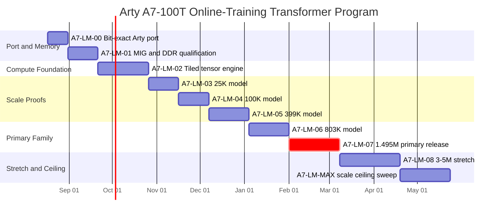

# Arty A7-100T Native Online-Training Transformer Program

> **DEPRECATED — DO NOT USE AS ACTIVE ROADMAP** (effective 2026-08-17).  
> This file is a historical copy of `Arty A7-100T Native Online-Training Transformer Program.md`.  
> **Sole program-roadmap authority:** `Revised Arty A7 Program Master.md`.  
> Contracts remain under `docs/contracts/`. Frozen BOARD_PASS releases remain immutable.  
> Do not use this file for architecture, milestone order, numerical law, DDR interface, gates, or next tasks.  
> Native MIG `app_*` recommendations here are archived. Authoritative interface = official Digilent AXI MIG.  
> Current state: A7-LM-00…04 BOARD_PASS / FROZEN; **A7-LM-05 OPEN**. This deprecated file remains historical only.

## Executive summary

The recommended program is to treat the **Arty A7-100T as the final research platform for this phase**, not as a temporary bridge to an SoC. The board combines an XC7A100T with **63,400 LUTs, 126,800 flip-flops, 240 DSP48E1 slices, 4,860 Kbit of Block RAM, and 256 MB of 16-bit DDR3L running at 333 MHz / 667 MT/s**. The supplied Digilent MIG preset targets the XC7A100T, a 16-bit `MT41K128M16XX-15E` memory interface, 4:1 PHY ratio, 333.3 MHz memory clock, and a full 256 MB address space. citeturn13search0turn10search3turn11search1

The current project should be preserved as **two scientifically distinct lines**:

```text
Research lineage
─────────────────────────────────────────────────────────────────

8-Agent Neuromorphic Fabric
8 agents / 64 spatial synapses
full-parallel plasticity
STDP / Hebbian / temporal association
BOARD VALIDATED
        │
        │  keep frozen as evidence
        │
        └───────────────────────────────┐
                                        │
Basys-3 Tiny Transformer                │
3.2K trainable parameters               │
causal forward + approximate backprop   │
FPGA weight update                      │
BOARD VALIDATED                         │
        │                               │
        ▼                               │
Arty A7 Transformer Family              │
DDR-backed / DSP-tiled                  │
online training                         │
0.8M → 1.5M → 3–5M → MAX               │
                                        │
                                        ▼
                          separate architecture claims
```

This distinction matters. The original research branch has demonstrated **64 simultaneously active spatial synapses** rather than a time-multiplexed accelerator. fileciteturn0file7 The Arty design, by contrast, should deliberately become a **tiled tensor machine** in which millions of stored parameters share a much smaller number of DSP MAC lanes. The two architectures answer different research questions and should never be conflated in release claims.

The previous Arty planning target—**0.8–1.5 million parameters as the primary objective, 3–5 million as the strong stretch, and roughly 8–10 million as a measured ceiling experiment**—is technically sensible. fileciteturn0file0 The important qualification is that DDR **capacity** is not likely to define that ceiling: an 8.45M-parameter tied INT8 model needs only about 8.1 MiB for weights, while even a 10.55M untied configuration is about 10.1 MiB. The limiting factors will instead be sustained DDR bandwidth, backward/update traffic, fixed-point convergence, routing, and useful tokens/s. This is an engineering inference from the board's 256 MB DDR capacity and 16-bit/667 MT/s interface. citeturn10search3turn11search1

My recommended closeout hierarchy is:

| Program stage | Target | Release interpretation |
|---|---:|---|
| **A7-LM-00** | existing 3.2K | bit-exact Arty compatibility port |
| **A7-LM-01** | memory subsystem | production-quality MIG/DDR foundation |
| **A7-LM-02** | tensor engine | DSP/BRAM tiled compute platform |
| **A7-LM-03** | 25K | first scaled multi-head/multi-layer model |
| **A7-LM-04** | 100K | first real-text/byte-level online LM |
| **A7-LM-05** | 399K | four-layer research LM |
| **A7-LM-06** | 803K | primary lower-bound model |
| **A7-LM-07** | 1.495M | **primary program success** |
| **A7-LM-08** | 4.276M nominal | **stretch online-training model** |
| **A7-LM-MAX** | 8.45M tied / 10.55M untied | measured ceiling experiment |

The primary research claim after A7-LM-07 should be deliberately narrow:

> **FPGA-native small autoregressive Transformer with FPGA-resident forward, backward, optimizer/update state machine, DDR-resident trainable model state, and teacher-free autoregressive generation after training.**

It should **not** be marketed as a modern general-purpose LLM. At 0.8–5M parameters it is much more accurately a small language-model research platform.

AMD's FINN work strongly supports the architectural principle of co-designing quantization, dataflow, and parallelism for an FPGA rather than mapping a software neural network literally. FINN itself is an inference framework, not the training solution for this project, but its use of quantized streaming/dataflow components is a useful precedent. Vitis AI likewise documents the memory/bandwidth benefits of integer quantization, although its DPU flow is not the deployment target for an Artix-7 Arty board. citeturn10search0turn14search0

## Baseline and target family

### Compatibility contract inherited from Basys

A7-LM-00 should begin from the **exact Basys LM-05 numerical law**, not from an improved Arty version. The purpose of the first milestone is not performance; it is to prove that a board change alone does not alter the trained machine.

The compatibility package should therefore freeze:

```text
MODEL
Vocab              32
Context             8
d_model             16
Heads                1
Layers               1
d_ff                 32
Trainable params   3200

ARITHMETIC
INT8 persistent weights
existing integer forward law
existing causal masking
existing approximate softmax
existing LayerNorm treatment
existing gradient shifts
existing sign-SGD/deadzone update law

BEHAVIOR
same checkpoint
same initialization
same inputs
same logits
same gradients
same updates
same generated tokens
```

For the existing bias-free/scale-free architecture with an untied language head, the planning parameter formula is:

\[
P = 2Vd + Cd +
L\left(4d^2+2d\,d_{ff}\right)
\]

where the first two terms are token embedding plus untied language head and position embeddings, and each Transformer layer contributes Q, K, V, output projection, and the two FFN matrices.

That reproduces the 3,200-parameter Basys baseline:

\[
2(32)(16)+(8)(16)+
1\left[4(16^2)+2(16)(32)\right]
=3200.
\]

### Recommended model ladder

The following configurations are not industry-standard model sizes; they are a deliberately smooth **hardware research progression**. Every width is selected so the per-head dimension remains integral, and the progression avoids changing too many variables in a single milestone.

| Milestone | Vocab | Context | \(d_{model}\) | Layers | Heads | \(d_{ff}\) | Parameters | INT8 weights | INT8 KV cache |
|---|---:|---:|---:|---:|---:|---:|---:|---:|---:|
| Basys / A7-LM-00 | 32 | 8 | 16 | 1 | 1 | 32 | 3,200 | 3.1 KiB | 0.25 KiB |
| A7-LM-03 | 128 | 16 | 32 | 2 | 2 | 64 | 25,088 | 24 KiB | 2 KiB |
| A7-LM-04 | 256 | 32 | 64 | 2 | 4 | 128 | 100,352 | 98 KiB | 8 KiB |
| A7-LM-05 | 512 | 64 | 96 | 4 | 4 | 192 | 399,360 | 390 KiB | 48 KiB |
| A7-LM-06 | 1,024 | 128 | 128 | 4 | 4 | 256 | **802,816** | 784 KiB | 128 KiB |
| A7-LM-07 | 2,048 | 128 | 160 | 4 | 5 | 320 | **1,495,040** | 1.43 MiB | 160 KiB |
| A7-LM-08 | 4,096 | 256 | 192 | 6 | 6 | 768 | **4,276,224** | 4.08 MiB | 576 KiB |
| A7-LM-MAX tied | 8,192 | 256 | 256 | 8 | 8 | 1,024 | **8,454,144** | 8.06 MiB | 1.00 MiB |
| A7-LM-MAX untied | 8,192 | 256 | 256 | 8 | 8 | 1,024 | **10,551,296** | 10.06 MiB | 1.00 MiB |

`KV cache` above is \(2LCd\) bytes, assuming quantized INT8 K and V. This exposes an important architecture breakpoint: the Arty's 4,860 Kbit of on-chip memory is about 607.5 kB in decimal terms, so the 0.8M and 1.5M KV caches can comfortably remain on-chip alongside carefully sized tiles, whereas the 4.28M configuration's approximately 576 KiB KV cache is already too close to total BRAM capacity to be practical. A7-LM-08 should therefore introduce **hybrid/DDR KV storage** as a deliberate milestone feature. The total BRAM capacity follows directly from the XC7A100T board specification. citeturn10search3

The 8–10M row should remain a **ceiling experiment rather than a promised deliverable**. Tying input embedding and output language-head weights at A7-LM-MAX removes exactly \(8192\times256=2,097,152\) INT8 parameters, moving the configuration from about 10.55M to 8.45M. That makes weight tying valuable not merely for model regularization but for DDR traffic.

### What “online training” must mean

A milestone is not an online-training pass merely because the host sends new weights. The project contract should require:

```text
TRAIN

host token IDs / targets
         │
         ▼
      FPGA
  forward pass
         │
         ▼
 loss / error law
         │
         ▼
     backward
         │
         ▼
 gradient/update
         │
         ▼
DDR model state changes
```

and then:

```text
AFTER / FREEZE

Teacher             OFF
Host target stream   OFF
Learn                OFF
Optimizer writes       0
Model weight writes    0
External LLM calls     0
Next-token choice    FPGA
Autoregressive loop  FPGA
```

The host is allowed to tokenize, provide corpus tokens, issue commands, display output, calculate independent evaluation metrics, and archive checkpoints. It must not calculate training gradients, update the weights, or decide the next token during the board-validation run.

## Arty hardware architecture and DDR system

### Top-level hardware/software boundary

There is no SoC processor on the board, so the accelerator should be designed as a **self-scheduling RTL machine**, not as a DPU under embedded Linux.

```text
                         HOST PC
          ┌────────────────────────────────────┐
          │ tokenizer / BPE                    │
          │ corpus & target streaming          │
          │ experiment controller              │
          │ golden reference in TEST MODE only │
          │ logging / plots / checkpoint files │
          └─────────────────┬──────────────────┘
                            │ UART initially
                            │
                            ▼
┌─────────────────────── ARTY A7-100T ─────────────────────────┐
│                                                              │
│  protocol parser ──► command scheduler                       │
│                            │                                 │
│              ┌─────────────┴─────────────┐                   │
│              ▼                           ▼                   │
│       inference FSM                 training FSM             │
│              │                           │                   │
│              └─────────────┬─────────────┘                   │
│                            ▼                                 │
│                  Tensor Microsequencer                       │
│                            │                                 │
│            ┌───────────────┼───────────────┐                 │
│            ▼               ▼               ▼                 │
│       GEMV/GEMM         Vector ALU      Norm/Softmax          │
│       DSP48E1 array     LUT/DSP         LUT/BRAM              │
│            │               │               │                 │
│            └───────────────┼───────────────┘                 │
│                            ▼                                 │
│                BRAM Scratchpad Fabric                        │
│          ┌────────┬──────────┬───────────┐                   │
│          │ W ping │ W pong   │ act/psum  │ KV                │
│          └────┬───┴─────┬────┴────┬──────┘                   │
│               │         │         │                          │
│               └─────────┼─────────┘                          │
│                         ▼                                    │
│                  DDR DMA Scheduler                           │
│                         │                                    │
│              MIG native app_* interface                     │
│                         │                                    │
│                         ▼                                    │
│                   256 MB DDR3L                               │
│  weights | optimizer | activations | KV | checkpoints        │
└──────────────────────────────────────────────────────────────┘
```

The XC7A100T has 240 DSP slices, while DSP48E1 supplies a dedicated multiplier plus accumulator/ALU functionality. The primitive exposes a 25-bit multiplier-side A path, an 18-bit B path, and a 48-bit arithmetic output/accumulator path, making a conservative **one fixed-point MAC per DSP per cycle** mapping straightforward. citeturn15search0turn15search10 I recommend *not* using clever packed dual-INT8 multiplication in the first engine: it complicates sign handling and exactness for relatively little scientific value.

### MIG configuration

Use the **official Digilent Arty-A7-100 board MIG project as the source of truth**, version-pinned into the repository. Digilent's current board file specifies:

| MIG property | Arty A7-100 setting |
|---|---|
| FPGA | `xc7a100t-csg324/-1` |
| DDR device | `MT41K128M16XX-15E` |
| Physical data width | 16 bits |
| Memory clock period | 3000 ps |
| Memory clock | ≈333.3 MHz |
| PHY ratio | 4:1 |
| Input reference clock | 166.666 MHz |
| DDR voltage | 1.35 V |
| Capacity | 268,435,456 bytes |
| DDR burst | BL8 fixed |
| Address policy | `BANK_ROW_COLUMN` |

These settings come directly from Digilent's generated `mig.prj`; the file itself warns against hand-editing generated MIG configuration. citeturn11search1

With `nCK_PER_CLK=4`, UG586 defines the UI data width as physical DQ width × 8. A 16-bit Arty DRAM interface therefore presents a **128-bit user-data path** in this configuration. citeturn16search0 The physical bus's theoretical peak is:

\[
667\times10^6\ transfer/s\times16\ bit
=10.672\ Gbit/s
\approx1.334\ GB/s.
\]

That is a *raw theoretical number*, not a promise of usable application bandwidth. The first DDR milestone must measure sustained bandwidth under the exact command scheduler and address mapping.

I recommend the MIG **native `app_*` user interface**, rather than adding AXI solely for familiarity. UG586 already provides a flat user interface with `app_addr`, command, write-data, readiness, read-data-valid, calibration, and maintenance signals. Commands are accepted only when `app_en && app_rdy`; write data has its own `app_wdf_*` handshake, while reads return with `app_rd_data_valid`. citeturn10search20turn10search11 There is no processor on this board that inherently benefits from an AXI memory map, so native MIG removes one unnecessary abstraction layer.

### DDR verification contract

MIG's PHY performs DDR initialization and read/write timing calibration, so `init_calib_complete` must become a **hard system prerequisite**, not an LED-only diagnostic. citeturn10search8

A7-LM-01 should perform the following sequence on every board-validation run:

```text
POWER / PROGRAM
      │
      ▼
wait init_calib_complete
      │
      ├── timeout → FAIL
      ▼
walking-1 / walking-0
      ▼
address-as-data
      ▼
PRBS32 / PRBS64
      ▼
sequential burst test
      ▼
random-address test
      ▼
boundary tests
      ▼
read BW / write BW / mixed BW
      ▼
RESET / recalibrate
      ▼
repeat
```

Recommended release gates are **100/100 cold-boot calibration successes**, zero bit errors over multiple whole-memory equivalent passes, and no errors through explicit row/bank/buffer boundaries. The exact amount of BIST traffic should be recorded, not simply “PASS.”

For performance, use two grades rather than quietly weakening the gate:

```text
minimum release:
sequential sustained read >= 0.85 GB/s

preferred:
>= 0.95 GB/s

stretch scheduler:
>= 1.00 GB/s
```

Those are project engineering targets, not AMD guarantees; they correspond roughly to 64%, 71%, and 75% of the 1.334 GB/s raw link rate. If A7-LM-01 cannot exceed ~0.85 GB/s on long sequential transfers, **do not proceed to the million-parameter milestones** until the address scheduler, bursts, and buffering are understood.

### DMA and double buffering

The DMA layer should have its own descriptor abstraction:

```text
struct dma_desc {
    op;             // READ / WRITE
    tensor_id;
    ddr_base;
    byte_count;
    row_stride;
    tile_id;
    scratch_bank;   // PING / PONG
    completion_tag;
}
```

The canonical flow is:

```text
time ─────────────────────────────────────────────────────►

DDR       load W0       load W1       load W2       load W3
             │             │             │             │
BRAM      [PING]         [PONG]        [PING]         [PONG]
             │             │             │             │
DSP             compute W0     compute W1     compute W2
```

A tile should never be copied from DDR and then left idle while the previous tile finishes. Prefetch begins as soon as the opposite BRAM bank is free.

For the initial 128-lane engine I recommend logical tiles of approximately:

```text
GEMV:
N_TILE = 128 outputs
K_TILE = 128 or 256

GEMM / BACKPROP:
M_TILE = 8 token rows
N_TILE = 16 output columns
K_TILE = 128 or 256
```

The physical datapath can have two scheduling modes over the same 128 multipliers:

```text
AUTOREGRESSIVE GEMV MODE
1 activation value broadcast
×
128 weight values
→ 128 partial sums

TRAINING GEMM MODE
8 × 16 logical PE organization
→ 128 MACs/cycle
→ reuse each fetched weight across token rows
```

This dual-mode architecture is important because autoregressive generation has little weight reuse at a single token, whereas teacher-forced sequence training can amortize each weight tile over several token rows. FINN's general lesson—that quantization and the degree/shape of parallelism should be co-designed with the FPGA dataflow—is directly relevant here, even though FINN itself is inference-oriented. citeturn10search0

Start A7-LM-02 with **128 DSP MAC lanes**. Do not commit to 192 until measurement. At the 4:1 MIG UI rate, even 128 lanes can consume data much faster internally than DDR can stream unique INT8 weights; additional MACs improve training when there is reuse, but they do not magically remove the memory roofline for one-token GEMV.

### BRAM organization

Use BRAM as a **scratchpad**, not as the model store:

```text
BRAM allocation concept
────────────────────────────────────────────
Weight tile PING      banked, wide-read
Weight tile PONG      banked, wide-read

Activation PING       INT16
Activation PONG       INT16

Partial sums          INT32 / internal 48-bit
Gradient tile         INT16/INT32
Layer scratch
Command/DMA FIFOs
KV cache              through A7-LM-07
────────────────────────────────────────────
```

The project should infer or instantiate RAMB36/RAMB18 structures with explicit widths/depths rather than building large arrays out of flip-flops. The on-chip memory capacity is one of the Arty's major advantages over the Basys phase, while DSP48E1 is the appropriate resource for repeated multiply-accumulate work. citeturn10search3turn15search3

For A7-LM-08 onward, use a hybrid KV policy:

```text
recent window / active layer KV → BRAM
older or inactive-layer KV      → DDR
```

The switch should be triggered by model configuration, not ad-hoc RTL edits.

### Sample DDR address map

Use a **generated map** rather than hard-coded magic addresses. Each model build should produce `ddr_layout.json`, but this is a good initial 256 MB top-level partition:

| DDR address | Size | Primary use |
|---|---:|---|
| `0x0000_0000–0x000F_FFFF` | 1 MB | manifest, tensor descriptors, tokenizer/model metadata |
| `0x0010_0000–0x02FF_FFFF` | 47 MB | live model tensors |
| `0x0300_0000–0x05FF_FFFF` | 48 MB | optimizer state |
| `0x0600_0000–0x07FF_FFFF` | 32 MB | activation/gradient scratch |
| `0x0800_0000–0x09FF_FFFF` | 32 MB | KV/sequence workspace |
| `0x0A00_0000–0x0BFF_FFFF` | 32 MB | checkpoint A |
| `0x0C00_0000–0x0DFF_FFFF` | 32 MB | checkpoint B |
| `0x0E00_0000–0x0EFF_FFFF` | 16 MB | telemetry/result staging |
| `0x0F00_0000–0x0FFF_FFFF` | 16 MB | BIST/guard/reserved |

The map uses the full 256 MB physical capacity specified by Digilent's MIG preset. citeturn11search1 Tensor bases inside those regions should be at least 4 KiB aligned; 64 KiB tensor alignment is preferable for human-readable dumps and easier checkpoint verification.

Do not assume the 48 MB optimizer region is forever sufficient. The layout generator must resize profiles for A7-LM-MAX. For example, a 10.55M model with 32-bit first and second moments plus INT8 weights would use roughly 90.6 MiB for live weight+optimizer state alone.

## On-FPGA training law and host partition

### Precision strategy

Vitis AI's quantization documentation is useful evidence that INT8 significantly reduces model memory and data-path bandwidth for FPGA inference, but this project has a harder problem: **training convergence**. citeturn14search0 I therefore recommend *not* forcing every intermediate quantity to INT8.

The default A7 scale profile should be:

| Quantity | Recommended initial format | Reason |
|---|---|---|
| Persistent weights | signed INT8 | 1 byte/parameter and Basys continuity |
| Token/position embeddings | signed INT8 stored | same model-state format |
| Activation scratch | signed INT16 | more training headroom |
| Q/K/V after requantization | INT8 or INT16 selectable | study accuracy/bandwidth tradeoff |
| Multiplier product | exact product | DSP native |
| MAC accumulation | 48-bit DSP internal; exported INT32 | prevent accumulation overflow |
| Attention scores | INT32 | headroom before rescaling |
| Softmax representation | current integer law initially | preserves Basys parity |
| Logits | INT24/INT32 | avoid premature clipping |
| Gradients | INT16 tile-local | practical update precision |
| Gradient accumulation | INT32 | microbatch / sequence accumulation |
| Optimizer state | none for sign-SGD; INT16 for momentum experiment | minimize DDR traffic |

A 16-bit activation multiplied by an 8-bit weight fits comfortably within a DSP48E1's multiplier operand widths, and accumulation can exploit the 48-bit DSP arithmetic path. citeturn15search0

Use **power-of-two scales** wherever feasible:

\[
q = \operatorname{sat}\left(x \gg s\right)
\]

rather than arbitrary multipliers/dividers in the first release. Every tensor descriptor should carry:

```text
weight_scale_shift
activation_in_shift
activation_out_shift
gradient_shift
saturation_mode
rounding_mode
```

Those values are part of the model checkpoint and therefore part of the SHA-locked research result.

### Preserve Basys law before improving it

A7-LM-00 through the first A7-LM-03 regression must retain:

```text
existing LayerNorm backward treatment
existing approximate softmax
existing last-query attention law where applicable
existing gradient shifts
existing sign-SGD rule
existing deadzone
```

Only after the scaled engine reproduces the exact reference should experimental improvements branch into new **learning-law IDs**.

Do not silently turn:

```text
law_id = lm05-signsgd-v1
```

into:

```text
law_id = something-better
```

while keeping the same milestone name.

### Optimizer sequence

My recommendation is:

```text
A7-LM-00 ... A7-LM-07
        │
        └── sign-SGD / Basys-compatible update
             no moment state

after 1.5M primary PASS
        │
        ├── A7-OPT-MOM
        │     INT16 momentum
        │
        └── optional A7-OPT-ADAMLITE
              INT16 m/v experiment
```

The reason is mostly **bandwidth**, not capacity.

Approximate live optimizer storage is:

| Model | INT8 weights only | + INT16 momentum | + two INT16 moments | + two INT32 moments |
|---|---:|---:|---:|---:|
| 0.803M | 0.77 MiB | 2.30 MiB | 3.83 MiB | 6.89 MiB |
| 1.495M | 1.43 MiB | 4.28 MiB | 7.13 MiB | 12.83 MiB |
| 4.276M | 4.08 MiB | 12.23 MiB | 20.39 MiB | 36.70 MiB |
| 8.454M | 8.06 MiB | 24.19 MiB | 40.31 MiB | 72.56 MiB |
| 10.551M | 10.06 MiB | 30.19 MiB | 50.31 MiB | 90.56 MiB |

All of these fit in 256 MB in isolation, but an optimizer that repeatedly reads and rewrites moment arrays consumes several times more DDR traffic per parameter. Thus **sign-SGD is an architectural choice that maximizes the probability of reaching the largest truly online-trainable model**, not merely a shortcut.

### Gradient accumulation

Support two modes:

```text
ONLINE-1
microbatch = 1 sequence
update immediately
primary research mode

ACCUM-N
N = 4 or 8 sequences
INT32 tile gradient accumulator
one update after N sequences
experimental convergence mode
```

Do **tile-local accumulation**. A full FP32 gradient tensor should not be materialized in DDR unless the optimizer experiment specifically requires it.

For a linear layer, backward scheduling should be:

```text
load old W tile
      │
      ├── dX = dY × Wᵀ
      │
      ├── dW/sign statistics = Xᵀ × dY
      │
      └── only after old-W dependencies complete:
             update W
             write new W to DDR
```

This avoids a second full gradient array and preserves correct use of the pre-update weight for `dX`.

### Host/FPGA responsibility matrix

| Function | Host PC | FPGA |
|---|:---:|:---:|
| UTF-8/BPE tokenizer | ✅ | |
| Corpus storage | ✅ | |
| Stream token IDs/targets during TRAIN | ✅ | |
| Experiment start/stop | ✅ | |
| Fixed-point golden reference in validation mode | ✅ | |
| Forward logits in release run | | **✅** |
| Attention / FFN | | **✅** |
| Loss/error law | | **✅** |
| Backward/gradient | | **✅** |
| Weight updates | | **✅** |
| Optimizer state | | **✅ DDR** |
| KV state | | **✅** |
| Next-token argmax | | **✅** |
| Sampling RNG/top-k later | | **✅ preferred** |
| Compute reporting perplexity from dumped logits | ✅ | |
| Update weights from software | **FORBIDDEN** | |
| External LLM during AFTER | **FORBIDDEN** | |

Host-side evaluation is not a violation of FPGA-native training: a PC may compute a floating-point reference cross-entropy or perplexity from **dumped FPGA logits** after an experiment. It simply may not feed those computed gradients or next-token decisions back during the evidence run.

### Perplexity needs two definitions

The Basys integer training law's native “CE” may not be numerically identical to a conventional natural-log negative log-likelihood. Do not exponentiate a hardware-specific integer score and call it perplexity unless its scaling is defined.

Log both:

```text
ce_hw_native
    exact integer metric used by hardware

nll_float_eval
    host evaluation of dumped logits

ppl_float_eval = exp(nll_float_eval)
```

This allows exact hardware-regression tracking and a conventional model-quality metric to coexist without mixing units.

## Complete milestone package

The milestone system should be **conjunctive**: every gate must pass. A failed performance, freeze, timing, or reproducibility gate means the milestone stays open even if a demo “looks good.”

### Milestone contract

| Milestone | Core deliverables | Acceptance gates | Mandatory evidence | Effort |
|---|---|---|---|---:|
| **A7-LM-00** | Arty wrapper/XDC; exact LM-05 port; compatibility UART; deterministic build | bit-exact forward/grad/update/generation vs Basys; freeze=0 writes; WNS≥0 | bitstream SHA, board transcript, 1K logits, gradient vectors, snapshots, timing/utilization | 2–3 pw |
| **A7-LM-01** | Digilent-preset MIG; native UI wrapper; DDR DMA; BIST/perf counters | calibration 100/100; zero DDR errors; ≥0.85 GB/s sequential read target; reset/recalibration PASS | MIG PRJ SHA, BIST logs, BW CSV, address-map JSON | 3–4 pw |
| **A7-LM-02** | 128-lane tensor engine; BRAM ping/pong; GEMV/GEMM; DMA overlap | ≥10K randomized exact kernels; no tile hazards; ≥60% measured roofline; WNS≥0 | kernel vectors, waveform set, utilization, stall counters | 4–6 pw |
| **A7-LM-03** | 25,088-param, 2-layer/2-head model | exact fixed-point reference; all banks update; CE drop ≥30% on controlled corpus; AFTER zero writes | checkpoint before/after, tensor SHAs, train curve | 2–3 pw |
| **A7-LM-04** | 100,352-param model; byte-level V=256 corpus path | held-out NLL improves; FPGA/reference trajectory agreement; online adaptation test | dataset/tokenizer SHA, held-out metrics, generation corpus | 3–4 pw |
| **A7-LM-05** | 399,360-param, 4-layer model | causal-mask suite; gradient sampling all layers; quality improvement; stable C=64 training | layer-by-layer hashes, PPL report, KV tests | 3–5 pw |
| **A7-LM-06** | 802,816-param primary-lower-bound model | full online train; no host compute leakage; performance ≥60% measured roofline | 0.8M release checkpoint, power/thermal report | 4–5 pw |
| **A7-LM-07** | **1,495,040-param primary model** | full forward/back/update; held-out improvement; freeze integrity; sustained generation; release resource limits | complete immutable BOARD-PASS package | 4–6 pw |
| **A7-LM-08** | 4.276M stretch model; DDR/hybrid KV | stretch model trains without divergence; DDR traffic fits target; useful tok/s | roofline report, hybrid-KV evidence, stability logs | 5–7 pw |
| **A7-LM-MAX** | parameter/config sweep; 8.45M tied and 10.55M untied probes | identify last config satisfying all ceiling gates; failures captured, not hidden | ceiling matrix, failed + passed builds, final architecture paper | 4–6 pw |

Total sequential engineering effort is approximately **34–49 person-weeks** for one experienced FPGA/ML engineer, before contingency. That is an engineering estimate, not an elapsed-time promise.

### A7-LM-00 — compatibility before optimization

**Deliverables**

```text
rtl/board/arty_a7_100_top.sv
constraints/arty_a7_100.xdc
configs/a7lm00.yaml
vivado/build_a7lm00.tcl
python/ref/lm05_fixed_ref.py
tools/a7lm00_bitexact.py
docs/contracts/A7-LM-00.md
```

The XC7A100T is supported in the current Vivado 2026.1 tool family, so pinning the project to that tool version is reasonable. citeturn12search0

**Gate**

```text
forward logits                1000/1000 exact
random gradient probes         128/128 exact
full small-tensor gradients      exact
weight snapshots after steps     exact
autoregressive sequences        20/20 exact
checkpoint restore SHA          exact
AFTER training writes               0
WNS                                 >= 0
TNS                                  0
git dirty                        false
```

No DDR optimization belongs in this milestone. First prove the same machine on the new FPGA.

### A7-LM-01 — DDR foundation

Use Digilent's board files and lock the exact board-files commit; Digilent explicitly includes MIG project files and presets for its non-Zynq boards. citeturn11search0turn11search1

**Deliverables**

```text
rtl/ddr/mig_native_wrap.sv
rtl/ddr/ddr_dma.sv
rtl/ddr/ddr_bist.sv
rtl/ddr/ddr_perf_counters.sv
configs/ddr_layout_base.json
tools/ddr_bist.py
tools/ddr_benchmark.py
```

**Gate**

```text
MIG init_calib_complete      100/100 cold starts
walking 1/0                     PASS
address-as-data                 PASS
PRBS                            PASS
whole-memory equivalents      >= 4
bit errors                         0
read BW                        >= 0.85 GB/s target
write BW                       recorded + gated
random BW                      recorded
reset/recalibrate                PASS
```

AMD recommends using MIG-generated pin planning for 7-series DDR3 rather than treating the interface like arbitrary FPGA I/O. citeturn10search14

### A7-LM-02 — tensor platform

This is the **most important implementation milestone**. Do not start million-parameter work until it closes.

**Deliverables**

```text
rtl/tensor/mac_lane.sv
rtl/tensor/mac_array_128.sv
rtl/tensor/gemv_scheduler.sv
rtl/tensor/gemm_scheduler.sv
rtl/tensor/requantize.sv

rtl/memory/tile_weight_pingpong.sv
rtl/memory/tile_activation.sv
rtl/memory/psum_bank.sv

rtl/control/tensor_microseq.sv

python/ref/fixed_gemm.py
tools/tensor_diff.py
tools/roofline_bench.py
```

**Gate**

```text
signed random GEMV/GEMM        >= 10,000 cases exact
INT8 min/max corner cases           exact
saturation cases                    exact
nonmultiple dimensions              exact
tile-boundary cases                 exact
DMA PING/PONG hazards                  0
DMA underflows during stress           0
MAC activity counters               valid
WNS                                  >= 0
```

Do not require the engine to hit 128 MACs every cycle while fetching unique weights from DDR. Instead, report:

\[
U_{MAC}=
\frac{\text{actual useful MAC operations}}
{\text{lane count}\times f\times time}
\]

separately for compute-only, DDR-streamed GEMV, and sequence-reuse GEMM.

### A7-LM-03 through A7-LM-05 — scaling proof

The sequence deliberately expands one complexity axis at a time:

```text
25K
  ↓
multiple heads + layers are real

100K
  ↓
V=256 byte-level text becomes practical

399K
  ↓
4 layers + C=64
real multi-layer causal learning behavior
```

At every level:

```text
RESET / INIT
    ↓
TRAIN
    ↓
all intended tensor families move
    ↓
held-out quality improves
    ↓
AFTER/FREEZE
    ↓
0 writes
    ↓
teacher-free autoregressive generation
```

The fixed-point Python reference is allowed in the **test harness**, but the final board run should explicitly start it in monitor-only mode.

### A7-LM-06 — first primary model

At **802,816 parameters**, the system should now be treated as a proper research language-model platform rather than a test fixture.

The acceptance report must add:

```text
input corpus tokens
train tokens
held-out tokens
training updates
ce_hw_native before / after
NLL before / after
PPL before / after
tokens/s inference
tokens/s training
DDR read GB
DDR write GB
DSP useful MAC utilization
peak saturation %
mean saturation %
power estimate
steady-state board power if measured
```

### A7-LM-07 — primary program completion

This is the release I would make the principal target.

```text
Vocab       2048
Context      128
d_model      160
Layers         4
Heads          5
d_ff         320
Params    1,495,040
```

The claim gate should require **both learning and retention**:

```text
Stage A: baseline held-out evaluation
Stage B: online adaptation corpus
Stage C: post-adaptation new-domain evaluation
Stage D: original held-out re-evaluation
```

This turns catastrophic forgetting into a measured research property rather than a qualitative observation.

Recommended quality gate:

```text
FPGA trajectory == fixed-point reference trajectory
on the locked regression corpus

AND

held-out NLL after training
< held-out NLL before training

AND

relative held-out improvement >= 10%
on the milestone's locked dataset

AND

no uncontrolled saturation / divergence
```

Do not set an absolute perplexity such as “PPL < 20” until the dataset/tokenizer is fixed; absolute PPL is not comparable across vocabulary/tokenization choices.

### A7-LM-08 — 3–5M stretch

This milestone is where the project changes from “BRAM-supported model” to **DDR-dominated model**.

Required architecture changes:

```text
KV BRAM-only
        ↓
hybrid DDR/BRAM KV

small address schedule
        ↓
sustained multi-stream scheduler

model checkpoint quick
        ↓
multi-MB checkpoint manager
```

At 4.276M parameters, the weight file is only about 4.08 MiB, so DDR **capacity** remains comfortable. The challenge is repeatedly moving that data through a raw ~1.334 GB/s physical memory interface while simultaneously handling activations, KV, backward traffic, and updates. citeturn10search3turn11search1

### A7-LM-MAX — find the ceiling scientifically

Do not define MAX as “10M must work.” Define it as an automated experiment:

```text
1.5M PASS baseline
   ↓
2M
   ↓
3M
   ↓
4.3M
   ↓
6M profile
   ↓
8.45M tied
   ↓
10.55M untied
```

For every configuration record:

```text
config SHA
parameters
weight bytes
optimizer bytes
KV bytes
LUT / FF / BRAM / DSP
WNS / TNS
routing status
DDR read/write GB/s
DDR bytes/token
MAC utilization
inference tokens/s
training tokens/s
CE/NLL/PPL trajectory
saturation counters
checkpoint time
power
temperature
final claim status
```

The **last configuration that passes every mandatory gate** is the actual Arty online-training ceiling.

A model that fits DDR but produces one token every several seconds may still be an interesting hardware experiment, but it should be labeled an experimental fit, not the practical ceiling.

## Validation, resource budget, and reproducibility

### Resource budget

The physical XC7A100T ceiling is **63,400 LUTs, 126,800 FFs, 240 DSP slices, and 4,860 Kbit BRAM**. citeturn13search0turn10search3 Because MIG, wide BRAM buses, reset/enable networks, and routing all consume resources that are not visible in a simple parameter-count calculation, the following are **engineering envelopes**, not predicted synthesis results.

| Milestone | LUT engineering budget | FF budget | BRAM36-equivalent target | DSP target | DDR role |
|---|---:|---:|---:|---:|---|
| A7-LM-00 | 18–25K | 20–30K | 3–8 | 30–40 | none / optional |
| A7-LM-01 BIST image | ≤25K | ≤25K | ≤20 | ≤8 | subsystem under test |
| A7-LM-02 | 32–44K | 35–60K | 70–100 | **128–176** | tensor source/sink |
| A7-LM-03 | 34–45K | 40–65K | 80–105 | 128–176 | model store |
| A7-LM-04 | 34–46K | 40–70K | 80–110 | 128–176 | model store |
| A7-LM-05 | 36–48K | 45–75K | 90–115 | 144–192 | model store |
| A7-LM-06 | ≤48K preferred | ≤80K | ≤115 | 160–192 | dominant model store |
| A7-LM-07 | **≤48K preferred** | **≤80K** | **≤115** | **≤192** | dominant |
| A7-LM-08 | ≤52K experimental | ≤85K | 90–110 | 160–192 | dominant + KV |
| A7-LM-MAX | stop at ~85% LUT for release | stop at ~80% FF | <90% BRAM | <90% DSP | dominant |

The reason for leaving substantial LUT and BRAM headroom is routing rather than parameter capacity. The model should scale by increasing DDR-resident tensor dimensions; **resource use should remain roughly engine-size dependent**, not parameter-count dependent. If moving from 1.5M to 4M weights suddenly adds 20,000 LUTs, something has leaked from DDR/tiled storage back into spatial logic.

### Bandwidth roofline

At 128 MAC lanes:

\[
128\times83.33\,MHz
\approx10.67\,GMAC/s
\]

if the tensor engine runs at the 4:1 MIG UI clock, or:

\[
128\times100\,MHz
=12.8\,GMAC/s
\]

after it is safely decoupled onto a 100 MHz compute clock.

The DDR raw link, however, is only about **1.334 GB/s**, so one-token GEMV with unique INT8 weights is fundamentally memory-bound well before the DSP array is saturated. This conclusion follows directly from comparing the proposed MAC throughput with the board's DDR link rate. citeturn10search3turn16search0

At a hypothetical measured sustained 0.90 GB/s, the *weight-only* upper bound would be roughly:

| Model | INT8 weights | Weight-stream-only upper bound |
|---|---:|---:|
| 0.803M | 0.803 MB | ~1,120 token/s |
| 1.495M | 1.495 MB | ~600 token/s |
| 4.276M | 4.276 MB | ~210 token/s |
| 8.454M | 8.454 MB | ~106 token/s |
| 10.551M | 10.551 MB | ~85 token/s |

These are **not predicted application speeds**. They intentionally ignore activation transfers, attention/KV traffic, scheduler bubbles, language head work, and training writes. Actual measured speed must be lower. They are useful because any claimed result above the physical roofline reveals a counter or accounting error.

Use milestone performance acceptance as:

\[
\text{efficiency}=
\frac{\text{measured tokens/s}}
{\text{cycle-and-DDR roofline predicted for the exact workload}}
\]

rather than promising a fixed tokens/s before A7-LM-02 has measured the real DDR and compute behavior.

Planning bands—not release guarantees—are:

| Model stage | Inference planning band | Full online-training planning band |
|---|---:|---:|
| 100K | 800–2,000 tok/s | 150–800 tok/s |
| 400K | 500–1,200 tok/s | 100–400 tok/s |
| 0.8M | 350–700 tok/s | 60–250 tok/s |
| 1.5M | 200–450 tok/s | 30–150 tok/s |
| 4.3M | 60–160 tok/s | 10–60 tok/s |
| 8–10M | 25–80 tok/s | **experimental; measure** |

Training can reuse a weight tile across multiple token rows and therefore has higher arithmetic intensity than a single-token GEMV, but backward and optimizer writes add traffic. That is why the true result must come from measured counters rather than a simple multiple of inference speed.

### Recommended acceptance scripts

The release toolset should standardize these entry points:

| Script | Purpose | Key output |
|---|---|---|
| `tools/a7lm00_bitexact.py` | Basys↔Arty parity | exact mismatch index or PASS |
| `tools/ddr_bist.py` | memory integrity | bytes tested, errors, calibration cycles |
| `tools/ddr_benchmark.py` | memory roofline | read/write/mixed MB/s |
| `tools/tensor_diff.py` | kernel parity | randomized exact GEMV/GEMM results |
| `tools/train_smoke.py` | short board training | CE/NLL, tensor deltas |
| `tools/freeze_audit.py` | prove no writes | before/after SHA + HW write counter |
| `tools/roofline_bench.py` | calculate efficiency | MAC, DDR, tok/s counters |
| `tools/checkpoint_roundtrip.py` | DDR/file persistence | exact SHA |
| `tools/power_capture.py` | correlate workload/power | phase + report/measurement |
| `tools/package_release.py` | immutable release | manifest + all SHA256 |

Example release commands:

```bash
python tools/a7lm00_bitexact.py \
  --port COM10 \
  --config configs/a7lm00.yaml \
  --vectors results/golden/lm05_vectors.npz \
  --cases 1000

python tools/ddr_bist.py \
  --port COM10 \
  --full-memory \
  --patterns walking,addr,prbs32 \
  --passes 4

python tools/tensor_diff.py \
  --port COM10 \
  --seed 2026081601 \
  --cases 10000 \
  --include-corners

python tools/train_smoke.py \
  --port COM10 \
  --config configs/a7lm07.yaml \
  --dataset-sha "$DATASET_SHA" \
  --steps 4096

python tools/freeze_audit.py \
  --port COM10 \
  --generate-tokens 1000 \
  --require-weight-writes 0
```

### UART protocol

Keep the Basys legacy 15-byte `A5` protocol during A7-LM-00 for direct regression. After parity, introduce a versioned variable-length protocol for DDR operations.

Recommended framing:

```text
+0   magic[0]       0xA5
+1   magic[1]       0x7E
+2   protocol_ver   0x01
+3   opcode
+4   flags
+5   seq_lo
+6   seq_hi
+7   len_lo
+8   len_hi
+9.. payload
...  CRC32 little-endian
```

Suggested operations:

```text
0x01 PING
0x02 GET_INFO

0x10 LOAD_MODEL_META
0x11 DDR_WRITE
0x12 DDR_READ
0x13 DDR_BIST

0x20 RUN_FORWARD
0x21 RUN_TRAIN_STEP
0x22 GENERATE
0x23 SET_MODE

0x30 DUMP_LOGITS
0x31 DUMP_GRAD_TILE
0x32 GET_COUNTERS

0x40 SNAPSHOT
0x41 RESTORE
0x42 GET_TENSOR_SHA
```

Minimal host packing example:

```python
from __future__ import annotations

import binascii
import struct

MAGIC = b"\xA5\x7E"
VERSION = 1


def make_frame(opcode: int, seq: int, payload: bytes = b"", flags: int = 0) -> bytes:
    if not 0 <= opcode <= 0xFF:
        raise ValueError("opcode must fit in one byte")
    if not 0 <= seq <= 0xFFFF:
        raise ValueError("seq must fit in uint16")
    if len(payload) > 0xFFFF:
        raise ValueError("payload too large")

    header = struct.pack(
        "<2sBBBHH",
        MAGIC,
        VERSION,
        opcode,
        flags,
        seq,
        len(payload),
    )
    body = header + payload
    crc = binascii.crc32(body) & 0xFFFFFFFF
    return body + struct.pack("<I", crc)
```

UART at the current compatibility baud rate is suitable for commands and low-rate corpus token streaming, but multi-megabyte checkpoint movement will become tedious. Transport speed may later be raised without changing the command protocol. Transport optimization should remain separate from AI correctness so that a faster UART/Ethernet experiment cannot invalidate an LM milestone.

### Immutable package structure

Use a repository layout such as:

```text
arty-a7-online-lm/
├── rtl/
│   ├── board/
│   ├── ddr/
│   ├── tensor/
│   ├── lm/
│   ├── train/
│   ├── protocol/
│   └── legacy/
├── constraints/
├── configs/
├── python/
│   └── ref/
├── host/
├── tools/
├── vivado/
│   ├── tcl/
│   └── ip/
├── docs/
│   ├── contracts/
│   └── architecture/
├── tests/
│   ├── xsim/
│   ├── golden/
│   └── board/
├── results/
└── releases/
```

Release naming:

```text
releases/
└── A7-LM-07-BOARD-PASS-20270101/
    ├── RELEASE.md
    ├── VALIDATION.json
    ├── SHA256SUMS
    ├── bit/
    ├── checkpoints/
    ├── config/
    ├── reports/
    ├── board_logs/
    ├── vectors/
    └── source_manifest/
```

**Never update a release archive in place.** This is especially important given the earlier project history of package names and current-state metadata drifting apart. The release directory, Git tag, bitstream SHA, model config SHA, and validation manifest must refer to one immutable state.

### `VALIDATION.json`

Recommended schema:

```json
{
  "schema_version": "1.0",
  "release_id": "A7-LM-07-BOARD-PASS-20270101",
  "milestone": "A7-LM-07",
  "status": "PASS",
  "claim": "ARTY_NATIVE_1P5M_ONLINE_TRAINING_AUTOREGRESSIVE_TRANSFORMER_BOARD_VALIDATED",

  "source": {
    "git_commit": "40-hex-sha",
    "git_dirty": false,
    "golden_ref_sha256": "...",
    "board_files_commit": "..."
  },

  "board": {
    "name": "Arty A7-100T",
    "revision": "E",
    "fpga": "xc7a100t-csg324-1",
    "serial": "..."
  },

  "toolchain": {
    "vivado": "2026.1",
    "build_id": "..."
  },

  "bitstream": {
    "file": "arty_a7_lm07.bit",
    "sha256": "..."
  },

  "mig": {
    "project_sha256": "...",
    "memory_bytes": 268435456,
    "physical_data_width": 16,
    "phy_ratio": "4:1",
    "init_calibration": "PASS"
  },

  "model": {
    "vocab": 2048,
    "context": 128,
    "d_model": 160,
    "layers": 4,
    "heads": 5,
    "d_ff": 320,
    "parameter_count": 1495040,
    "weight_format": "INT8",
    "activation_format": "INT16",
    "weight_tied": false
  },

  "training": {
    "law_id": "a7-signsgd-v1",
    "optimizer": "sign_sgd",
    "microbatch": 1,
    "steps": 4096,
    "teacher_off_after": true
  },

  "dataset": {
    "corpus_sha256": "...",
    "tokenizer_sha256": "...",
    "split_sha256": "..."
  },

  "tests": {
    "forward_bitexact": true,
    "gradient_regression": true,
    "ddr_bist": true,
    "freeze_zero_writes": true,
    "heldout_improved": true
  },

  "performance": {
    "tensor_clock_hz": 100000000,
    "ddr_read_MBps": 0,
    "ddr_write_MBps": 0,
    "inference_tokens_per_s": 0,
    "training_tokens_per_s": 0,
    "mac_utilization": 0.0
  },

  "resources": {
    "lut": 0,
    "ff": 0,
    "bram36_equiv": 0,
    "dsp48e1": 0,
    "wns_ns": 0.0,
    "tns_ns": 0.0
  },

  "power": {
    "method": "post_route_saif",
    "vivado_total_w": 0.0,
    "external_input_w": null,
    "junction_temperature_c": null
  }
}
```

Do not have a single stale field such as `"board_default": "legacy LIF..."`. Use explicit profiles if both the neuromorphic and Transformer branches remain in the repository.

### CI layers

```text
PR CI
  Python unit tests
  model-config validation
  golden arithmetic
  protocol tests
  RTL lint
  XSim

        ↓

BUILD CI
  deterministic Vivado Tcl
  synth
  place
  route
  timing
  utilization
  report_power

        ↓

BOARD HIL
  program exact SHA
  UART identify
  DDR calibration
  milestone tests
  freeze audit
  evidence capture

        ↓

RELEASE
  git dirty == false
  all gates PASS
  package SHA
  immutable tag
```

Power reporting should use realistic switching activity whenever possible. AMD's current Vivado power methodology accepts SAIF activity, and post-implementation/post-route simulation activity gives the best pre-silicon estimate because it incorporates mapped/routed structure and glitch activity more accurately than a purely vectorless estimate. citeturn12search1turn12search2

The power acceptance package should therefore include:

```text
report_power.rpt
report_power.rpx
training.saif
inference.saif
idle.saif
```

plus, when available, external board input power and device temperature. Vivado's own guidance emphasizes using realistic junction-temperature conditions for accurate power estimation. citeturn11search7

## Risks, stop conditions, open choices, and schedule

### Program stop conditions

The project should explicitly distinguish **repairable milestone failure** from **device ceiling**.

| Risk | Early warning | Stop condition | Required response |
|---|---|---|---|
| DDR calibration | intermittent `init_calib_complete` | <100/100 cold boots or any unexplained BIST error | stop LM work; fix board/MIG |
| DDR bandwidth | low long-burst throughput | <0.85 GB/s after scheduler optimization | do not scale beyond primary until fixed |
| DSP routing | WNS collapses above 128 lanes | WNS <0 after phys-opt | reduce lanes before reducing model |
| LUT congestion | control fanout/routing | >85% LUT for release | repartition/control replication |
| BRAM pressure | KV crowds tiles | >90% BRAM | move KV/scratch to DDR |
| Fixed-point saturation | large clamp rate | persistent >1% critical activation/gradient saturation | adjust shifts/precision |
| Convergence failure | NLL does not improve | FPGA matches reference but locked corpus fails quality gate | training-law research branch |
| FPGA/reference mismatch | one-bit drift | any unexplained deterministic mismatch | stop scaling immediately |
| Host leakage | host participates in result | any host-calculated gradient/update/next-token during evidence run | milestone invalid |
| Optimizer BW | DDR writes dominate | useful training throughput falls below accepted roofline efficiency | revert/fuse optimizer |
| Checkpoint integrity | interrupted write | A/B checkpoint cannot recover exact SHA | no release |
| Thermal/power | increasing die temperature | project guardband exceeded | clock/lane/power optimization |

A fixed-point saturation threshold such as **1%** is a recommended engineering alert, not a universal ML rule. It must be tested per tensor; a ReLU-like activation naturally has many values at one boundary, whereas repeated saturation of Q/K/V or gradients indicates a genuine dynamic-range problem.

### The most important architecture risk: more DSP is not automatically faster

The likely temptation is:

```text
240 DSP available
→ use 220 for MAC
→ therefore fastest
```

That is unlikely to be the right first design.

The DDR interface has only ~1.334 GB/s raw physical bandwidth, whereas 128 INT8 MAC lanes at 100 MHz would nominally consume far more than that if every multiplication needed a new, unique weight byte. citeturn10search3turn15search0 The winning architecture therefore depends on **reuse**, not maximum DSP occupancy.

The recommended evolution is:

```text
128 lanes
  ↓
measure
  ↓
if training tiles are compute-bound:
      try 160
  ↓
measure
  ↓
only if useful MAC utilization stays high:
      try 192
```

A 192-DSP design that spends 70% of cycles waiting for DDR is worse than a 128-DSP design with easier timing, lower power, and identical tokens/s.

### Open design choices and recommended defaults

| Choice | Recommended default | Revisit at |
|---|---|---|
| Weight precision | **INT8** | after A7-LM-07 |
| Activation precision | **INT16 training**, optional INT8 inference study | A7-LM-04 |
| Accumulator | DSP 48-bit internally / INT32 stored | keep |
| MAC lanes | **128** | A7-LM-02 benchmark |
| Compute clock | initially MIG `ui_clk`; then **100 MHz** separate domain if clean | A7-LM-02 |
| DDR interface | **MIG native UI** | only change for concrete reason |
| Weight tiling | K-major, N-contiguous; 128-output GEMV tiles | A7-LM-02 |
| Tokenizer at 100K | **byte-level V=256** | stable/simple |
| 1.5M tokenizer | host BPE, V=2048 | A7-LM-07 |
| Positional encoding | **learned position embeddings** | keep through primary |
| RoPE | not initially | post A7-LM-07 experiment |
| Norm | Basys-compatible form | preserve parity |
| Optimizer | **sign-SGD/deadzone** | momentum after primary |
| Microbatch | **1** | optional 4/8 accumulation |
| Weight tying | no through A7-LM-08 | yes at MAX |
| KV placement | BRAM through A7-LM-07 | DDR hybrid from A7-LM-08 |
| Generation | **argmax FPGA** | add RNG/top-k later |
| Soft CPU | **none** | only if RTL control becomes prohibitive |

Keeping the tokenizer on the PC is intentional. The research question is on-chip learning and autoregressive computation, not whether UTF-8/BPE parsing consumes LUTs.

### Schedule

A realistic sequential schedule for one strong FPGA/ML engineer is approximately 40 person-weeks at the center of the range. The dates below assume kickoff immediately after the current August 2026 Basys closeout; they are planning markers rather than promises.



The critical path is not A7-LM-07 itself. It is:

```text
A7-LM-00
bit-exact port
      │
      ▼
A7-LM-01
DDR proven
      │
      ▼
A7-LM-02
tensor engine proven
      │
      ▼
only then scale the model
```

Skipping either DDR qualification or tensor-kernel exactness would make every later training failure ambiguous: it would be impossible to know whether the model, the arithmetic, the DMA, or the memory subsystem caused it.

### Final milestone interpretation

At **A7-LM-06**, the project has demonstrated that the tiled architecture genuinely scales beyond toy size.

At **A7-LM-07**, the primary research objective is complete:

```text
~1.5M trainable parameters
4 Transformer layers
5 attention heads
128-token context
FPGA forward
FPGA backward
FPGA weight updates
DDR-resident trainable state
BRAM KV/cache
teacher-free autoregressive generation
no SoC
```

At **A7-LM-08**, the research question changes to:

> Can online Transformer training remain useful when the model becomes DDR-bandwidth dominated?

At **A7-LM-MAX**, the goal is not a marketing number. It is to establish an experimentally defensible boundary between:

```text
FITS
        ≠
RUNS

RUNS
        ≠
TRAINS

TRAINS
        ≠
CONVERGES

CONVERGES
        ≠
IS USEFUL
```

The Arty A7-100T's memory capacity makes an 8–10M INT8 model **storage-feasible**, but only board measurements can establish whether it remains a useful online-training model. The official board and MIG specifications support the capacity argument; they do not guarantee application throughput. citeturn10search3turn11search1

The strongest final research outcome is therefore not “we forced a 10M model to fit.” It is:

> **A reproducible, FPGA-native family of autoregressive Transformers whose forward pass, approximate backward pass, and model updates remain on the XC7A100T; whose scale progresses from a bit-exact 3.2K Basys compatibility model through a validated 0.8–1.5M primary family; and whose practical online-training ceiling is established experimentally up to the 3–10M range under explicit bandwidth, convergence, timing, freeze, power, and reproducibility gates.**

That preserves the original project's defining feature—**learning on the hardware after deployment**—while replacing the Basys-era spatial scaling limit with an architecture built around the resources Artix-7 was designed to exploit: DSP48E1 arithmetic, Block RAM scratchpads, and external DDR3L. AMD's DSP and MIG documentation directly support those architectural primitives, while FINN and Vitis AI provide useful independent precedent for quantized, resource-aware FPGA neural-network design. citeturn15search0turn10search20turn10search0turn14search0
